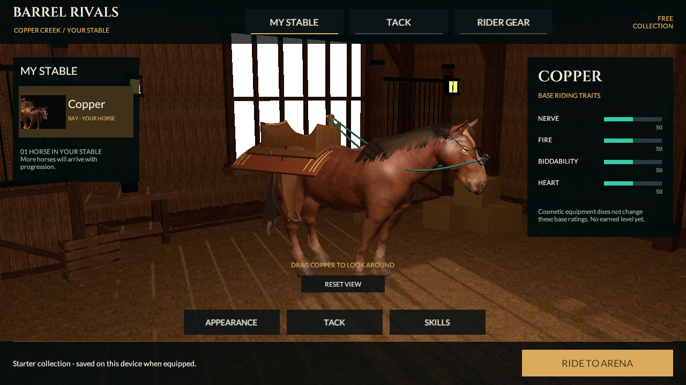

# Reins character motion — skinned hair and synchronized riding

September 20, 2026. **Source verification complete; visual milestone unfinished.** This source continues the same Reins project, existing CC0 horse and `reins-lab-v1` simulation. Native identity remains 0.4.0/build 4. It does not implement the approved 0.5/v2 moving alley or establish reference-quality graphics.

## What changed

The previous Animator used `CullUpdateTransforms`. Its state clock could advance while Unity stopped updating the actual bones when the imported body was outside the view. First-person tack and the new sibling hair renderer still needed those bones. Checking normalized animation time alone missed this defect. The builder and runtime presentation initialization now explicitly use `AlwaysAnimate`, retaining disabled root motion. Diagnostics inspect clip bindings and sampled bone rotations; the focused regression also requires visible leg, neck and skinned-hair movement. The passing evidence below verifies both bone transforms and rendered leg silhouettes.

Original skinned strand cards replace the old rigid mane/tail clumps, which are deactivated rather than allowed to reappear in thumbnails or ghosts. The generator defines **118 cards, 2,748 vertices and 2,512 triangles**, with one material and a generated **256 × 512 RGBA atlas**. Four existing neck, head and tail bones drive the hair, with at most two influences per vertex. Authored local bounds expand by 0.55 m overall to accommodate deformation. The shader uses two-sided alpha clipping at 0.36 with preserved mip coverage. There is no cloth solver, runtime hair mesh rebuild or new third-party asset. These are implementation bounds, not measured mobile overdraw or memory acceptance.

The mane follows measured outer neck cross-sections with a small clearance, rather than an arbitrary curve that passed through the skin. The save/reload review also found that copying a temporary Mesh through `EditorUtility.CopySerialized` could leave its old native vertex buffer despite updated bounds metadata. Hair persistence now writes every mesh channel explicitly while retaining the existing asset GUID. The regression checks the reloaded geometry itself, not just a renderer reference or bounds header.

Camera and hand movement now read the cycle actually rendered by the Animator instead of separate time oscillators. The camera uses a restrained stride bob; hands follow the same phase, and flexible reins continue joining the moving grips to the animated bit. Gallop playback increases gradually from 1× at 8 m/s to a capped 1.35× at 14 m/s. Reduced motion removes camera bob and speed-related FOV changes while preserving horse/tack animation. All changes remain presentation-only: accepted Core pose, timing, collisions and race results retain authority.

Own-best ghosts receive private strand materials that retain the source atlas, UV transform, cutoff and culling. A bundled URP shader clips atlas alpha **before** applying ghost opacity; otherwise the existing 0.28 opacity would fall below the 0.36 cutoff and erase the hair. Other ghost surfaces retain their existing behavior. An active resource owner releases private materials after ghost destruction, including ghosts that were never activated, and on scene unload. Imported-script removal and private skeleton protections remain in place; source assets are not tinted or modified.

## Verification and moving evidence

| Check | Status |
|---|---|
| Generate, save/reopen and persisted references | Passed; saved hair vertex channels independently checked against bounds and measured neck clearance |
| Editor tests | **103/103 passed** — [result XML](../../Evidence/CharacterMotion-EditMode.xml) |
| Play Mode tests, including actual bone movement and ghost alpha rendering/cleanup | **21/21 passed**, no skipped tests — [result XML](../../Evidence/CharacterMotion-PlayMode.xml) |
| Canonical v1 replay and unchanged Core fingerprint | Replayed successfully: **35,120 ms, zero knocks, 300 style, 2,156 frames**. Core/contracts unchanged; fingerprint rechecked. No new independent .NET/verifier run claimed. |
| Moving capture, frame count and visual review | **220 actual frames, 25 fps, 8.8 seconds**; sampled poses reviewed and encoded frame decoded/compared — [motion study](../../Evidence/CharacterMotion-Motion.mp4), [capture record](../../Evidence/CharacterMotion-Capture.json) |
| Historical evidence preservation | **98 earlier records restored byte for byte**, also checked against the prior pushed source |
| Native export, installation and phone performance | **Not performed for this source** |

The opt-in capture tool is configured for a controlled 25 fps, 1280 × 360 side-by-side study. Both panes come from Unity cameras rendering the scene's actual `SkinnedMeshRenderer` character through the graphics pipeline; the video does not substitute baked meshes, still images or a separate animation. The left image is the rider camera; the right is an explicit diagnostic side camera, with owner-only saddle hiding temporarily lifted for inspection. HUD is omitted. Idle and walk are labeled rig studies, **not** a walking alley in the current v1 game. Other segments replay canonical acceleration, the first barrel turn, Drive and reduced-motion Drive. These are separate excerpts, not one continuous full-course recording.

Two different failures required separate checks. `CullUpdateTransforms` could leave the actual bones frozen despite an advancing Animator clock; `AlwaysAnimate` addresses that runtime dependency. After bone movement was established, an earlier capture loop still produced repeated rendered leg poses because it sampled many `Animator.Update` / `Camera.Render` calls without yielding a player-loop frame. That result is consistent with Unity reusing same-frame renderer skinning data. Advancing CPU bone rotations alone therefore cannot establish moving-image acceptance. The revised capture passed and sampled scene frames show different leg poses; earlier frozen captures are excluded from the published motion movie.

For capture, scaled time is paused and the source, tack and camera components' automatic callbacks are disabled. The Animator remains enabled in its normal update mode. Rig studies advance explicitly by 0.04 seconds per sample; canonical input and presentation advance by 0.02 seconds, with images sampled every second simulation tick. `RenderForCapture(dt)` advances the camera's normal bob-strength and FOV smoothing using that same explicit step. Repeated zero-time `RenderImmediate()` calls would freeze these envelopes and misrepresent the riding camera. Each image now follows a yielded player-loop frame, and the test requires the Animator phase to remain unchanged across that yield. The metadata records phase, speed, camera position/FOV and actual leg/neck rotations, with separate Drive bone-motion assertions.

Two additional black-and-white renders check actual lower-leg silhouette changes at distinct walk phases. They use the same skinned body and fixed diagnostic camera, temporarily isolating that renderer with a white unlit material and black background. This excludes moving reins, hair, lighting and scenery from the shape comparison. These masks are **QA evidence only**, not gameplay presentation and not frames inserted into the scene video. The final masks differ by **4,694 lower-leg pixels**; sampled side views show the corresponding changed poses. Captured Drive spans **26.95° of front-leg rotation and 2.99° of neck rotation**. These establish movement, not natural foot planting. Mask images retain the corresponding scene frame indices for comparison.

Capture helpers restore material assignments, renderer layers, camera settings and render targets in `finally` blocks. The outer capture also restores the prior time scale, source/tack/camera component enabled states and reduced-motion preference, and destroys its temporary cameras, textures and isolated replay files. Fixed stepping and 25 fps encoding describe the study's playback timing; they do not measure real-time rendering speed. This capture demonstrates movement under these controlled Editor conditions, not foot planting, continuous full-course comfort, native installation or phone performance.

## Current captures and inspection

[MyStable](../../Evidence/CharacterMotion-MyStable.png) · [Tack](../../Evidence/CharacterMotion-SaddlesPreview.png) · [Rider Gear](../../Evidence/CharacterMotion-RiderEquipped.png) · [4:3 gear layout](../../Evidence/CharacterMotion-RiderTablet.png) · [race approach](../../Evidence/CharacterMotion-Race-Approach-1.png) · [turn two](../../Evidence/CharacterMotion-Race-Turn-2.png) · [finish](../../Evidence/CharacterMotion-Race-Finish.png) · [full race capture metadata](../../Evidence/CharacterMotion-Race-Run.json) · [checks and hashes](../../Evidence/CharacterMotion-Checkpoint.json).

The persisted mane now forms a fuller curtain outside the neck, rather than the earlier cropped strands. In first person it still shows regular striping and broad sheet-like sections; grooming, strand breakup and close-range shading need refinement. The motion samples also expose the basic gait's unplanted feet and incomplete rider presentation. These are useful inspection results, not accepted premium art. The older bright stable window, simplified saddle/gloves, repeated crowd/ground and south-facing sky streak remain visible. Existing thumbnails were regenerated from real equipped meshes.

## Remaining limits

The free horse retains its low-detail base anatomy and basic Idle/Walk/Gallop studies. Planted feet, natural stride matching, convincing braking and tight turns, refined hair silhouettes, a complete rigged rider and synchronized production animation remain unfinished. Hair alpha quality and overdraw need close and distant device review. `AlwaysAnimate` has a CPU cost that must be included when profiling multiple horses.

Before further procedural art changes, audit the other existing-Mesh save helpers in `StableTackBuilder`, `ReinsRiderTackBuilder`, `StableWardrobeArtBuilder`, `StableShowroomBuilder`, `ReinsPremiumArenaBuilder` and `PracticePresentationBuilder`. They use the same `CopySerialized` update pattern. This is an identified regeneration risk, not evidence that those other saved meshes are currently corrupt; their actual vertex channels were not compared in this checkpoint.

No new phone build, measured frame time/memory/thermals, native visual acceptance, trusted progression or multiplayer service is established here. The reference images remain the target. This checkpoint addresses a real motion defect and a specific character-art gap without claiming the full visual milestone or any complete release section.

Reproduce with `BarrelRivals.Editor.ReinsLabBuilder.Generate` and one Unity 6000.6.0f1 Editor. Use fresh `CharacterMotion-*` evidence filenames. Preserve historical records before tests because older capture tests still write their original paths. Set `BARREL_MOTION_CAPTURE_DIRECTORY` to a fresh intermediate directory only for the opt-in motion study; encode its frames with the repository's `Tools/Art/encode_motion.swift` workflow and retain the capture metadata.
