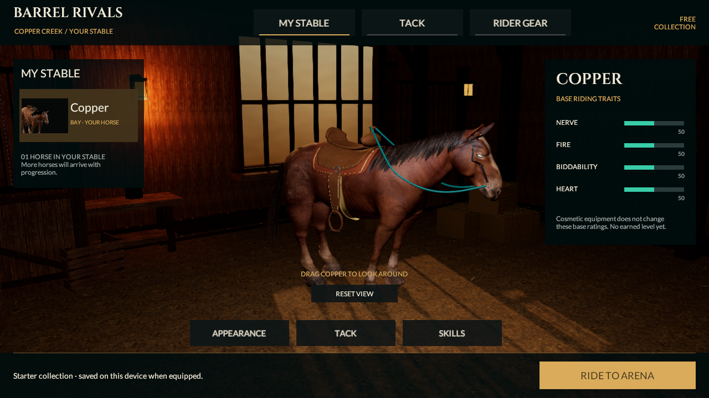
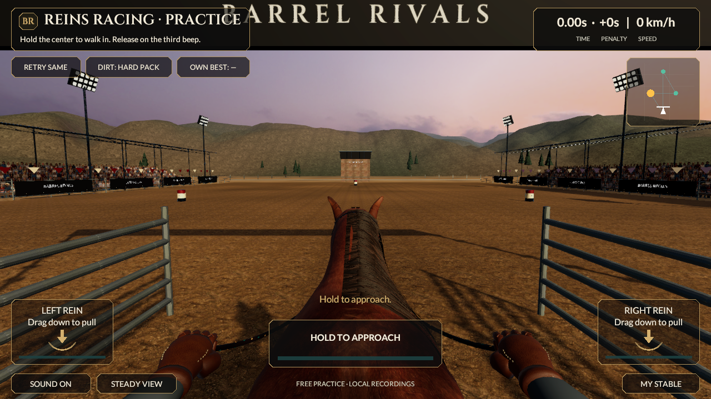

# Reins fiber shading checkpoint

September 20, 2026. Art-only continuation from `ffc45f8c07664575fe0ee59c9b360097d78ddd45`. Current source remains **0.5.0/build 5, reins-v2**. Last installed iPhone app remains 0.4.0/build 4. This is not a new native build, measured phone performance, planted-animation acceptance or a match to the photographic references.

## Connected change

The shared mane, forelock and tail now use an original `Barrel Rivals/Horse Fiber` shader instead of general URP Lit. Highlights follow the atlas's root-to-tip direction, taken from the mesh bitangent; its tangent runs across the lock. Two restrained shifted lobes, mip-filtered strand detail, wrapped diffuse lighting, bounded edge transmission and darker roots replace broad isotropic highlights. This is an artist-controlled real-time approximation, not a full physical fiber-scattering simulation.

The shader samples one existing original RGBA atlas per layer. Both sides remain visible; forward, shadow, depth and normal passes use the same clipped mask. Main and additional lights, shadows, ambient light and fog remain connected to the existing forward URP renderer. The ghost retains its separate transparent shader, original masks and private material lifetime. No purchased asset, new bitmap, groom density, geometry, light or gameplay input is introduced. The existing floodlight material also now retains its authored glow after reload: its GI flags are `BakedEmissive`, matching the installed URP validator. Previously the keyword alone was enabled while the flags marked emission black, so validation stripped it. This does not introduce realtime lights or realtime GI; no lightmap bake was performed. A regression invokes the actual installed URP material validator on a private copy.

The original two atlas PNGs, imported horse FBX, skinned hair mesh, animation and helper-bone behavior remain byte-unchanged. Hair remains **118 cards, 3,048 vertices, 3,232 triangles, 27 palette bones and two material slots**. The player remains **54,980 triangles / 17 renderers / 22 material slots**; no LODs or material-count reduction. MyStable and its actual rendered horse portrait use the same saved materials. Tack/glove previews, one horse and 20 local styles remain the existing feature scope.

## Implementation sources

The shader code is original project work using the installed URP 17.6 package APIs. The [NVIDIA discussion of hair-direction reflectance](https://developer.nvidia.com/gpugems/gpugems/part-v-performance-and-practicalities/chapter-33-converting-production-renderman) informs the tangent-based lobe approach. [NVIDIA's surface adaptation discussion](https://developer.nvidia.com/gpugems/gpugems2/part-iii-high-quality-rendering/chapter-23-hair-animation-and-rendering-nalu-demo) informs using a surface direction and wrapped illumination. No article images, lookup tables, model, simulation system or source code were imported. Existing atlas ownership/provenance remains in the hair art directory.

A first-import capture showed saturated red/colored artifacts although no shader compiler error was logged. Reopened scenes, persistent-versus-cloned materials, baked-versus-skinned geometry, shadows, batching and post-processing diagnostics did not reproduce that artifact. The exact original cause is not proven. Each pass now uses `editor_sync_compilation` to prevent incomplete Editor variants contaminating generated portraits or evidence, following [Unity's documented directive](https://docs.unity.com/en-us/engine/6000.6/manual/materials-and-shaders/shaders/shader-troubleshooting/shader-reduce-stalling/asynchronous-shader-compilation/enable-or-disable). This affects Editor compilation, not a claim of native shader warmup or device qualification. Final first-regeneration portrait and gameplay captures are inspected again.

The first complete shading candidate was also rejected for a broad gold sheen. Final strengths are 0.035/0.015 for the dense layer and 0.060/0.028 for outer locks, with a near-neutral reflection tint and texture-driven glint intensity. The source tint/atlas/alpha cutoff remains unchanged.

## Verification

- Unity 6000.6.0f1 regenerated the shared materials and real horse portrait, then reopened the saved scenes.
- **138/138 Editor tests and 35/35 Play Mode tests passed**, zero skipped: [Editor XML](../../Evidence/FiberShading-EditMode.xml), [Play Mode XML](../../Evidence/FiberShading-PlayMode.xml). [Shader pixel proof](../../Evidence/FiberShading-Shader-Proof.json) records 18,983 dense-layer and 6,482 outer-layer pixels responding to fiber direction, with identical reverse-face coverage.
- Canonical v2 race remains **33,860 ms, zero knocks, 300 style, Perfect launch/error 0 and 1,893 input frames**: [actual Unity run](../../Evidence/FiberShading-Race-Run.json). Core, runtime input/replay, contracts and verifier are unchanged. The prior 78/78 HTTP check is historical; no new HTTP run is claimed.
- Fresh [saved gait inspection](../../Evidence/FiberShading-Unity-Gait-Geometry.json), race/stable/tack/glove images, [161-frame launch movie](../../Evidence/FiberShading-Launch.mp4) and [220-frame side/rider motion movie](../../Evidence/FiberShading-Motion.mp4) cover this source. Both movies are silent controlled 25 fps studies, not measured phone frame rates. [Decoded-frame checks](../../Evidence/FiberShading-Video-Verification.json) compare against original Unity pixels.
- All **427** prior tracked PNG/JSON/XML/MP4 evidence files remain byte-identical: [integrity record](../../Evidence/FiberShading-Historical-Integrity.json). New evidence uses `FiberShading-*`; [checkpoint metadata](../../Evidence/FiberShading-Checkpoint.json) identifies current source hashes and limits.
- Regeneration-only scene/prefab object-ID changes were checked for equivalent serialized graphs and restored to baseline IDs. Original source geometry and texture hashes remain unchanged.

Persisted mesh checks now verify finite, normalized tangent frames orthogonal to normals; existing fitted-root/crown-face clearance and mobile two-weight skinning checks remain. The isolated live test uses both real saved atlas materials, removes diffuse contribution, rotates only the supplied fiber direction, and checks the changed highlight energy. It also verifies clipped gaps, reverse-winding coverage and availability of all four named passes. The separate actual-scene test compares saved and cloned material output and guards against the observed flat-red artifact. These checks exercise rendering behavior; neither proves photographic quality or physical light transport.

The outer atlas is intentionally much sparser than the dense atlas. The initial coverage lower bound guessed 10% of the whole image and rejected its valid 9.89%; the final test uses 5–50%, which still rejects an empty mask and an opaque full proof quad. Camera aspect is explicit. This adjusts the fixture's visual bounds, not the production cutoff or textures.

## Visual judgment and next work

The final shared horse retains a dark mane and less broad, pale/plastic shine. Directional highlights are visible in the live render proof and follow the animated surface. The groom still reads as layered strips in places; clipping gaps, anatomical proportions, planted turns/braking, missing full rider and crowd detail remain visible limitations. This is a shading improvement, not a finished hero character or reference-quality acceptance.

Prioritize a larger character/silhouette/animation improvement next rather than adding more hair cards or repeatedly tuning tiny material values. The shader and whole 0.5 player still need native iPhone/Android compilation and sustained device profiling. Preserve the eight categories/53 sections and the R2 → M1N → online/progression/economy/release sequence. No full section is release-accepted by this art checkpoint.
