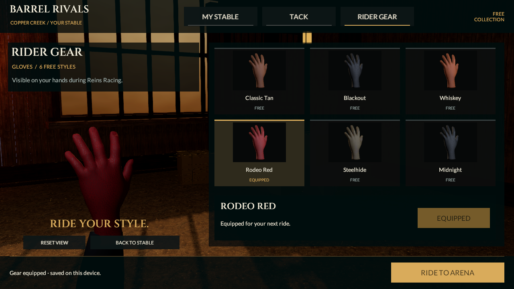
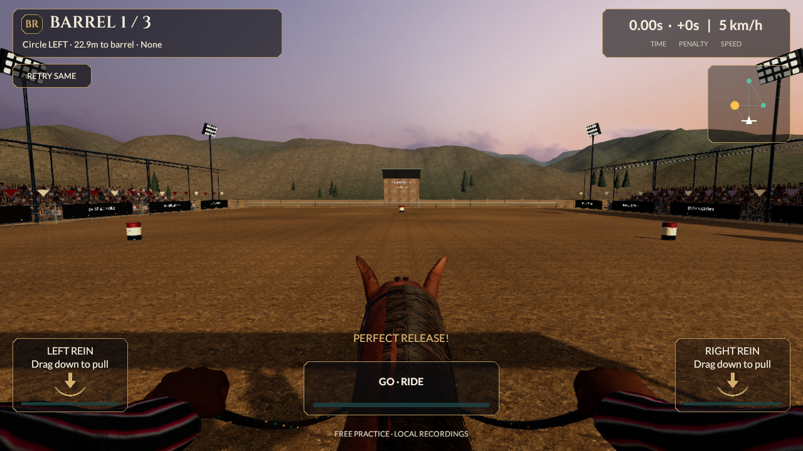

# Reins connected glove anatomy checkpoint

September 20, 2026. Continuation from `72d7a63ead38c1ffc22c1603a7c55f2bdd71b657`. Source remains **0.5.0/build 5, reins-v2**; last installed phone build remains 0.4.0/build 4. This is an art/client-content increment, not full R2, photographic, device or release acceptance.

## What changed

The foreground riding gloves and MyStable's glove inspection now derive from one connected anatomical hand source. A continuous palm, web of the thumb and fingers replace intersecting palm/finger tubes. The open inspection pose and closed rein grip retain distinct finger lengths, a padded outer shell and a short rolled cuff. They are fixed offline poses attached to the existing moving hand transforms; no additional runtime hand rig, skinning, input behavior or gameplay authority is introduced.

The source is the CC0 MakeHuman base mesh and game-engine weights already pinned through MPFB 2.0.17. The original authoring script extracts a hand, converts it to metre-space, poses the fingers, keeps the thumb base neutral, opposes its distal joints, softens small surface borders, adds a 1.5 mm shell/cuff, reduces density and unwraps the surface. The external GPLv3 authoring program is not distributed with the game. [Provenance/reproduction](../../Assets/_Project/Art/Reins/Gloves/README.md) / [archive and mesh hashes](../../Assets/_Project/Art/Reins/Gloves/Source-Provenance.json).

Existing credited brown-leather albedo, normal and roughness maps remain unchanged. All six existing glove dyes share restrained normal strength and a matte surface response; hidden inside faces are culled. No new texture, sponsor art, image-reference pixels or paid asset is used. MyStable inspection, actual item thumbnails and both race hands use the connected geometry and the same selected material. Preview/equip/cancel/persistence and frozen race appearance remain intact.

The left rein anchor is now `(-.010, -.031, .075)` in glove-local metres; the right is mirrored. A vertical section through the authored grip leaves approximately 22 mm between the palm and curled fingers, accommodating the braid at that sample. The two-sided clearance test covers this intended section, not all dynamic rein/glove intersections. Existing wrist-to-sleeve, endpoint, rider gait and ghost checks still run.

## Geometry and cost

| Surface | Before | Current |
|---|---:|---:|
| Inspection glove plus seam/sleeve assembly | 4,192 triangles / 3 renderers | 2,537 triangles / 2 renderers |
| Closed riding glove, each hand | 1,116 triangles | 1,408 triangles |
| Active full horse/tack/rider, including shadow-only meshes | 78,030 triangles / 21 renderers / 26 slots | 78,614 triangles / 21 renderers / 26 slots |

The inspection assembly is approximately 39% smaller by triangle count. The racing character adds 584 triangles in total; this is a shape improvement, not a reduction in its whole-character triangle count. The 60k/six-material targets and lower LODs remain unmet. Backface culling and lower inspection counts are engineering changes, not measured phone FPS improvements. No extra runtime textures or finger skinning are added.

The open glove is 2,393 triangles and the closed glove 1,408. Compared with their unreduced posed meshes, bidirectional vertex-to-surface samples differ by at most approximately 0.681 mm and 0.779 mm respectively. This is a sampled reduction check, not an exact continuous Hausdorff bound. Smooth source normals persist across split UV seams; right-hand mirroring reverses index winding. [Current runtime character counts](../../Evidence/GloveAnatomy-Character-Budget.json).

## Verification

- Unity 6000.6.0f1 regenerated the actual race/stable scenes and all six glove thumbnails. **140/140 Editor and 37/37 Play Mode checks passed**, zero skipped: [Editor XML](../../Evidence/GloveAnatomy-EditMode.xml) / [Play Mode XML](../../Evidence/GloveAnatomy-PlayMode.xml).
- New geometry checks weld UV seams for topology inspection, require a single connected palm/finger/cuff surface, reject non-manifold edges and holes outside the wrist, verify normal/tangent frames, check mirrored winding and test palm/finger clearance at both rein anchors. An older fixed triangle-count assertion is replaced with the riding-glove mesh budget; the separate topology/clearance tests cover the new shape's behavior.
- Existing six-style material isolation, preview/equip/cancel, persisted loadout, ghost materials, endpoint following, 48-pose rider contact/deformation, reduced motion and input/replay checks pass. No new progression, rarity, stat advantage or selectable outfit category is implied.
- Canonical Unity race remains **1,893 frames, 33,860 ms, zero knocks, 300 style, Perfect release/error 0**: [race record](../../Evidence/GloveAnatomy-Race-Run.json). Core, runtime input, contracts and verifier are unchanged. No new independent HTTP run is claimed.
- [Launch movie](../../Evidence/GloveAnatomy-Launch.mp4) and [rider/side motion study](../../Evidence/GloveAnatomy-Motion.mp4) contain 161 and 220 actual Unity frames. They are silent, controlled 25 fps studies, not measured phone performance. [Encoding checks](../../Evidence/GloveAnatomy-Video-Verification.json) compare a decoded sample against the Unity source frame.
- All **515** earlier tracked PNG/JSON/XML/MP4 evidence files remain byte-identical: [integrity record](../../Evidence/GloveAnatomy-Historical-Integrity.json). New screenshots and proof use `GloveAnatomy-*`; [checkpoint metadata](../../Evidence/GloveAnatomy-Checkpoint.json) pins current sources and limits.

The first authoring study reversed the palm/back frame and flexed the fingers away from the palm. A later unrestricted thumb-base solve distorted its skin; the final source keeps the base neutral and moves only distal joints. The initial tight fist also left insufficient room for the braid, so the final grip is more open. These were rejected local studies, not accepted gameplay evidence. The imported material initially gave the new smooth surface excessive speckled shine; the final shared leather finish reduces normal strength and smoothness without rewriting source textures.

## Visual judgment and next steps

The connected fingers, palm and thumb make the inspection and riding silhouettes more coherent. The glove still lacks detailed sewn panels, convincing large leather folds and animated finger pressure. It remains below the photographic reference. The wider game still needs improved horse/rider anatomy, planted turns/braking, mane/crowd detail, character material/LOD work and native phone qualification.

The next checkpoint should include a fresh 0.5 native build and device review alongside further art refinement, so the user can evaluate the new view and controls on the phone. Preserve R2 → M1N → multiplayer/progression/economy/release and all eight categories/53 sections. No full section is release-accepted here.
