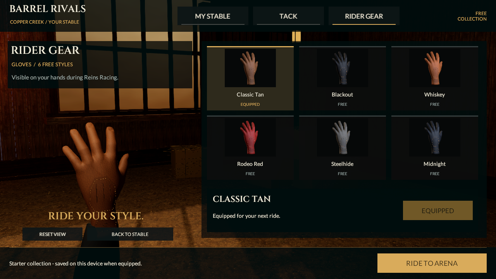

# Shared glove construction checkpoint

September 21, 2026. Baseline `3d65dc1e1bd7b0e2b4f44762f1b2bb7f138aa194`. Source remains **0.5.0/build 5, reins-v2**. This adds sewn leather construction to the actual race hands, Rider Gear inspection and all six rendered glove thumbnails. The full-game, photographic and phone-quality gates remain open.

## Actual game change

The previous connected hand shell supplied sound anatomy but looked like an unsewn hand. Its old separate stitch/sleeve renderer is hidden when the full skinned rider is present. The new details are part of the glove mesh itself: a fitted dorsal reinforcement, three raised leather ribs, a tapered wrist closure, visible individual stitches and an original small embossed diamond. Both closed riding grips and the open inspection pose use the same original construction method.

`GloveTailoringBuilder` projects authoring points onto the actual dorsal source triangles, interpolating normals and UVs. It adds panels and thread without moving any anatomical shell vertex or triangle, preserving the measured palm-side rein aperture. The right glove mirrors positions, normals and winding together. This is offline mesh generation; there is no new runtime finger rig, collider, physics, per-frame projection or gameplay behavior.

The opaque `Tailored Leather` URP shader uses the same credited albedo/normal/roughness-derived surface maps. Vertex RGB shades the leather panels; vertex alpha selects fixed flax thread and is **not opacity**. Thread color is independent of the six leather dyes. Leather grain and gloss are restrained for close viewing. The material has forward, shadow, depth and depth-normal passes, main/additional lighting and fog. No new texture, renderer or material slot is added to either hand.

MyStable still contains one horse and twenty free cosmetics in five slots. This adds no inventory IDs, purchased ownership, rarity, levels, gear bonuses or selectable outfit categories. Preview/equip/cancel, cosmetic saves, frozen race appearance and private ghost presentation remain the same contracts.

## Cost and verification

| Geometry | Before | Current |
|---|---:|---:|
| Open inspection glove | 2,393 triangles | 4,470 triangles |
| Each closed riding glove | 1,408 triangles | 3,485 triangles |
| Inspection with sleeve | 2,537 triangles / 2 renderers | 4,614 triangles / 2 renderers |
| Active full race character | 79,288 triangles / 21 renderers / 26 slots | 83,442 triangles / 21 renderers / 26 slots |

This increases geometry by 4,154 triangles across both riding hands. The isolated development horse references these same persistent hand meshes, so its prior 93,076-triangle character likewise becomes 97,230 triangles (unchanged 20 renderers / 25 slots); this arithmetic follows the shared asset references, not a new full candidate review. It does not meet the 60k/six-slot character target; lower LODs and actual phone cost remain necessary. Small stitching should be reduced or baked at lower detail levels before roster expansion.

**Four focused Editor tests and seven final focused Play Mode tests pass, zero skipped.** All six rendered dye samples retain identical thread color while leather changes. The separate controlled alley capture also passed; its earlier run included the material-initialization failure subsequently corrected by the final probe. All **694 historical evidence files remain byte-identical**.

Final test and capture results are recorded in [checkpoint metadata](../../Evidence/GloveTailoring-Checkpoint.json). Existing connected-shell/winding/aperture checks remain intact. New checks preserve exact source vertices/indices, validate mirrored details and finite unit normal/tangent frames, verify saved construction channels and six-style map sharing, and compare actual rendered leather/thread colors. Equipment, saved loadout, ghost isolation and 48 sampled rider poses are checked separately from image review.

The material probe initially selected the fallback subshader before an explicit batch-mode camera render initialized URP. A player-loop yield alone did not initialize that render path. The final probe initializes the saved scene first and then checks all four active passes. Item photography now renders an empty initialization frame before capturing the product, fixing the incorrect first Classic Tan thumbnail. This is a capture initialization correction, not a runtime dye workaround.

[Actual Rider Gear screen](../../Evidence/GloveTailoring-RiderGear.png) / [actual first-person launch image](../../Evidence/GloveTailoring-Launch.png) / [controlled gameplay movie](../../Evidence/GloveTailoring-Alley.mp4). The movie is 161 actual Unity frames, 1280×720, 25 encoded fps, 6.44 seconds, silent. It contains Ready, the moving alley, release and first steering/cadence. Encoding rate is not measured device FPS; it cannot establish speaker/input alignment.

## Remaining work

The gloves now visibly read as sewn equipment, but finger construction, wrinkles, pressure articulation and clothing fit still fall short of the reference. Horse anatomy/face/groom, natural turns/braking/Wrap, arena/crowd detail, LOD/material budgets and native/device review remain unfinished. The newer horse candidate remains development-only; this increment does not adopt it into race/stable/ghost behavior.

No Core/input/replay/server contract or native artifact changed. The last verified installed iPhone app remains 0.4.0/build 4; both earlier 0.5 packages remain uninstalled/unqualified. Continue R2 art/device qualification, then M1N authority proof and the preserved multiplayer/progression/economy/release scope. All eight categories and 53 section IDs remain in force.

