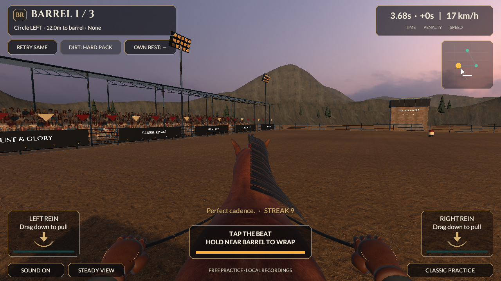
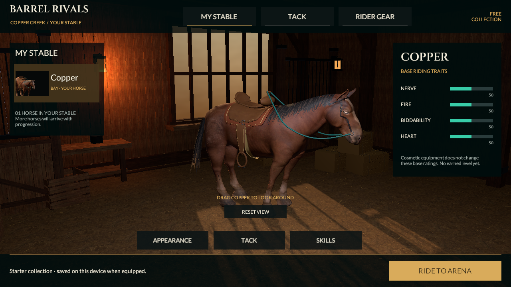
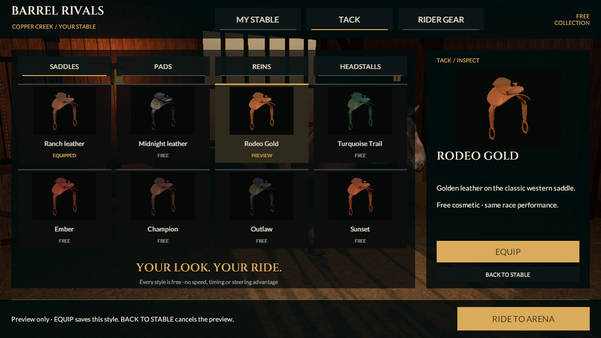
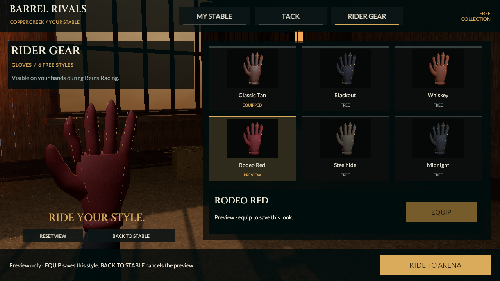
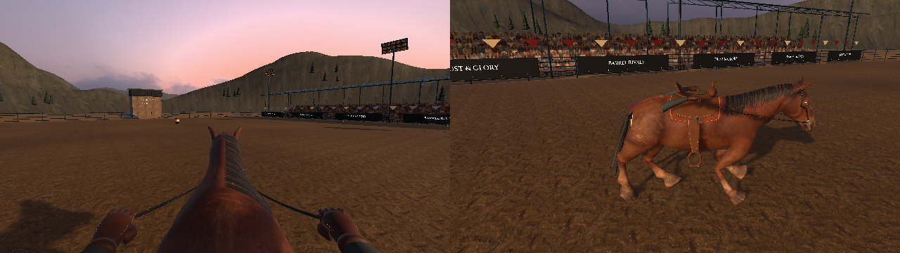

# Reins hair groom and hand material checkpoint

September 20, 2026. This source continues the same game and connected MyStable/Tack/Rider Gear flow. Native identity remains **0.4.0/build 4** and rules remain **reins-lab-v1**. There is no new native build, phone installation, measured device performance or photographic-quality acceptance. The approved 0.5/v2 moving-alley launch is still pending.

## What changed

The mane now combines a short dense undercoat with longer, tapered separated strands. Root placement and strongest-two skin weights still come from the actual neutral horse surface. The groom varies lock length, sweep, width and loose-end clearance; the forelock retains ear gaps and the tail retains its measured dock. Both original RGBA atlases are preserved. The new [separated atlas provenance](Original-separated-hair-provenance.md) records exact built-in generation/edit prompts, its hash and analytical alpha measurements. The first sparse-only groom was rejected after an actual Unity render because it left the horse visibly too bare.

One persistent skinned mesh contains **118 cards, 2,748 vertices, 2,512 triangles and two alpha-clipped material slots**. The triangle count matches the preceding source; the additional undercoat slot is deliberate. Its 27-bone palette includes eight independent new hair helpers beneath existing deform bones. Roots retain body attachment, with helper influence only on distal strands. The authored neutral outer tips sit at most 38 mm outside the measured neck; tests retain the 20 mm root limit and check the explicit 40 mm distal envelope.

`ReinsHairMotion` derives restrained lift/sway from the actual Animator phase and accepted speed/turn. There is no accumulated spring state, physics, root motion or Core mutation. Each helper is independently bounded to 10 degrees; positions/scales and imported bones are not written. The same phase reproduces the same pose. MyStable uses its retained Idle Animator after the race presenter is removed. Reduced motion restores helper neutral rotations. Ghosts retain this component and evaluate their own presenter; serialized neutral rotations survive cloning a posed player. Both private ghost hair materials preserve their respective source alpha and have checked cleanup, including the inactive case.

Each racing hand now uses two renderers instead of four. Shell and grip panels share the selected glove material; sleeve and seams use a fixed two-texel color/smoothness swatch with standard URP Lit. Geometry and grip transforms remain intact. All six glove styles, the separate open-hand gear preview, all 20 cosmetic IDs, save schema and frozen race appearance remain unchanged.

## Actual validation

| Check | Current evidence |
|---|---|
| Unity 6000.6.0f1 scene generation, save and reopen | Passed for Reins and MyStable |
| Editor suite | **110/110 passed**, zero skipped; [XML](../../Evidence/HairGroom-EditMode.xml) |
| Play Mode suite | **26/26 passed**, zero skipped; [XML](../../Evidence/HairGroom-PlayMode.xml) |
| New consequential checks | Phase seeking/no accumulated drift; reduced neutral pose; imported-bone/root invariance; posed-player ghost isolation; stable Idle/hidden lifecycle; both alpha layers' private material lifetime; all six glove palettes and fixed sleeve/seam invariance |
| Full canonical race | 35,120 ms, zero knocks, 300 style, 2,156 frames; [capture/run record](../../Evidence/HairGroom-Race-Run.json) |
| Current imported gait check | Same unchanged FBX; [geometry report](../../Evidence/HairGroom-Unity-Gait-Geometry.json) |
| Motion evidence | 220 explicitly stepped Unity frames, six selected stills and an 8.8-second side/rider study; [metadata](../../Evidence/HairGroom-Capture.json), [video](../../Evidence/HairGroom-Motion.mp4), [verification](../../Evidence/HairGroom-Video-Verification.json) |
| Prior evidence | All 234 earlier PNG/JSON/XML/MP4 records restored byte for byte against source commit 4c9ae0754168d39834b04170c5ad1ef2fd257fd0; [integrity record](../../Evidence/HairGroom-Historical-Integrity.json) |

An intermediate Editor run rejected a reused gait-report filename through its preservation guard; the complete suite was rerun with a fresh report path. The final results above are from the corrected two-layer groom. Raw Editor/licensing logs are not published. The controlled movie includes explicitly labelled Idle/Walk rig studies; the Walk is not a newly implemented gameplay alley. Sampling/encoding rate is not device frame rate. Core and contract source are unchanged, and the fingerprint check remains `ffd16884d534628a46d2164751c19fbf7ff51cf8e56e92d36a799cac129e4837`; no new independent server-verifier run is claimed.

## Source budget and limits

[Saved hierarchy and mesh counts](../../Evidence/HairGroom-Character-Budget.json) show **54,260 character triangles**, 17 player renderers and **22 material slots** (previously 21 renderers/25 slots). Four hand slots were removed and one undercoat slot added. The seated player's saddle is shadow-only, leaving 42,900 color-pass-eligible triangles/18 slots. MyStable has 50,780 triangles/13 renderers/18 slots. An active own-best ghost adds 54,260 triangles/22 slots before culling, with three tint materials including its two private hair copies. Shared source meshes are not duplicated by those counts. No new LOD was added.

These are geometry/slot counts, not measured draw submissions, GPU time or memory peaks. The character remains above the planned six-slot target. The extra alpha layer and helper skinning require actual phone profiling. The mesh bounds include a 0.55 m expansion for bounded secondary motion; this is not an all-device culling/performance guarantee.

## Visual review and remaining work

The dense underlayer restores coverage beneath the separated ends, and the changing groom shape is now present in the player, stable and ghost paths. This remains an art study below the user's realistic reference. The stable-view strand edges and tail separation show modest progress; the main rider view still reads as regularly spaced comb-like strips and has improved only slightly. The next groom pass should vary card roll and flow within overlapping locks while retaining fitted roots; further alpha thinning alone will not resolve this. The Lit shader also has no dedicated anisotropic fiber model. The horse face/coat, full rider, planted blends and turns, hand anatomy, arena lighting/crowd/terrain detail and mobile quality tiers need further work. Tests demonstrate the implementation boundaries above, not premium visual acceptance.

The gameplay/stable/gear screenshots below are actual Unity renders, not concept art or copied reference imagery.

Continue the approved representative horse/rider/arena and 0.5 launch rather than scaling the roster. All eight categories and 53 sections remain; full-release acceptance is still 0/53. Trusted progression, paid ownership, multiplayer services and store qualification remain unfinished. Free/original assets only; no purchase or new paid service was made.
