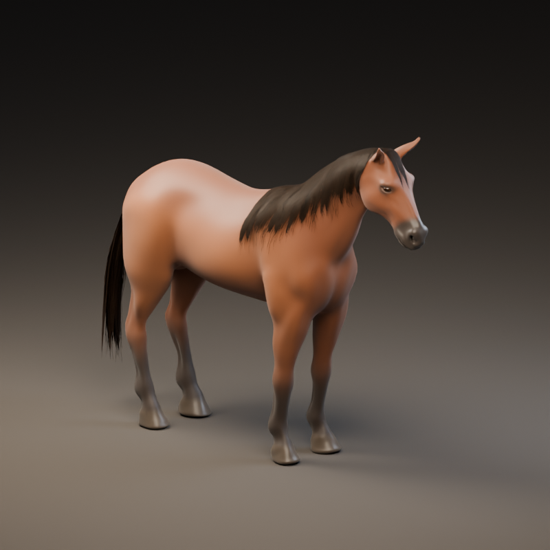

# Reins — fitted mane, forelock and tail study

September 21, 2026. This adds editable hair to the [offline face/coat candidate](Reins-Horse-Surface-Study.md). It does **not** replace the Unity horse, MyStable preview, verified 0.5 mobile packages or last installed iPhone app. It remains below the photographic reference, particularly in the flat root shading, simplified surface and natural motion.

## Added source

The new `HeroHorse-GroomStudy.blend` and `.fbx` contain 102 original hair cards: 54 mane, 12 forelock and 36 tail. Roots and skin weights fit the actual horse surface using triangle intersections and barycentric interpolation. More geometry around the neck crest and across the tail dock keeps broad flat faces from cutting through curved anatomy. Tail roots use a transverse surface tangent before fanning outward; projecting a purely depth-facing card along the fitting ray had collapsed its first polygons, which the saved-mesh check caught and the final revision repairs.

Four mane helper bones and one tail helper add bounded cyclic secondary movement. The rig now has 39 bones, including the original 34. Hair roots retain sampled base skin weights; only distal vertices receive helper influence, with at most four normalized weights. The original body, eyes, their materials and base walk remain canonically identical to the surface checkpoint. This is a walk study, not a new gallop, turn, braking, Wrap or physically simulated groom.

Hair adds **4,878 vertices / 6,624 triangles / two slots**. The horse-only candidate totals **48,504 triangles / four slots / three renderers**, before tack or rider. This does not fix the currently integrated character's 78,614-triangle/26-slot cost. The enlarged horse will need appropriate topology/LODs and measured combined-character budgets before mobile adoption.

[Moving quarter/rider review](../../Evidence/HorseGroom-Motion.mp4) · [head](../../Evidence/HorseGroom-Head.png) · [rider view](../../Evidence/HorseGroom-Rider.png) · [neutral head](../../Evidence/HorseGroom-HeadNeutral.png).

These are actual saved-mesh Blender renders, not gameplay or substitute target images. The silent review uses Cycles CPU, 800×600, authored 30 fps, 224 frames/7.467 seconds, four repeated cycles per view and a static diagnostic floor. [Capture record](../../Evidence/HorseGroom-Capture.json) and [native video verification](../../Evidence/HorseGroom-Video.json) state the exact scope. Material review still shows broad flat roots, regular card edges and restrained rather than naturally flowing hair. The coat is too smooth and the shoulder/hip movement remains simplified; passing mesh checks does not accept these visuals.

## Materials and provenance

The two existing original project atlases are reused **byte-for-byte** and packed into the `.blend`. No new bitmap, purchased asset, reference-image pixels or sponsor artwork was added. See [natural atlas provenance](Original-natural-hair-provenance.md), [separated atlas provenance](Original-separated-hair-provenance.md), [horse attribution](../../ArtSource/HorseStudy/ATTRIBUTION.md) and [pinned hashes](../../ArtSource/HorseStudy/PROVENANCE.json).

The Blender materials use dense/outer layers, UV-V strand direction, genuine alpha cutout at 0.36, restrained specular response and small relief from existing texture values. The initial specular treatment looked pale; reflection strength and tint were reduced before this checkpoint. Forelock roots remain too flat in close-up, so this is not final hair shading.

FBX transfers geometry, UVs, skin and animation, **not these Blender shader graphs**. It references atlas basenames; Unity must explicitly bind the unchanged project PNGs and a reviewed two-sided cutout shader. Reuse the existing fiber-direction/ghost-alpha contracts where applicable. Keep coat and eyes opaque; `CoatColor.a` remains a bare-surface mask, never transparency. This candidate introduces no new Unity shader yet.

## Verification and limits

- Original body geometry/UVs/normals/weights and the 34-bone rest hierarchy/base animation keys are unchanged. The five extra bones are hair-only. Body/eye mesh, colors, skin and original material graphs are also unchanged.
- Actual saved hair triangles are nondegenerate. Root UVs point to the top of the atlas, all weights are finite/normalized with at most four influences, and root vertices exclude helper weights. Both packed image hashes match the original repo files.
- Independent FBX reimport uses `anim_offset=0` and matches unused vertices by position, UV and weights, accommodating coincident attachment points. It preserves face winding/material assignments, UVs and weights exactly; corner-normal dot is above 0.9999998. Maximum groom position difference is 0.0017 mm over 225 samples, including between keys. Loop endpoints coincide and the object root remains fixed.
- Across 113 actual walk poses, signed nearest-surface checks at every groom vertex and triangle center find no crossing beyond the declared 2 mm tolerance. Worst signed distance is −0.315 mm; measured roots remain approximately 2.29–7.01 mm from their body attachments. This is finite spatial/temporal sampling, **not continuous collision proof or a guarantee of zero clipping in untested gaits**.
- The final combined FBX also passes the existing 225-sample body/contact check. Maximum body motion difference is 0.00213 mm; corrected stance contact travel remains below 0.031 mm. That proves export preservation within stated tolerances, not production biomechanics.

[Authoring](../../Evidence/HorseGroom-Authoring.json), [groom verification](../../Evidence/HorseGroom-Verification.json), [clearance samples](../../Evidence/HorseGroom-Clearance.json), [body preservation](../../Evidence/HorseGroom-BodyPreservation.json), [surface preservation](../../Evidence/HorseGroom-SurfacePreservation.json), [body roundtrip](../../Evidence/HorseGroom-BodyRoundtrip.json), [checkpoint](../../Evidence/HorseGroom-Checkpoint.json).

All 596 earlier evidence files remain unchanged. No Unity Assets, Core rules, input, replay, saves, native build or phone installation changed. The previous 140 Editor / 37 Play Mode results are historical; no new Unity test pass is claimed. Both verified 0.5 packages remain uninstalled/unqualified, and the last verified installed iPhone version remains 0.4.0/build 4.

## Next: a moving Unity benchmark

Bring the candidate into an **isolated development benchmark** before replacing race/stable/ghost prefabs. Implement explicit renderer and bone-role bindings, measured forward/scale validation and deliberate URP coat/eye/hair materials. The [surface checkpoint's integration table](Reins-Horse-Surface-Study.md#next-integration-work) identifies the existing name/orientation assumptions. Add a neutral idle and fit saddle, bridle, rider, hands, reins and camera to this anatomy. Review walk motion from the rider view and MyStable under actual Unity lights.

Use that benchmark to prioritize visible anatomy/root-shading corrections and the missing locomotion/turn/brake/Wrap clips. Then create LODs, check ghost lifetime/reduced-motion/always-updating bone behavior, and measure on devices before adoption. Keep Core's authoritative race root unchanged. A later runtime replacement needs a new build identity; preserve both verified 0.5 artifacts.

This advances S10/S12/S13 art work, without completing those sections, the roster, progression, multiplayer or release. All eight categories and 53 section IDs remain intact.
