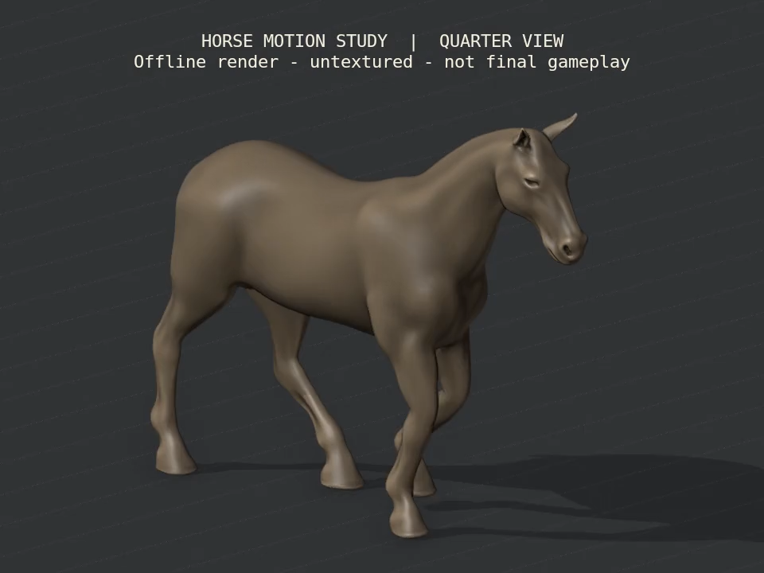

# Reins — horse movement refinement

September 20–21, 2026. **Offline art source, not an equipped Unity replacement.** The prior [rig checkpoint](Reins-Horse-Rig-Study.md) and all its evidence remain preserved. Current race/MyStable code, Core, controls, materials and both verified 0.5 native packages are unchanged; R2 and photographic acceptance remain open.

## Changed motion and deformation

The alternative horse now stands 33 mm higher on average during its walk, with a shorter 28-frame cycle at the same 1.5 m/s reference speed. Swing lift is 75 mm instead of 130 mm. Twenty connected-edge diffusion passes smooth shoulder/hip skin weights across 5,522 vertices; the geometry, UVs, normals and 34-bone hierarchy remain unchanged. At most four normalized weights affect each vertex. Rigid hoof and head regions stay protected.

Hooves remain level through midstance, then lift the heel around a measured toe surface vertex during the last 12% of the cycle. The swing folds the hoof and returns it level for landing. Ground clearance uses the lowest actual rigid hoof surface, rather than a bone tip. Small original body sway, pelvic/torso counter-roll and twice-per-cycle neck motion add a weight-transfer cue. These are authored animation choices, not motion capture or validated biomechanics.

The lateral four-beat footfall order remains consistent with [UGA's gait description](https://fieldreport.caes.uga.edu/publications/B1401/evaluating-common-equine-performance-classes/). UGA also describes smooth western movement with restrained knee action. [Rhodin et al.](https://pubmed.ncbi.nlm.nih.gov/36359178/) measured breed- and gait-dependent head/withers/pelvis timing; the walk does not share every timing relationship found in other gaits. That informs caution about applying one generic bob. Our amplitudes and phase choices still need artistic and runtime review.

[Three-view motion video](../../Evidence/HorseMotion-Walk.mp4): side, quarter and fixed rider view, four cycles each, moving ground reference, 11.2 seconds at authored 30 fps, no audio. The rider camera keeps the neck/ears low in frame; actual in-game camera, rider and mane integration remain pending. Native decoding checked six frames across all views. Offline rendering is not phone-performance evidence.

## Measured results

| Check | Result |
|---|---|
| Walk skin strain | Worst edge ratio 3.011 → 2.317, about 23% lower; creases still visible |
| Six static probes after weight smoothing | Fore-fold 2.765 → 2.352; hind-fold 2.817 → 2.306; unchanged neutral mesh |
| Authored walk | 113 sampled poses, no reach clamping or bone scaling; unchanged object root |
| Export/reimport | 225 samples including between-key times; maximum skinned position difference 0.001774 mm; UVs/weights unchanged |
| Planted phase | Maximum corrected contact travel 0.032 mm at 1.5 m/s, checking sole center during flat stance and toe vertex during rollover |
| Ground/hoof shape | Lowest imported geometry 3.907 mm above ground; maximum rigid-fit residual 0.001432 mm; level midstance and approximately 18° peak swing pitch |
| Loop/rebuild | Coincident endpoints; canonical mesh/rig/skin/animation data matches the reviewed render |
| Review movie | 960×720, 30 fps, 336 frames, 11.2 seconds, silent; decoded side/quarter/rider view boundaries |

[Weights](../../Evidence/HorseMotion-Weights.json), [rig](../../Evidence/HorseMotion-Rig.json), [authoring](../../Evidence/HorseMotion-Walk.json), [independent roundtrip](../../Evidence/HorseMotion-Roundtrip.json), [rebuild identity](../../Evidence/HorseMotion-Rebuild.json), [native video check](../../Evidence/HorseMotion-Video.json), [checkpoint](../../Evidence/HorseMotion-Checkpoint.json).

The independent verifier fits each imported hoof's rigid transform from its actual vertices. It distinguishes level midstance from toe roll and tests normalized ground travel across both phases. A flat-foot-only plane test would reject the intentional heel lift; the new checks verify the changed contact contract rather than relaxing the old tolerances. The first revised verifier run exposed missing toe/sole index initialization; this was corrected before all 225 samples passed. Source/export comparison still explicitly disables Blender's one-frame import offset.

## Remaining work and continuation

The model is still untextured. Eyes/lids, coat detail, mane/tail, fitted tack/rider, additional gaits, turn/brake/Wrap animation and Unity bone-role integration are unfinished. Shoulder/groin creases remain, and the walk still needs a more natural posture and nuanced weight transfer. Contact accuracy alone does not establish premium animation. The 39k body and current combined-character budget remain a separate mobile issue; no LOD or new device measurement exists.

Next, improve the close-up face/eyes and coat surfaces while retaining these movement checks; keep refining residual shoulder/hip deformation. Fit the hair, tack and rider to the actual anatomy and add explicit presentation bindings before replacing the existing horse. Then compare actual moving gameplay and MyStable views on device. Preserve existing 0.5 packages and assign a new identity to any later runtime art build.

[Editable source and rebuild steps](../../ArtSource/HorseStudy/README.md) include the added weight-refinement step. The CC-BY b2przemo credit remains required. All 570 earlier evidence files are unchanged. No Unity/native rebuild or phone install occurred; prior 140 Editor / 37 Play Mode results remain historical. Eight categories and 53 section IDs remain in scope; no full section or R2 gate is newly accepted.
