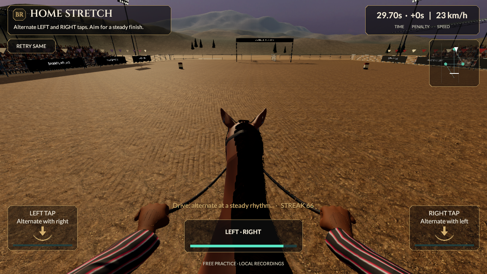
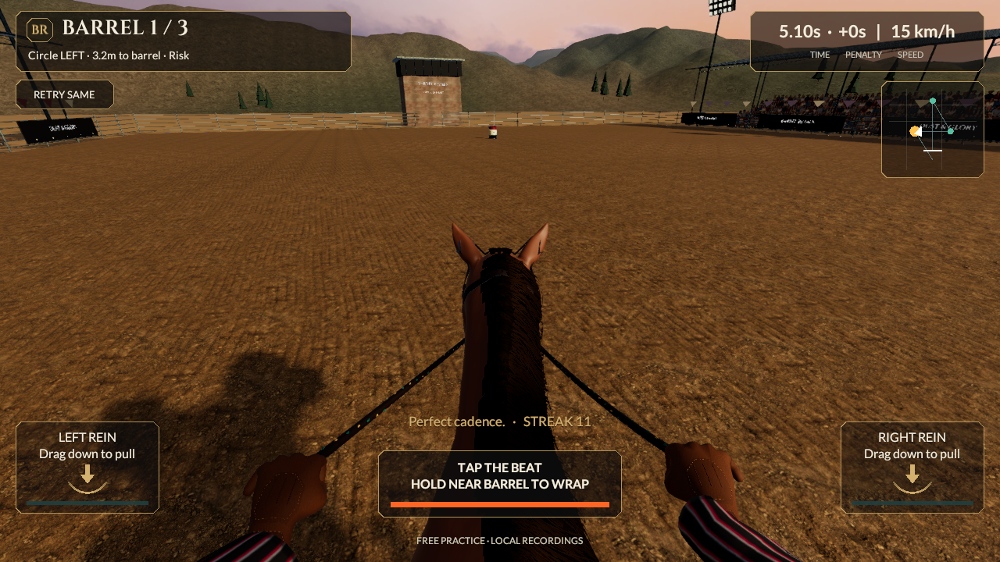

# Full-course horse integration review

The subsequent [matching stable review](Reins-Horse-Stable-Integration.md) now pairs this scene with the new horse in MyStable; the earlier results and limits below retain their own checkpoint.

September 21, 2026. Continues `07ee684cbc455553cd470c6ad6f7ce3e47e899bb`. Source remains **0.5.0/build 5, reins-v2**. The replacement horse now runs through the real arena/controller in a separate saved development scene. It has not replaced the normal racing or MyStable character, and no mobile build or installation occurred.

## Connected gameplay

`HeroHorseRaceBuilder` copies the actual saved race and inserts the existing explicit 39-bone horse, fitted rider/tack and five-gait controller. It retains the real Core/input/HUD/footing/result components and actor root. The separate scene is `Assets/_Project/Development/HeroHorse/HeroHorseRaceReview.unity`; it stays outside `EditorBuildSettings` and both mobile build scene lists.

`ReinsHorsePresentation.ConfigureRig` gives the alternative rig the same render interpolation boundary. Its own gait driver reads accepted speed; both hands read accepted rein pulls. The legacy horse continues using its existing parameter path. The candidate camera uses its measured neutral eye/support position, and follows skeletal displacement only as presentation. Reduced motion removes that displacement and speed FOV; retry resets the gait speed and view. The actual actor, contact, steering, timing, launch and replay rules remain authoritative and unchanged.

The imported Walk take is named `Scene`; the test identifies the actual FBX clip instead of renaming this preserved asset. The saved horse-only neutral clip avoids confusing the separate horse/rider bones both named `Root`. A serialized rider-camera component makes the new camera settings survive reopening. A full-route capture exposed hands dipping below the screen under a strong pull; the development view now uses a 25-degree pitch with 72-degree base FOV.

Personal ghosts retain the explicit rig, speed driver, floor correction and attachment components, with independent transforms and private rein meshes. Fiber shader recognition preserves both horse hair masks even though the new renderer uses a different name. Existing private ghost material ownership remains responsible for cleanup, including never-shown ghosts.

All 20 current local styles/five slots bind to the fitted saddle, pad, both reins, headstall and both gloves. A live test equips them through the existing MyStable controller, loads the development race with the saved choices, and checks their actual material targets. Rendering other styles does not write the profile or advance the race. This does not add ownership, levels, bonuses or a new roster.

## Verification

**Nine focused Play Mode tests pass, zero skipped.** The three new tests cover the complete candidate race, independently moving ghost/resource cleanup, and all 20 styles through the existing MyStable equip flow. Six existing camera/ghost/locomotion/attachment regressions also pass.

- Canonical result: **33,860 ms**, zero knocks, 300 style points, unchanged v2 fingerprint; all five actual gait clips appeared.
- Maximum measured actor deviation from Core: **0 m**. Maximum rider target error: **0.00501 mm**. Minimum corrected sampled hoof height: **3.997 mm** above the flat model floor. These are sampled constraints, not natural motion or world-foot-planting acceptance.
- Across the full race and additional comfort sample, both grip centers remain within viewport X **0.2082–0.7927**, minimum Y **0.0570**, and minimum camera depth **0.5282 m**. Retry returns to the measured ready view; comfort removes stride height variation.
- Ten actual stage images and **948 frames**, 1280×720, **37.92 seconds**, 25 encoded fps, silent. AVFoundation verified the timing/dimensions and decoded frames 0/947. The last 20 ms simulation interval occupies one 40 ms video frame.

[Focused Play Mode results](../../Evidence/HorseRace-PlayMode.xml) · [full-course measurements](../../Evidence/HorseRace-Full-Course.json) · [continuous actual Unity ride](../../Evidence/HorseRace-Full-Course.mp4) · [checkpoint](../../Evidence/HorseRace-Checkpoint.json).

The controlled recording steps the real v2 fixture, Animator, ground correction, rider/reins and camera together. Skin matrices are refreshed per capture and the previous flags restored. The actual uGUI overlay is captured after world grading. The movie is silent; encoded frame rate is not measured game FPS. Scheduled audio/input latency still needs phone testing.

All **767 prior evidence files remain byte-identical**. The normal player scenes, source FBX/actions, source photographs and existing native artifacts are preserved. No new full Editor, Core or HTTP-suite result is claimed. Last verified installed iPhone remains **0.4.0/build 4**.

## Remaining gates and continuation

This closes an integration gap between the isolated model and real racing, not the art-quality gap. The coat remains too smooth, mane/forelock edges are regular, clothing is simplified, and the arena is below the references. Natural tight-turn, braking, canter/contact and Wrap actions, world-space stance locking and authored rider effort remain unfinished. The forward-facing camera also loses the active barrel during parts of tight circles; revisit rider look/turn framing without changing steering authority. Keeping grips in the viewport does not establish full course visibility or comfort. Flat-floor correction prevents sampled penetration but cannot establish planted feet in world motion.

The character remains over the 60k-triangle/six-material target and has no qualified lower LODs. The previously recorded 0.364 mm animated import discrepancy still exceeds the unchanged 0.2 mm source-fidelity target. No photographic, device performance, R2 or full-section acceptance is implied by the focused tests.

Next carry this explicit rig into a matching MyStable review with properly refitted animated stowed reins and actual thumbnails; reduce geometry/material cost and add LODs; improve natural turn/brake/Wrap movement and visible character detail. Then promote a reviewed shared character into player racing/stable/ghosts with a new build identity, fresh native builds and actual phone qualification. Preserve all eight categories/53 sections and the later multiplayer, progression/economy and release requirements.

## Reproduce

Use Unity 6000.6.0f1, one Editor per project. Run `BarrelRivals.Editor.HeroHorseRaceBuilder.Build` or **Barrel Rivals → Development → Build full-course horse review**. This does not regenerate or overwrite either normal player scene or the separate benchmark. Open the saved review scene and press Play to use the same Reins controls.

Run `BarrelRivals.Tests.HeroHorseRaceTests` in Play Mode. `BARREL_HORSE_RACE_OUTPUT` selects a fresh private capture directory; `BARREL_HORSE_RACE_MOVIE=1` enables the continuous frame sequence. Keep raw editor/signing logs and capture intermediates private. Retain [the CC-BY horse attribution](../../ArtSource/HorseStudy/ATTRIBUTION.md) and existing rider/project-art credits; no paid or reference-image assets were introduced.
