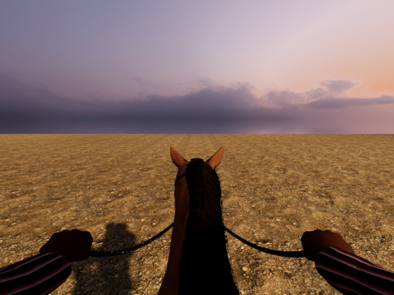

# Reins — candidate rider, bridle and reins fit

September 21, 2026. The [isolated Unity horse benchmark](Reins-Horse-Unity-Benchmark.md) now includes the existing credited skinned rider, connected gloves, a newly fitted western headstall and flexible reins. The rider follows the measured saddle, grips and stirrup anchors. **This remains a development scene, excluded from the player build.** Racing, MyStable/gear inventory, ghosts and both verified 0.5 mobile artifacts still use their existing character.

[Moving quarter/riding review](../../Evidence/HorseRider-Motion.mp4) · [side](../../Evidence/HorseRider-Side.png) · [headstall](../../Evidence/HorseRider-Head.png) · [horse in existing showroom](../../Evidence/HorseRider-StableFit.png).

## Connected implementation

`HeroHorseBridleBuilder` fits original headstall construction to the explicit candidate skin and both actual eye surfaces. Crown/brow/cheek straps, stitches, rings, buckles and mouth-side anchors are measured in neutral model metres and follow the Head role. It retains the original project leather/hardware materials. The old horse's named-bone path remains intact.

The saddle fitter maps the earlier rider seat and ankle locations through the same old-to-new body-surface fit used by the tack. `HeroHorseRiderBuilder` reuses the existing CC0 rider and connected glove assets. The new leg poles bend the knees forward instead of far outward. Actual boot sole/tread samples then correct approximately 6.2 mm of initial overlap on each side. This is contact fitting, not an authored riding animation.

`HeroHorseAttachments` poses the hands through the full inherited support transform, solves the existing rider against explicit targets, and deforms private rein mesh instances from each actual grip to its animated bit. The shared tube writer and speed-driven rider-solver entry avoid a duplicate deformation implementation. Existing production callers still read their original `ReinsHorsePresentation`; the candidate needs no fake simulation component. On destruction, each rein filter returns to its persistent source mesh and its private instance is released. The adapter does not change Core, inputs, movement, contacts, timing, cosmetics or rewards.

The development camera now sits behind the grips with a 72-degree first-person field of view, retaining the support-based/reduced-motion position policy. Switching back restores the saved inspection position, rotation and field of view. Rider head surfaces remain shadows-only in first person and visible in inspection.

The first live test exposed a real discrepancy: manual captures used FOV 72, but the live view switch retained the inspection FOV 43 and clipped the grips. That was fixed in `HeroHorseBenchmarkPlayback`; the final live test checks both grips remain in view and verifies the return to inspection. Static images alone would not have established that behavior.

## Verification and limits

- **7/7 focused Play Mode tests passed, zero skipped.** The new live adapter test covers moving grip/bit endpoints, seat/reach, fixed actor root, camera framing/switch restoration, head visibility, persistent-mesh preservation and private-mesh disposal. The previous live benchmark test covers hidden-bone animation and reduced motion. Existing rider/gait/ghost and camera/controls/replay regressions also pass. This is a focused run, not a new full-suite result. [Results](../../Evidence/HorseRider-PlayMode.xml), [existing rider regression measurements](../../Evidence/HorseRider-ExistingRiderRegression.json).
- **84 controlled walk/pull combinations** sample 28 animation times and three opposing rein-pull pairs. Maximum measured reach, seat, rein-endpoint and boot-tread errors are each below 0.001 mm in this set. These numerical alignments do not prove collision-free limbs, natural motion or contact in unimplemented gaits. [Actual attachment measurements and geometry rows](../../Evidence/HorseRider-Attachments.json).
- Neutral surface/color and opaque-mask checks remain passing, with zero active shader errors. The prior **seven-pose Unity–Blender body discrepancy remains open: 0.364 mm versus the retained 0.2 mm target**. It is explicitly false in the report, its cause is not isolated, and no wider target was substituted. [Review](../../Evidence/HorseRider-Review.json).
- The silent moving review contains 56 unique Unity-rendered frames repeated to 224 frames: 800×600, 30 encoded fps, 7.467 seconds. It uses explicit animation sampling/attachment solving, a static floor, HDR/grade/FXAA and 2× MSAA. Native AVFoundation decodes both view boundaries and verifies timing. This is not measured gameplay or phone performance. [Capture](../../Evidence/HorseRider-Capture.json), [video check](../../Evidence/HorseRider-Video.json).
- The stable image is an **unsaved neutral fitting inspection** in the existing showroom, with UI hidden and the original horse temporarily hidden. The rider/hands are hidden, and temporary stowed reins are surface-fitted to the neutral horse. It does not update the stable inventory, thumbnails, equip bindings or saved scene, and it does not establish animated stowed-rein behavior.

The candidate now totals **92,402 triangles, 20 renderers and 25 material slots** before LODs, versus the 60k/six-slot targets. This is above the currently integrated character's 78,614 triangles/26 slots. Do not adopt it without reducing cost and measuring the result on devices. Its horse coat, hair roots/card edges, hat silhouette, clothing and simplified walking posture still fall short of the photographic references. There is no new idle/gallop/turn/brake/Wrap or authored rider-effort sequence in this increment.

All **624 previous evidence files remain unchanged**. Core/contracts/replay, player scenes, original art/material assets and project settings remain unchanged. A floating-point material reserialization from the regression run and Unity's automatic iOS API flag change were restored to their original bytes. No new native build or phone installation occurred; the last verified installed iPhone app remains 0.4.0/build 4. [Checkpoint](../../Evidence/HorseRider-Checkpoint.json).

## Source and reproduction

Carry the [b2przemo CC-BY horse credit](../../ArtSource/HorseStudy/ATTRIBUTION.md), [horse provenance](../../ArtSource/HorseStudy/PROVENANCE.json), and [existing rider CC0 source/modification record](../../Assets/_Project/Art/Reins/Rider/README.md). The [connected gloves](Reins-Glove-Anatomy-Checkpoint.md) retain their CC0-derived hand provenance; headstall/rein/saddle construction and hair atlases are original project work. No new bitmap, paid asset, account service, reference-image pixels or sponsor art was added.

Open **Barrel Rivals → Development → Open fitted horse benchmark** in Unity 6000.6.0f1. Play, then toggle the horse root's `HeroHorseBenchmarkPlayback.riderView` or `reducedMotion`. The adapter's left/right pull sliders are inspection inputs only.

Use `HeroHorseBenchmarkBuilder.Build` to rebuild the saved development scene and `HeroHorseBenchmarkBuilder.CaptureAttachments` for the measured review and temporary stable fit. Set `BARREL_HORSE_BENCHMARK_OUTPUT` to a fresh scratch folder. The latter method deliberately ends in an unsaved showroom inspection; never save it over MyStable. The existing `encode_unity_benchmark.py` and `verify_video.swift` create/verify the movie. Only one Unity Editor may use this project at a time.

## Next work

Improve the visible coat/groom/rider details and author the missing natural locomotion and rider actions, then reduce topology/material cost and add LODs. The measured import discrepancy remains explicit. Before replacing runtime content, connect the presentation to accepted Core speed/turn, stable cosmetic IDs and ghost lifetime/visibility without changing race rules, and review the complete moving race and stable flows. A later player replacement needs a new build identity, native builds and device comfort/performance checks. R2, the photographic reference, progression, multiplayer and release remain open; all eight categories and 53 section IDs remain intact.
