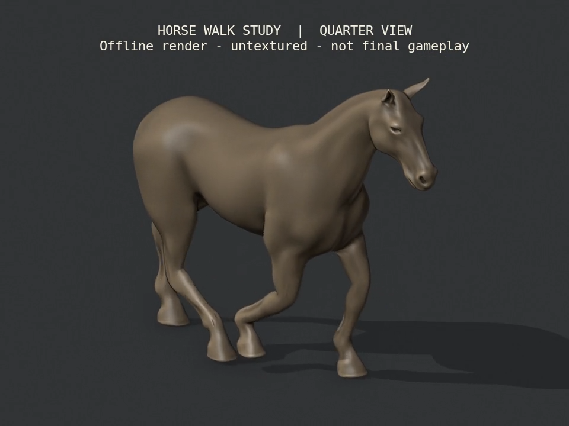

# Reins — alternative horse rig and walk study

September 20, 2026. **Offline art progress for S10/S12; no runtime replacement or photographic acceptance.** The existing race/MyStable content, rules, controls and verified 0.5 mobile packages are unchanged. R2 is open.

The earlier isolated b2przemo horse comparison now has an original fitted skeleton, continuous skin weights and an editable walk cycle. Its slimmer body and more defined head are useful for the requested realistic direction, but the rendered study still has visible shoulder/groin deformation and a crouched walk. Do not promote it based on contact metrics alone.

## Delivered source

[Editable asset and rebuild instructions](../../ArtSource/HorseStudy/README.md) · [credit and license](../../ArtSource/HorseStudy/ATTRIBUTION.md) · [pinned provenance](../../ArtSource/HorseStudy/PROVENANCE.json).

The body is **Horse by b2przemo, CC-BY 3.0**, reduced from the inspected public mirror to 19,502 vertices / 39,000 triangles. This is a different source from the runtime CC0 horse. The mirror contains an existing UV layer but no maps, rig or animation. The original listing's mention of textures does not establish that we have them.

The new skeleton has 34 bones including one non-deforming root, separate shoulder/upper-leg/cannon/pastern/hoof controls, neck/head/jaw/ears and a tail base. At most four normalized influences affect a vertex. Continuous side/trunk masks prevent opposite legs pulling the same skin, and continuous coronet weights blend into rigid hoof soles. The original 19-bone motion clips were not blindly transferred.

The original walk uses offline rotation-only IK, independent hoof/pastern orientation and a fixed object root. Its 32 frames at 30 fps describe a 1.067-second cycle at a reference speed of 1.5 m/s, with 62% stance and a 130 mm swing lift. The visual skeletal root compresses by 114–126 mm; Core movement is untouched. There is no toe roll-over or production weight-transfer animation yet.

[Side and quarter walk movie](../../Evidence/HorseRigStudy-Walk.mp4): four repetitions per view, 8.534 seconds, silent. This is a Blender diagnostic at authored 30 fps, not actual Unity or device performance. The movie uses the initial build; a canonical-data comparison verifies that the portable rebuild has identical geometry, UVs/normals, weights, hierarchy and animation key data.

## Verification and observed limits

| Check | Observed result |
|---|---|
| Rig/deformation probes | Six poses measured; no unweighted vertices, maximum four influences, normalized sums |
| Weight refinement | Fore-fold worst edge ratio 3.216 → 2.765; hind-fold 4.423 → 2.817; turning 1.471 → 1.189. These are improvements, not an acceptance threshold. |
| Walk authoring | 129 poses; zero reach clamping or scale animation; maximum unintended non-root bone translation 0.000255 mm |
| FBX reimport | 257 samples including times between authored keys; 19,502 vertices / 39,000 triangles / 34 bones preserved |
| Neutral import fidelity | Maximum position error 0.000596 mm; named weights and UV corner values unchanged; maximum corner-normal vector difference 2.74e-7 |
| Animated import fidelity | Maximum skinned position difference 0.001762 mm; loop endpoints coincide |
| Hoof stance after import | Maximum reference-speed residual travel 0.071 mm; minimum animated sole height 3.902 mm; maximum rigid sole-plane error 0.000455 mm |
| Review video | AVFoundation verified 960×720 / 30 fps / no audio and decoded six exact-time frames; inspected decoded quarter view |
| Portable rebuild | Mesh/topology/UV/normals, named weights, rest hierarchy/matrices and animation key data match the rendered build exactly |

Evidence: [rig](../../Evidence/HorseRigStudy-Rig.json), [walk](../../Evidence/HorseRigStudy-Walk.json), [independent FBX check](../../Evidence/HorseRigStudy-Roundtrip.json), [rebuild comparison](../../Evidence/HorseRigStudy-Rebuild.json), [video](../../Evidence/HorseRigStudy-Video.json), [checkpoint](../../Evidence/HorseRigStudy-Checkpoint.json).

The first weight pass had abrupt region changes and opposite-leg borrowing. Revised masks and continuous four-weight reduction reduced those defects. The initial FBX comparison failed because Blender's default importer adds one frame; the verifier now explicitly uses `anim_offset=0` and retains its strict position thresholds. No gameplay or export timing was shifted to conceal the failure.

The final walk still reaches a **3.011 worst edge-length ratio**, with visible creases/stretching around the shoulder and groin. The Reach stress pose also penetrates the floor; it is an unconstrained deformation probe, not a planted locomotion clip. The controlled walk keeps the checked body above ground, but this does not prove every self-intersection, a natural gait, transitions, or arbitrary-speed contact. The forelegs look crouched and body weight transfer remains limited. Eyes, coat maps, hair, tack and rider are absent from this study.

The body alone adds **9,436 triangles** compared with the current 29,564-triangle body. The existing complete character is already 78,614 triangles / 26 slots against 60k / six-slot targets. This candidate therefore needs deliberate topology/LOD and material work before mobile adoption. Current Unity/native counts remain unchanged because this source lives outside Assets.

## Next connected increment

1. Refine shoulder/groin topology and weights, walking posture, body weight transfer and hoof roll-over; review side, quarter and rider-height movement. Retain the independent export/contact checks without treating them as artistic acceptance.
2. Author the eyes and coat treatment, then the remaining idle/gallop/turn/brake/Wrap motions. Fit mane, bridle, saddle and rider to this actual anatomy; resolve the triangle/material budget before expanding content.
3. Add explicit semantic bone bindings for the new hierarchy. Update `ReinsHorseSurface`, hair/tack/rider/camera attachments and ghost handling together; preserve Core authority, reduced motion and always-updating animation. Do not fake compatibility by renaming bones.
4. Review moving Unity racing and MyStable views, persisted scene bindings and phone performance. A later native art build must have a new identity; preserve both verified 0.5/build 5 packages and historical evidence.

No Unity code/assets/packages/settings changed, so the earlier 140 Editor / 37 Play Mode results remain historical; no new Unity test run is claimed. All 559 pre-existing tracked evidence files remain unchanged. No purchase, paid service, multiplayer implementation, new progression or release acceptance occurred.
