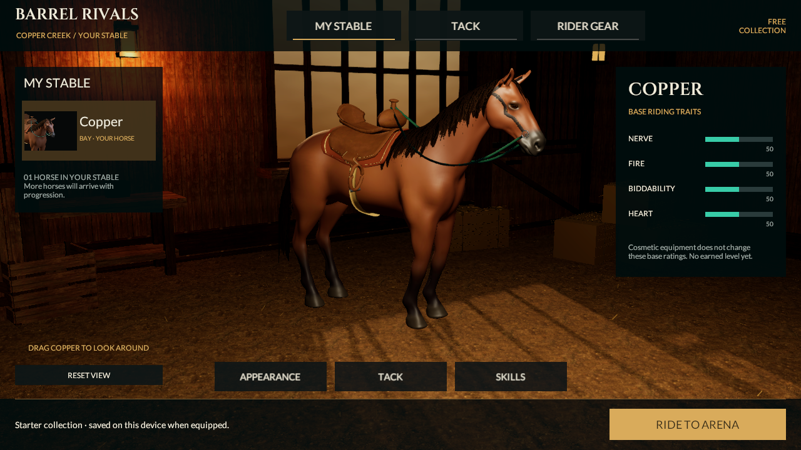
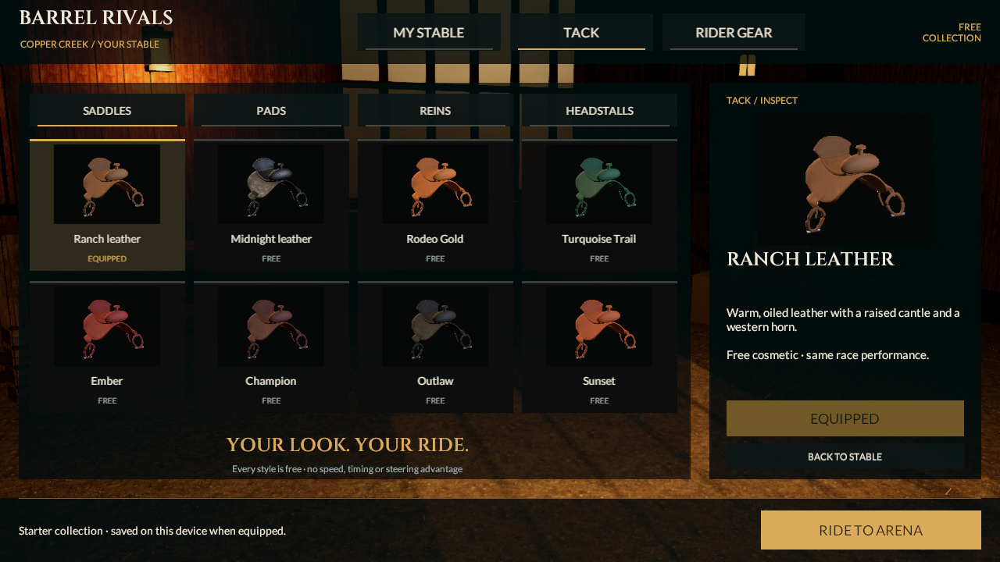
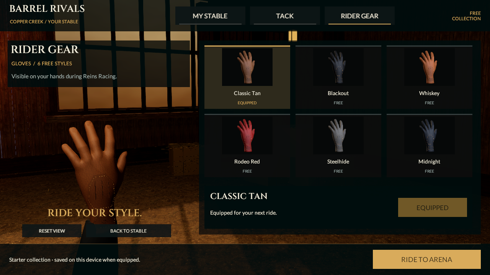

# Matching horse and stable review

September 21, 2026. Continues `bb7feaba91adaad8d0f8698fdf019d5c38aa7049`. The explicit 39-bone replacement now has a saved MyStable review paired with its existing full-course racing review. Both scenes remain development-only. Source stays **0.5.0/build 5, reins-v2**; no mobile build or installation occurred.

## Connected presentation

`HeroHorseStableBuilder` clones the actual saved MyStable environment, UI and controller, inserts the fitted candidate horse, removes the racing rider/hands, and binds the same saddle, pad, reins and headstall choices. The existing separate glove inspector and six glove styles remain. All twenty local styles/five slots retain their IDs, explicit equip/save and preview cancellation behavior. One horse is available; this adds no levels, rarity, stat bonuses, ownership or progression.

The resting reins are newly fitted around the actual neutral neck surface from saddle horn to bit. Each cord contains 41 rings of 12 vertices and 960 triangles, retaining the existing dyed material slot. Four-weight body binding follows the idle rig; horn and bit endpoints remain exact. Each live drape owns and releases its private mesh, without runtime colliders or changes to the authoritative horse root.

The camera frames actual visible geometry in the central UI opening. Twenty gear thumbnails and the horse portrait are real Unity renders of the candidate's equipped meshes. The portrait uses the actual eye surface rather than the lower neck-joint origin. Thumbnails have their own development folder; production thumbnails remain unchanged. The warm barn, glove inspector and existing materials are retained, not new photographic-quality assets.

**RIDE TO ARENA** opens the matching full-course candidate, and **MY STABLE** returns after a ready/completed/cancelled attempt. An editor-only serialized route connects the excluded scenes; normal player navigation and both mobile scene lists stay unchanged. Active attempts cannot be interrupted by gear navigation. Race appearance uses the equipped profile, discards unequipped previews, and remains frozen during the run.

## Verification

**Nine focused Play Mode tests pass, zero skipped:** three new stable checks, three existing full-course candidate/ghost/all-style checks, and three existing production stable/gear regressions. Generation saved and reopened both candidate scenes. Actual UI-button navigation and a fresh profile-store reload retain equipped pad/reins/headstall/gloves; preview cancellation remains separate from equip. All 21 unique thumbnail references point to the matching candidate folder. The canonical race remains **33,860 ms**, zero knocks and 300 style points; rules and fingerprint are unchanged.

Across 48 sampled Idle poses and 1,728 body cross-section checks, minimum centerline clearance is **28.99 mm** with a **9 mm** rein radius; maximum measured endpoint error is **0.000281 mm**. The reins visibly deform, reuse private buffers on tab changes, and release independent cloned buffers on destruction. These are sampled constraints, not full continuous collision or natural-animation acceptance.

Actual 1280×720 and 1024×768 captures verify body framing between panels. The retained character is **65,288 triangles, 12 renderers and 17 material slots**, without a rider. It already exceeds the entire character's 60k/six-slot budget; no LOD or optimization acceptance is claimed. The scene retains three lights.

The four-second silent idle recording contains **120 actual Unity frames at 960×540**, sampled and encoded at 30 Hz. Skin matrices refresh per capture. Native AVFoundation verifies dimensions/timing and decodes frames 0 and 119. Encoded frame rate is not measured gameplay FPS.

[Play Mode results](../../Evidence/HorseStable-PlayMode.xml) · [rein measurements](../../Evidence/HorseStable-Drape.json) · [showroom measurements](../../Evidence/HorseStable-Showcase.json) · [actual idle recording](../../Evidence/HorseStable-Idle.mp4) · [checkpoint and hashes](../../Evidence/HorseStable-Checkpoint.json).

All **783 historical evidence files remain byte-identical**. The original player scenes, build settings, Core/contracts, source FBX/actions, production thumbnails and native artifacts are preserved. Test captures that reused historical filenames were restored from their verified Git bytes. No fresh full Editor/Core/HTTP-suite or device result is claimed. Last verified installed iPhone remains **0.4.0/build 4**.

## Quality gates and next work

This connects the newer horse across development racing, stable and gear; it does not reach the supplied image's realism. The coat is too smooth, mane edges too regular, and saddle/glove surfaces lack the reference's construction detail. Barn lighting and texture depth also remain below that target. The reference's extra horses, earned levels, broader apparel and progression are still future systems.

Prior gates remain open: the active barrel can leave the first-person view during tight turns; natural turn/brake/canter/contact/Wrap actions and world-space foot planting are unfinished; the retained 0.2 mm animated-source target still fails at 0.364 mm; character rendering/material budgets and LODs need work. Neither photographic, R2, device-performance nor full-section acceptance follows from these tests.

Next improve the visible moving horse/tack/rider and turn framing, reduce rendering cost and add LODs, then promote a reviewed shared character into player scenes with a distinct build identity, fresh native artifacts and actual phone qualification. Keep all eight categories/53 requirements and subsequent multiplayer, trusted progression/economy and release work.

## Reproduce

Use one Unity 6000.6.0f1 Editor. Run `BarrelRivals.Editor.HeroHorseStableBuilder.Build`, or **Barrel Rivals → Development → Build matching horse stable review**. This rebuilds both excluded review scenes. Open `Assets/_Project/Development/HeroHorse/Stable/HeroHorseStableReview.unity` and press Play. Existing production scene generation remains available separately.

Run `HeroHorseStableTests`, `HeroHorseRaceTests` and `StableFlowTests` in Play Mode. Set `BARREL_HERO_STABLE_OUTPUT` to a fresh private directory to produce real views and the 120-frame sequence. Preserve historical Evidence bytes before legacy capture tests. Keep raw logs, intermediate frames and native/signing files private. Existing [horse attribution](../../ArtSource/HorseStudy/ATTRIBUTION.md), rider and original-art credits remain; no purchases, new outside assets or reference-image pixels are introduced.
