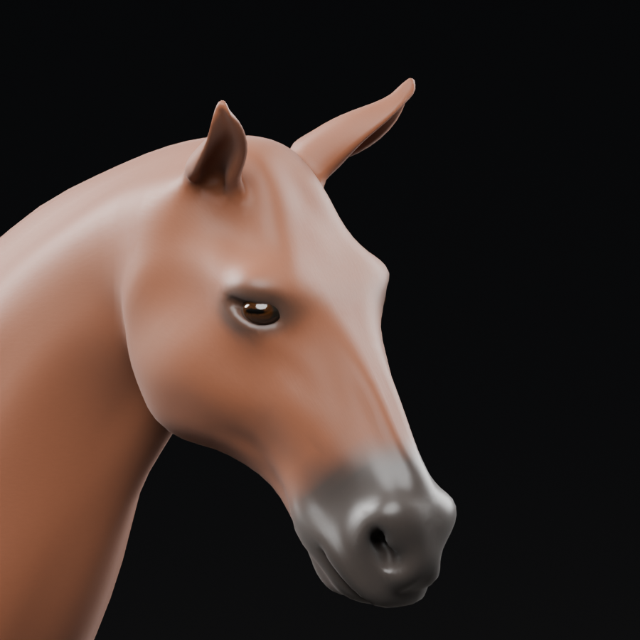

# Reins — horse face and coat study

September 20–21, 2026. This is an editable **offline art candidate**, continuing the [movement refinement](Reins-Horse-Motion-Refinement.md). It does not change the horse equipped in Unity, MyStable, either verified 0.5 mobile package or the last installed iPhone build. Reference-quality appearance and R2 remain unfinished.

## Added art

The existing eye cavities now contain two original fitted, closed globes. Dark brown irises, horizontal pupils, a darker outer iris ring and reflective corneal shading make the eyes readable inside the original eyelids. Both globes share one material and follow the existing Head bone. They add 1,444 vertices / 2,880 triangles; this candidate now totals 41,880 triangles and two material slots before hair, tack or a rider. This is not yet a blinking/looking eye rig.

An original bay-colored surface adds warm body variation, darker lower legs, muzzle and eyelid margins, with separate hoof coloring. The coat uses restrained UV-space grain, short relief and roughness variation. Bare muzzle/hoof regions suppress hair relief and use a smoother finish. The first review was excessively glossy with conspicuous amber eyes; specular response and iris brightness were reduced before the recorded revision. The result is still smooth and simplified compared with the photographic reference, especially without hair, finer skin detail and tack.

This is an actual Blender render of the saved mesh/materials, not an in-game screenshot or substitute target image. [Moving quarter/rider review](../../Evidence/HorseSurface-Motion.mp4) shows four repeated cycles per view at authored 30 fps, 800×600, 7.467 seconds, without audio. It uses a static diagnostic floor; it is not a measured game performance capture. Native AVFoundation decoded frames 0/111/112/223 across both view boundaries. [Capture settings](../../Evidence/HorseSurface-Capture.json) and [video verification](../../Evidence/HorseSurface-Video.json) record the exact scope. The initial EEVEE attempt stalled in Metal shadow-buffer readback; it was diagnosed and explicitly stopped before completing these renders with Cycles CPU. [Warm head](../../Evidence/HorseSurface-HeadWarm.png), [side](../../Evidence/HorseSurface-Side.png), and [body](../../Evidence/HorseSurface-Body.png) review the same candidate. Warm and neutral studio lights are diagnostic; they are not the game's lighting configuration.

No bitmap textures, new third-party assets, reference pixels or sponsor artwork were introduced. The attributed b2przemo base and all earlier source candidates remain intact. [Source attribution](../../ArtSource/HorseStudy/ATTRIBUTION.md) and [provenance](../../ArtSource/HorseStudy/PROVENANCE.json) accompany the derivative.

## Portable material contract

`HeroHorse-SurfaceStudy.blend` contains the original procedural Blender materials and existing walk; `.fbx` carries the geometry, skinning, animation and vertex-color data. FBX does **not** transfer these shader graphs into Unity.

- `CoatColor.rgb`: linear, unlit base reflectance. `CoatColor.a`: bare-surface mask, **not transparency**. The coat is opaque; do not multiply alpha into opacity in a future Unity material.
- `EyeColor.rgb`: dark outer eye, iris and pupil reflectance. Eyes are opaque with a separate smooth specular response.
- Existing body UVs and normals are unchanged. Fine coat relief uses those UVs. Its direction/seams and silhouette need further close-up review before adoption; this is not a completed fur treatment.
- Two material slots cover body and eyes. Fit/reduce hair, tack and rider with the total character budget in mind. The current runtime character's excessive material/triangle counts have not been fixed by this offline work.

An explicit URP equivalent or reviewed baked-map workflow is required. Keep that conversion outside the shipping character until the moving result, attachment fitting and device budget are checked. Do not silently let Unity's generic FBX material conversion stand in for the authored coat.

## Verification

A clean rebuild through the portable repository tool reproduces identical surface mesh/color/skin data and shader nodes, values and links. The saved body mesh, topology, UVs, normals, skin weights, rest hierarchy and walk keys are canonically identical to the prior movement candidate. Existing independent contact/export checks pass all 225 samples, including between-key times: maximum body position difference 0.001774 mm and corrected stance contact travel below 0.032 mm.

New checks inspect the actual eye topology: two closed outward-facing components, no open/nonmanifold edges or zero-area faces, finite color data, and normalized single-bone Head skinning. Across 113 poses, maximum eye/head attachment discrepancy is below 0.00034 mm and loop endpoints coincide. Independent FBX reimport preserves linear vertex colors exactly and eye motion within 0.0013 mm. The initial pole-welding approach produced nonmanifold eye edges; explicit single-vertex poles replaced it, and the unchanged topology check passes.

[Surface rebuild](../../Evidence/HorseSurface-Rebuild.json), [surface checks](../../Evidence/HorseSurface-Verification.json), [body preservation](../../Evidence/HorseSurface-BodyPreservation.json), [independent body roundtrip](../../Evidence/HorseSurface-BodyRoundtrip.json), [authoring record](../../Evidence/HorseSurface-Authoring.json), [checkpoint](../../Evidence/HorseSurface-Checkpoint.json).

All 581 prior evidence files remain unchanged. No Unity source, Core rules, input, replay, save data or mobile build changed; previous 140 Editor / 37 Play Mode results remain historical. These offline checks establish artifact integrity and motion preservation, not photographic quality, production biomechanics or phone performance.

## Next integration work

Refine coat/skin detail and remaining shoulder/hip deformation; fit a mane, forelock and tail to this anatomy. Fit tack and rider, author the missing gaits/turns/braking/Wrap, and add explicit bone-role adapters for the different 34-bone hierarchy. Convert the coat/eye materials deliberately into URP, review first-person and MyStable motion, produce suitable LODs and measure the combined character on device. Preserve both verified 0.5 artifacts; a subsequent runtime replacement needs a new build identity.

The current source was inspected for concrete integration points. These are pending changes, not implemented adapters:

| Current consumer | Required deliberate change |
|---|---|
| `ReinsReferenceArtBuilder.BuildCharacter` | Replace the legacy mesh-name material selection and fixed 180-degree art rotation with explicit body/eye bindings and a measured forward-axis check. Author a neutral Idle and the missing gaits; the current importer requires Idle and the existing controller references the old clips. |
| `ReinsHorseSurface` | Accept the explicitly bound `HeroHorseBody` instead of a `HorseBody` prefix. Sample the actual neutral pose in model-local metres; preserve scale compensation and measured bounds. |
| `ReinsHorsePresentation.Configure` / `TorsoMotion` | Replace the `Bone` name and local-translation-only assumption. The new study translates its non-deforming Root and rotates torso bones; copying the old local-position delta would miss inherited motion. Derive presentation offsets from neutral and animated transforms without moving Core's race root. |
| `StableTackBuilder` | Replace the exact `Bone` dependency with an explicit saddle-support role, then refit the pad, saddle and horn against this back. |
| `ReinsHairBuilder` | Bind `TailBase`/`TailTip` semantically instead of `Bone.003`/`Bone.004`, and measure new mane/forelock/dock roots. Their anatomical locations are not interchangeable just because names are mapped. |
| `ReinsRiderTackBuilder` / `ReinsRiderBodyBuilder` | Bind the new Head and body renderer explicitly, refit the bridle and both grip/seat/boot landmarks, and rerun rider, ghost, hair and reduced-motion checks. |

The new body's name also prevents the legacy `HorseEye` material branch from identifying `HeroHorseEyes`. Simply swapping the FBX path would therefore produce several incorrect bindings even before visual-quality review.

This advances art work within S10/S12/S13 and the shared racing/stable visual target. It does not complete those cards, the ten-horse roster, upgrades, progression, multiplayer, cloud saves or store release. All eight categories and 53 section IDs remain in scope.
