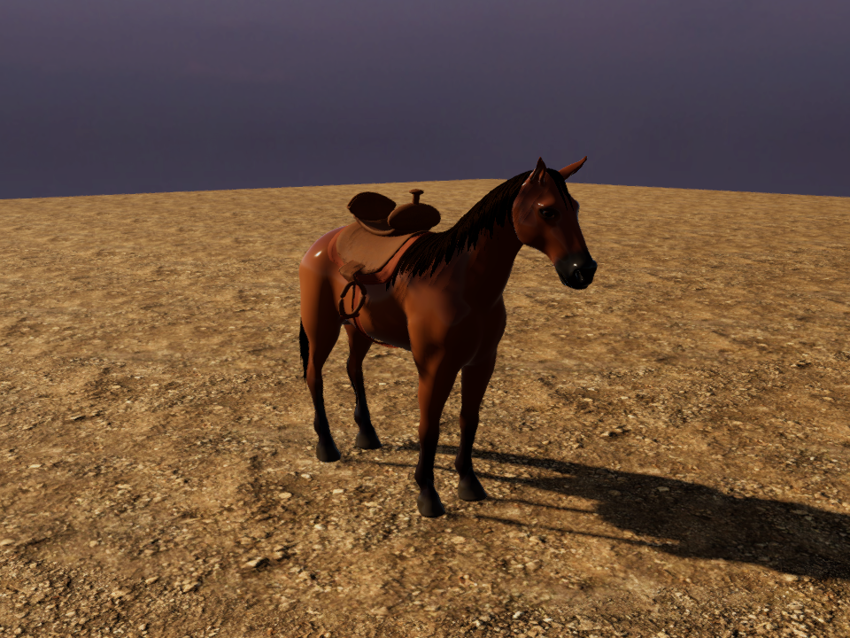

# Reins — isolated Unity horse and saddle benchmark

September 21, 2026. The fitted horse now runs in a saved Unity development scene, with deliberate URP materials, explicit rig roles, refitted original western tack and a rider-view camera. It is **not the horse used by the racing, MyStable or ghost scenes**, and is excluded from the player scene list. This advances S10/S12/S13/S23/S43 without completing their acceptance gates.

[Moving Unity quarter/rider review](../../Evidence/HorseUnity-Motion.mp4) · [head close-up](../../Evidence/HorseUnity-Head.png) · [rider view](../../Evidence/HorseUnity-Rider.png).

The review still shows a smooth coat, regular hair edges and simplified walking deformation. It does not yet reach the supplied photographic racing or warm stable reference. The bridle, reins, rider and hands have not been fitted to this candidate. These are real development-scene renders, not a target mockup or a new phone build.

## What changed

`Assets/_Project/Development/HeroHorse/HeroHorseBenchmark.unity` references an unchanged copy of the [groom FBX](Reins-Horse-Groom-Study.md), a new constant neutral fitting clip and its imported 28-frame walk. The neutral clip holds a fitting pose; it is not an authored natural idle.

`HorseRigBindings` explicitly connects the model space, visual root, spine support, head, tail, body, eyes, groom and Animator. The imported art child turns 180 degrees to face game +Z. Unity's imported mesh handedness means canonical source coordinates after that turn are `(x,z,y)`; an additional X reflection is wrong. The FBX's initial sampled walk pose is compressed, so the builder restores actual skin bind matrices and the non-deforming root before fitting attachments. The saved support matrix therefore measures motion from a genuine neutral rest frame.

The support camera includes inherited root translation and ancestor rotations. The Animator always updates with root motion disabled; all three skins explicitly use four weights and update while offscreen. Reduced motion in this development component uses a fixed model-space camera point. It does not yet connect the production settings, gameplay adapter or ghost ownership.

`HeroHorseTackFitter` refits the four existing original pad, blanket/cinch, leather and hardware meshes. It samples both old and new neutral body surfaces and preserves the authored radial clearance while adjusting the longitudinal placement. The saved saddle follows the spine support; its horn has a named fitted anchor. This is a neutral geometry fit plus moving visual review, not a proof against every future rider/gait intersection.

## Materials and provenance

The new `Barrel Rivals/Horse Surface` shader handles opaque body and eyes. Linear vertex RGB supplies reflectance; alpha supplies the bare-surface mask and **never transparency**. Separate coat/eye materials set smoothness and reflectance. Small UV grain is suppressed above pixel frequency; forward, shadow, depth and depth-normal passes are included. This is an explicit Unity material conversion, not an automatic transfer of Blender shader graphs.

The existing fiber shader and the two original hair atlases remain byte-for-byte unchanged. The imported groom clone adds UV2 strand progress, and binds dense/separated cutout materials explicitly. No new bitmap or purchased asset was added. The development scene reuses the existing arena dirt, photographic dusk sky, premium pipeline and grade without editing those shared assets.

Horse anatomy derives from **Horse by b2przemo**, CC-BY-3.0. Keep [attribution](../../ArtSource/HorseStudy/ATTRIBUTION.md), [pinned provenance](../../ArtSource/HorseStudy/PROVENANCE.json), [original natural atlas provenance](Original-natural-hair-provenance.md) and [separated atlas provenance](Original-separated-hair-provenance.md). Existing original project tack remains credited as project work. The user's reference pixels and sponsor logos are not included.

## Measured checks, including the open result

- The independent Blender reference covers all 19,502 source body and 1,444 eye vertices. Unity creates 23,024 body vertices for imported seams. All source vertices are matched; maximum neutral body/eye deviations are approximately 0.00204/0.00166 mm. Vertex colors use UNorm8, with maximum linear channel deviation 0.001961, consistent with half an 8-bit step.
- **Animated source fidelity remains open.** Seven independently exported body poses yield maximum Unity–Blender difference **0.363931 mm**, exceeding the retained **0.2 mm target**. Explicit Bone4 rendering and lowering the importer minimum weight did not eliminate it. Imported blend weights are Float32; the cause has not been isolated. The report records `animatedReferenceTargetMet: false`. Capture now finishes diagnostically despite this open result; the target was not widened and no exact-motion acceptance is claimed. Preserve this issue when fitting the remaining attachments.
- An actual GPU quad check produces the same 16,384 foreground pixels with bare-mask alpha zero and one, verifying opaque coverage. Active coat/hair shader import/render checks report zero errors.
- One focused **live Play Mode** test passes, zero skipped: the saved Animator keeps visual bones moving with all three skins hidden, leaves the actor root fixed, and drives both inherited and reduced-motion camera positions. Earlier full-suite results are historical; no new full-suite run is claimed.
- The movie uses 56 actual Unity-rendered frames (28 per view), repeated four times per view: 800×600, 224 encoded frames, 30 fps, 7.467 seconds, silent. Frames sample the animation explicitly, using the active premium pipeline, HDR/grade, FXAA and a 2× MSAA render target. A static floor provides an inspection background. This does **not** measure real-time gameplay or phone FPS. Native AVFoundation verifies timing and decodes both view boundaries.

[Build record](../../Evidence/HorseUnity-Build.json) · [render/reference checks](../../Evidence/HorseUnity-Review.json) · [motion diagnostic](../../Evidence/HorseUnity-MotionDiagnostic.txt) · [Play Mode result](../../Evidence/HorseUnity-PlayMode.xml) · [live playback measurements](../../Evidence/HorseUnity-Playback.json) · [capture record](../../Evidence/HorseUnity-Capture.json) · [native movie verification](../../Evidence/HorseUnity-Video.json) · [checkpoint](../../Evidence/HorseUnity-Checkpoint.json).

Horse-only cost is **48,504 triangles/four slots/three renderers/39 bones**. The fitted saddle adds 11,360 triangles/four slots/four renderers, totaling **59,864 triangles/eight slots before bridle and rider**. It is already above the six-slot target and near the entire 60k-character target. [Geometry counts](../../Evidence/HorseUnity-GeometryBudget.json) are saved-mesh counts, not draw-call or device performance measurements. No LOD solution is included.

All **611 earlier evidence files remain unchanged**. The old horse/rider source, player scenes, Core/rules/input/replay, cosmetic IDs/saves, project settings and verified 0.5 mobile artifacts are unchanged. The last verified installed iPhone version remains 0.4.0/build 4; no phone installation occurred here.

## Reproduce

Open **Barrel Rivals → Development → Open fitted horse benchmark**. Play starts the walk. Select the horse root and enable `HeroHorseBenchmarkPlayback.riderView` for first person; `reducedMotion` fixes the camera. The rebuild menu prompts to save unsaved scene edits before replacing the open development scene.

For a batch rebuild, use Unity 6000.6.0f1 with `-batchmode -quit -projectPath <repo> -executeMethod BarrelRivals.Editor.HeroHorseBenchmarkBuilder.Build`. Then run `...ValidateAndCapture` with graphics enabled. Set `BARREL_HORSE_BENCHMARK_OUTPUT` to a new scratch directory; the default is `Temp/HorseBenchmarkReview`. Never overwrite historical evidence. Do not run concurrent Editors on the same project.

`Tools/Art/horse_study/export_unity_reference.py` exports the independent surface/color and seven-pose reference from the groom `.blend` through Blender with auto-execution disabled. It accepts the source blend and output directory after `--`; store the resulting pinned `UnitySurfaceReference.bytes/.json` under `ArtSource/HorseStudy`, outside Assets. `encode_unity_benchmark.py` takes the capture directory, and the existing `verify_video.swift` reads its `video-spec.json` to validate the encoded movie. The focused Unity test is `BarrelRivals.Tests.PlayMode.HeroHorseBenchmarkTests`.

## Next work

Fit the bridle, reins and existing skinned rider to this anatomy using the explicit roles, then review the real moving character from riding and stable cameras. Improve the visibly smooth coat, hair roots/card edges and limb deformation; the measured motion discrepancy remains an explicit import issue. Author walk-to-gallop, turn, brake and Wrap motions rather than expanding the roster. Reduce geometry/material cost and add LODs before replacing player/stable/ghost content. A later replacement needs independent integration, native and phone checks and a new build identity; keep both verified 0.5 packages intact.

R2, photographic quality, sustained device performance, multiplayer, trusted progression and release remain unfinished. All eight categories and 53 section IDs remain in scope.
