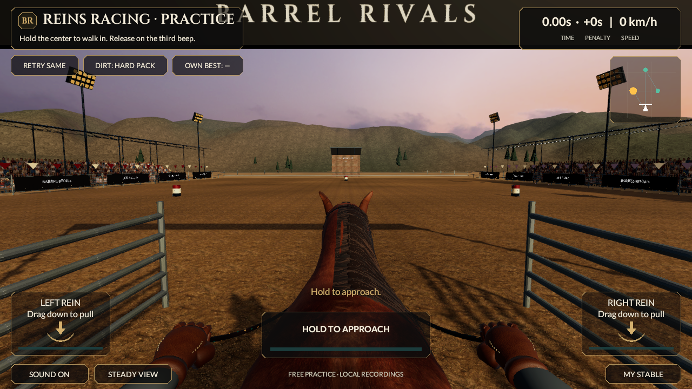
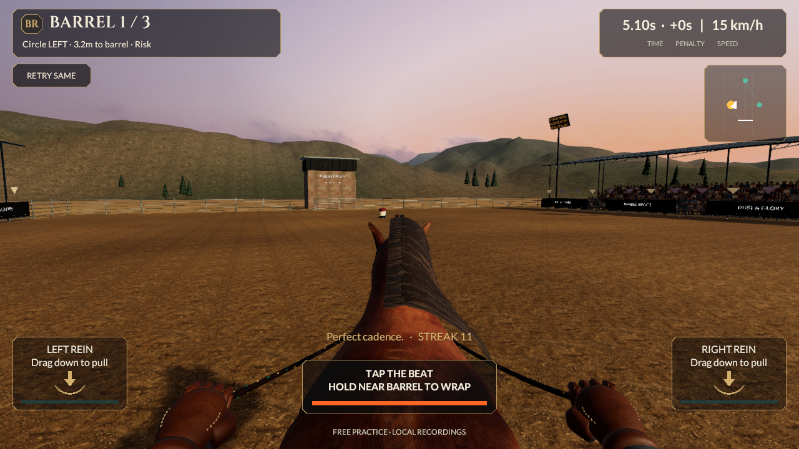

# Reins landscape checkpoint

September 20, 2026. Art-only continuation from `0b0395cd1d47f686c050022d10093bed1c2dba33`. Source remains **0.5.0/build 5, reins-v2**. Last installed phone app remains 0.4.0/build 4. This revision has no new native build, phone install, measured device performance or reference-quality acceptance.

## Connected change

The arena's continuous backdrop now uses actual USGS 3DEP elevation samples from Eagle Valley, Colorado. The source is scaled and blended around a clear venue apron; this is a fictional game landscape, not a geographically accurate location. [Source, license, exact hashes and offline reproduction](Elevation-Source.md) preserve the original Float32 GeoTIFF, acquisition request and numerical conversion tool. Scene generation reads the pinned local samples without a network request. The saved mesh renders without loading elevation data at runtime.

An original URP shader maps the existing reviewed CC0 rock texture across three world axes and soil across the horizontal plane. Slope/height and broad vertex variation blend their coverage. The final shader reduces orange source saturation and uses restrained mineral/sage tints; it does not alter source image bytes. Distant fog now starts at 180 m and ends at 1,400 m, with a cooler gray tint. Foreground arena lighting, controls, gameplay authority and timing are unchanged. The backdrop neither receives nor casts arena shadows, and adds no lights or colliders.

Saved terrain contains **12,336 vertices / 24,064 triangles**. Existing pine geometry contains **14,112 / 4,704** and is repositioned on the actual surface. Total: **26,448 vertices / 28,768 triangles, two renderers and three opaque material slots**. The terrain uses four albedo samples per shaded pixel, one sun and ambient lighting; no normal-map, additional-light or shadow variants. These are source budgets, not measured draw calls or GPU timings. No terrain LODs were added.

The horse, mane, tack, gloves and cosmetic system are unchanged from the [mane crown checkpoint](Reins-Mane-Flow-Checkpoint.md). MyStable remains one horse and 20 local styles with preview/equip/persistence; this revision does not add levels, rarity, stat bonuses or ownership. Regeneration-only stable/prefab object-ID changes were checked for equivalent serialized content and are restored to the baseline to avoid unrelated source churn. The race scene likewise preserves its baseline IDs after reference-normalized comparison with the tested generated graph; only the three intended fog values change in its serialized document.

## Verification

- Unity 6000.6.0f1 generated, saved and reopened the source. **137/137 Editor tests and 33/33 Play Mode tests passed**, zero skipped: [Editor XML](../../Evidence/Landscape-EditMode.xml), [Play Mode XML](../../Evidence/Landscape-PlayMode.xml).
- Canonical v2 race remains **33,860 ms, zero knocks, 300 style, Perfect launch/error 0, 1,893 input frames**. [Actual Unity run](../../Evidence/Landscape-Race-Run.json). Core, runtime input/replay, contracts and verifier are byte-unchanged. The earlier 78/78 HTTP check is historical; no new independent HTTP run is claimed.
- Fresh saved gait inspection passed: [geometry report](../../Evidence/Landscape-Unity-Gait-Geometry.json). Existing stable preview/equip/cancel/persistence tests pass.
- Controlled Unity captures include nine race stages, stable/tack/gear screens, a 161-frame [moving launch](../../Evidence/Landscape-Launch.mp4) and 220-frame [side/rider motion study](../../Evidence/Landscape-Motion.mp4). The silent movies are explicitly stepped at 25 fps; encoding rate is not measured phone FPS. [Decoded-frame checks](../../Evidence/Landscape-Video-Verification.json) compare encoded frame 60 against its source pixels.
- All **386** previous tracked PNG/JSON/XML/MP4 evidence files remain byte-identical: [integrity record](../../Evidence/Landscape-Historical-Integrity.json). Current results use `Landscape-*`.
- [Checkpoint metadata](../../Evidence/Landscape-Checkpoint.json), [terrain counts](../../Evidence/Landscape-Terrain-Budget.json), [unchanged character counts](../../Evidence/Landscape-Character-Budget.json). The player remains 54,980 triangles / 17 renderers / 22 material slots, above its six-slot target.

The new saved-geometry regression checks finite positions, upward unit normals, clear arena apron, mesh bounds and continuous seam shading after reimport. Material/scene checks verify the two renderers, reviewed textures and absence of colliders/lights. The live render regression confirms the active forward/depth passes and actual terrain pixel response to isolated material changes. An initial Editor-only pass lookup failed without the live pipeline; pass selection is now tested in Play Mode rather than treating a supported shader asset as rendering proof.

A synthetic ridge candidate was rejected after it rendered as rounded volcanic shapes. The first elevation candidate was rejected for overly yellow/green cover; the final candidate reduces saturation before tinting. These visual decisions came from actual Unity captures, not mesh assertions. Raw editor/licensing logs remain outside Git.

## Visual judgment and remaining work

The final backdrop has coherent valley/ridge structure and more restrained colors than the initial candidate. It no longer uses the earlier repeating cliff rings, but still lacks fine vegetation, convincing distant layering and natural tree silhouettes. The terrain improves one background element; the overall game remains visibly below the supplied photographic reference. Hair card strips, horse/hand anatomy, planted turns/braking, missing full rider, repeating arena dirt and flat crowd geometry remain substantial gaps.

The foreground character and crowd now dominate the realism gap. Continue with a deliberate character/material/animation improvement, inspect actual motion and qualify the eventual 0.5 native build on phone. The new terrain shader also needs native Metal/Vulkan compilation and profiling. All eight categories/53 sections remain; full R2 acceptance, all multiplayer modes, trusted progression/economy and store qualification are unfinished.
