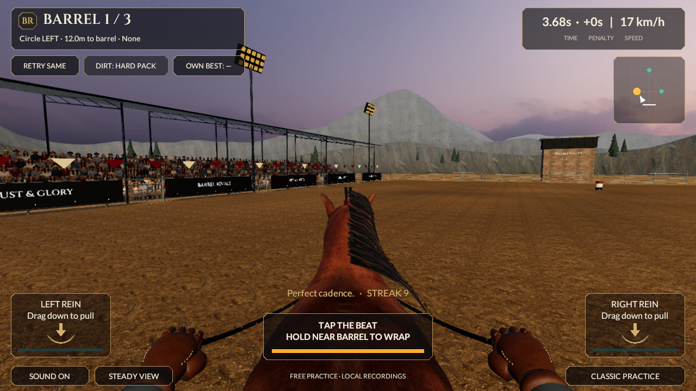
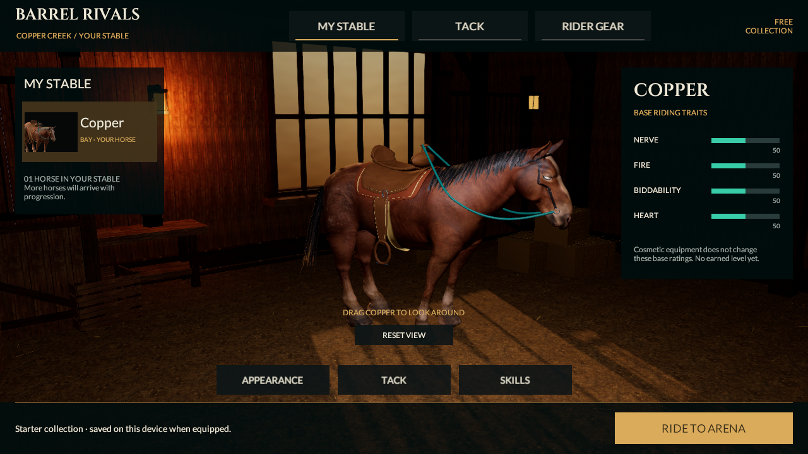
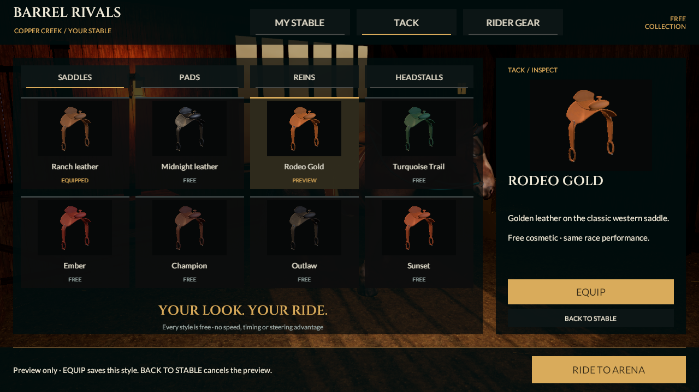
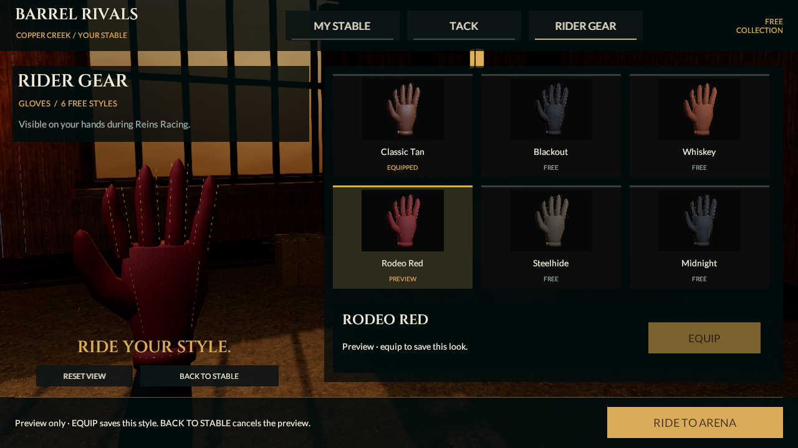

# Reins renderer, lighting and mane flow checkpoint

September 20, 2026. This continues the existing game and connected MyStable/Tack/Rider Gear reference work. Native identity remains **0.4.0/build 4**, rules remain **reins-lab-v1**, and the approved 0.5/v2 moving-alley launch remains unfinished. No new phone installation or device-performance acceptance is claimed.

## Rendering correction

The premium pipeline previously referenced the legacy Foundation renderer with **null PostProcessData**. ACES, exposure and FXAA were configured on the Volume/camera, but URP did not construct the required post-processing passes. Earlier documentation and screenshots establish configured intent, not executed grading. Their evidence is preserved at its original source boundary.

The premium pipeline now owns a persistent renderer with the installed URP 17.6 PostProcessData asset and HDR LUT, Uber and Final shader resources. The Foundation renderer remains intact. A new regression reloads those references; a separate pixel test proves that changing exposure changes the actual saved scene's rendered world. [Renderer proof](../../Evidence/LightingFlow-Renderer-Proof.json).

The arena now uses a brighter warm sun (2.5 intensity, 32° elevation, color 1/.90/.76), cooler Trilight sky fill (.58/.65/.76), equator .50/.45/.38 and ground .26/.20/.14. Exposure is +.35 EV, contrast 7 and saturation 2 with ACES. Linear fog runs from 130–700m. The existing photographic sky and .65 reflection intensity remain. Two candidate lighting renders preceded selection; these parameters are artistic choices, not a physically calibrated lighting claim. MyStable retains the same three lights and uses the corrected common grade. Its cooler Trilight fill is now .52/.56/.60 (sky), .44/.39/.34 (equator), .25/.20/.15 (ground), and its existing soft point fill rises from 8 to 12. The first working-ACES stable capture was too dark; this correction restores shadow detail without increasing the shared exposure or adding a light.

Fences use a new galvanized finish sharing the reviewed roof albedo, normal and metallic/smoothness textures. Its near-white tint, .12 normal strength and .55 smoothness multiplier improve rail visibility; structural steel keeps its existing material. It adds one environment material/batch with no new image assets. Generation updates existing profile components and rail assets explicitly, so the correction also reaches an already-generated project.

## Mane and equipment continuity

Mane roots are staggered across the measured crest, with varying curved flow and rolled/cupped outer cards. Fitted roots, both original alpha layers, helper motion and reduced-motion/ghost behavior remain. Forelock and tail geometry remain unchanged. The saved hair has **118 cards, 2,742 vertices, 2,688 triangles, 27 bones and two material slots**. Attachment and outward-normal thresholds were retained.

The 20 free cosmetics, five slots, preview/equip/cancel, cosmetic-v2 save migration and frozen race appearance remain intact. This is not the gameplay-v2 migration. Core, replay contracts and the imported FBX are unchanged; no new independent HTTP-verifier run is claimed.

## Actual checks and evidence

| Check | Result |
|---|---|
| Unity 6000.6.0f1 generation/save/reopen | Passed for Reins and MyStable |
| Editor suite | **111/111 passed**, zero skipped; [XML](../../Evidence/LightingFlow-EditMode.xml) |
| Play Mode suite | **28/28 passed**, zero skipped; [XML](../../Evidence/LightingFlow-PlayMode.xml) |
| New rendering checks | Saved resource persistence, actual exposure response, world changes while opaque HUD colors remain unchanged |
| Canonical v1 race | 35,120 ms, zero knocks, 300 style, 2,156 frames; [run](../../Evidence/LightingFlow-Race-Run.json) |
| Imported gait geometry | Same FBX; [current check](../../Evidence/LightingFlow-Unity-Gait-Geometry.json) |
| Controlled motion | 220 stepped frames, 8.8-second movie; [metadata](../../Evidence/LightingFlow-Capture.json), [video](../../Evidence/LightingFlow-Motion.mp4), [decode verification](../../Evidence/LightingFlow-Video-Verification.json) |
| Historical evidence | All 268 earlier PNG/JSON/XML/MP4 records restored byte for byte against abcf248fa38b74118a8cd03ec02e2fa24dd18fc7; [integrity](../../Evidence/LightingFlow-Historical-Integrity.json) |

Fresh race/stable captures render the world with grading, then the actual Canvas without grading. The capture helper uses a temporary ungraded camera and full-screen world texture because URP 17.6 clears Base-camera color even with a depth-only clear. Temporary targets, layers, Canvas and camera state are restored. A colored opaque HUD swatch remains stable under a −1/+2 EV challenge while over 25% of world pixels change. The diagnostic swatch is absent from gameplay captures.

These are controlled SDR Editor captures, not native phone screenshots, safe-area qualification or real-time frame-rate measurements. Static race samples explicitly seek animation but retain the previously documented GPU skin-cache limitation; the motion study yields a player frame between poses. Walk samples are rig studies, not the implemented gameplay alley. Raw licensing/signing logs are excluded.

## Source costs and visual review

[Saved character counts](../../Evidence/LightingFlow-Character-Budget.json): player **54,436 triangles, 17 renderers, 22 material slots**; MyStable 50,956/13/18. Player color-pass-eligible geometry is 43,076 triangles/18 slots because the saddle is shadow-only. An active ghost adds 54,436 source triangles/22 slots before culling. Shared meshes are not duplicated by these counts. No new LOD was added; the character remains above its six-material target.

The newly functioning HDR grading/final pass has a real GPU cost that was absent from earlier captures. Geometry/material counts are not measured draw submissions, frame time, memory or thermal results. Actual iPhone/Android qualification remains required.

All nine race frames and the stable, tack and glove screens were inspected. Ground and fence visibility improve, and the warmer light makes the horse and tack easier to distinguish. Stable fill restores some detail lost in the first working-ACES capture; the room and red glove remain dark, with further material/light balance needed. UI text and equipment selection remain legible. The mane flow change is modest: repeated diagonal strips remain obvious in the rider view, and side-view hair still resembles hanging cards. No detached roots or missing hair regions were obvious in the six selected moving samples. Brighter light also exposes existing body facets, coarse cliff-like terrain and strong grazing highlights. This is a rendering/visibility improvement, not reference-quality acceptance or proof of natural temporal motion.

This pass repairs rendering and advances the art study; it does not achieve the user's photographic reference. Horse/hand anatomy, natural hair, planted animation through blends/turns, a full rider, crowd depth, terrain texture and device quality tiers remain open. Continue one representative horse/rider/arena and the approved 0.5 launch. All eight categories and 53 sections remain; full-release acceptance is still 0/53. Progression, trusted ownership, multiplayer services and store qualification are unfinished. Free/original assets only; no purchase or paid service was made.
