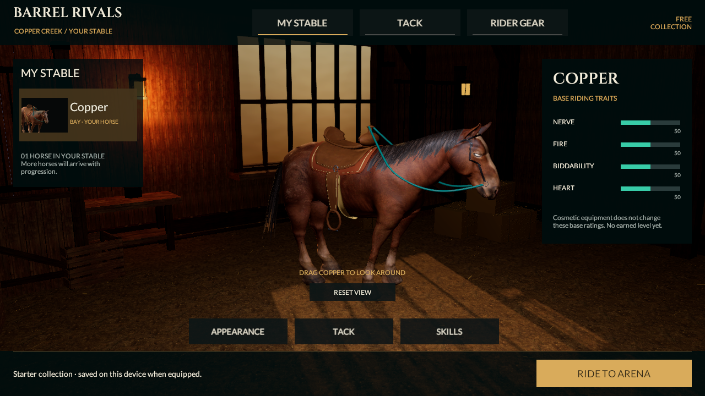
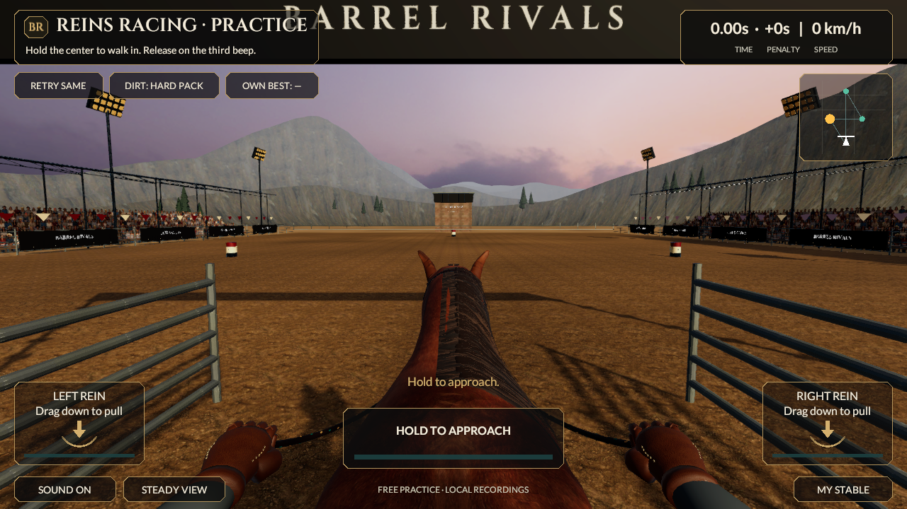

# Reins mane crown and coverage checkpoint

September 20, 2026. Art-only continuation from `977249b87518ff32e72c6d6b307991c7299c1a4c`. Source remains **0.5.0/build 5, reins-v2**. Last installed phone app remains 0.4.0/build 4. No new native build, device installation, measured performance or reference-quality acceptance.

## Connected change

The shared horse has wider overlapping undercoat cards, a fitted arc across the crest before the side drape, more coherent shoulder-directed flow and a warmer outer-layer tint. Dense mane UVs begin inside the existing lock texture rather than at its narrow isolated top. The original two PNG atlases and imported horse FBX are unchanged. This adds no purchased asset, image generation, reference pixels or runtime physics. The same persisted mesh reaches racing, MyStable, thumbnails and the personal ghost.

Earlier candidate renders exposed a key defect: fitted vertices could still form flat faces passing through the convex neck. Two crown rings now sample the actual neutral horse surface. The existing persistence regression additionally checks 480 crown-face centers against that surface, with a 2 mm tolerance. Existing 20 mm root attachment, outward normals, 40 mm distal clearance, normalized two-weight skinning and bindpose checks still pass. This is a neutral-geometry regression, not proof of every animated surface contact.

The final hair has **118 cards, 3,048 vertices, 3,232 triangles, 27 palette bones and two material slots**. Its 544-triangle increase is concentrated in the undercoat cross-section. The explicit hair regression ceiling rises from 3,000 to 3,600 triangles to accommodate the fitted surface; the 4,000-vertex bound is unchanged. Eight bounded motion helpers, stable Idle, reduced motion and both private ghost masks/lifetimes remain intact. Atlas imports and GUIDs remain unchanged. Outer tint changes from .24/.25/.28 to .38/.32/.28; no dedicated anisotropic fiber shader has been added.

## Actual verification

- Unity 6000.6.0f1 generated, saved and reopened Reins and MyStable.
- **135/135 Editor tests and 32/32 Play Mode tests passed**, zero skipped: [Editor XML](../../Evidence/ManeFlow-EditMode.xml), [Play Mode XML](../../Evidence/ManeFlow-PlayMode.xml).
- Canonical v2 race remains **33,860 ms, zero knocks, 300 style, Perfect launch/error 0, 1,893 input frames**. [Current Unity run](../../Evidence/ManeFlow-Race-Run.json).
- Core, replay/HTTP contracts, verifier and imported FBX are unchanged. The previous checkpoint's 78/78 HTTP checks remain historical; no new independent verifier run is claimed.
- Current gait geometry was rechecked: [report](../../Evidence/ManeFlow-Unity-Gait-Geometry.json).
- Controlled Unity captures include a 161-frame moving launch and 220-frame side/rider motion study, with metadata and sampled stills. [Launch](../../Evidence/ManeFlow-Launch.mp4), [motion](../../Evidence/ManeFlow-Motion.mp4), [video decode check](../../Evidence/ManeFlow-Video-Verification.json). They are silent, explicitly stepped 25 fps studies; encoding rate is not phone frame rate.
- All **346** earlier tracked PNG/JSON/XML/MP4 evidence files were restored byte for byte: [integrity record](../../Evidence/ManeFlow-Historical-Integrity.json). New results use `ManeFlow-*`; prior images have not been relabeled as current.

Two preliminary visual candidates were rejected for crest gaps. The final geometric correction required new complete test/capture runs. Raw editor/licensing logs remain outside Git. The tests include preview/equip/cancel and persistence for the existing one horse and 20 free local cosmetics; no new roster, level, rarity or stat bonus was invented.

## Cost and visual judgment

[Saved source counts](../../Evidence/ManeFlow-Character-Budget.json): player **54,980 triangles, 17 renderers, 22 material slots**; color-pass-eligible geometry 43,620 triangles/18 slots because the saddle is shadow-only. Stable is 51,500/13/18. An active personal ghost adds 54,980 triangles/22 slots before culling. No lower LODs were added. Material count remains well above the six-slot target; these are source counts, not measured GPU submissions, memory or thermal results.

Reviewed actual Ready/turn/GO, stable, tack, glove and moving-study samples show fuller crown and side coverage than the previous groom. The arc corrects the broad gap exposed by the intermediate candidate. It still reads as layered strips with flat highlights and some visible skin gaps, especially from the rider view. **This does not meet the photographic reference.** Hair shading/groom design, horse and hand anatomy, planted turns/braking, a full rider, coarse cliff-like terrain, repeating ground and crowd depth remain substantial gaps. The new neutral face check is useful engineering progress, not photographic acceptance.

The next art work should address fiber shading and the overall character/environment silhouette, not continue increasing card count without a clear visual benefit. Qualify the eventual 0.5 native build on phone before accepting R2. All eight categories and 53 sections remain; progression, trusted economy/ownership, all multiplayer modes, cloud services and store qualification remain unfinished.
