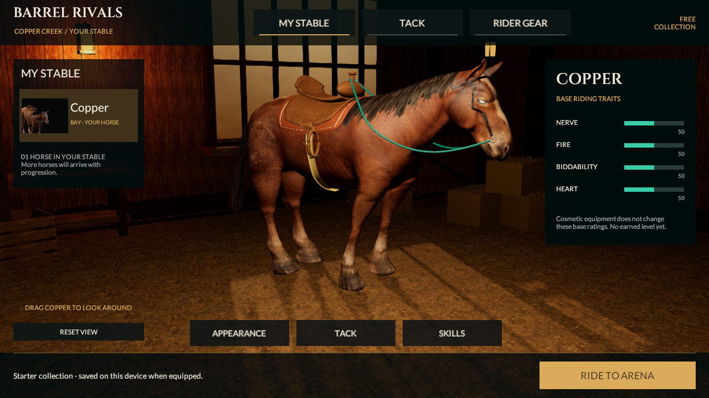
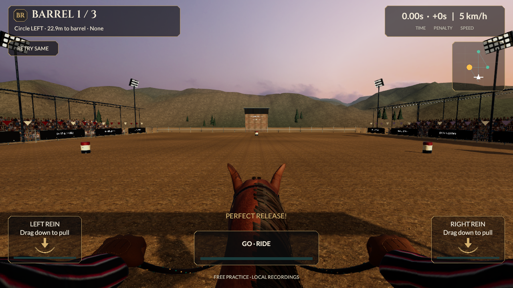

# Shared mane foundation checkpoint

September 21, 2026. Continuation from `a59f7d1d4a0a44458c6cc667dfa227a901a8c764`. Source remains **0.5.0/build 5, reins-v2**. This changes the actual racing/MyStable horse, not the separate development replacement. No phone build or installation occurred.

## Visible change and limits

The dense mane base is now one curved surface fitted to the horse’s skin, replacing 34 overlapping strips. Twenty-six outer locks sweep toward the shoulder over that base. The revised crown follows the rounded neck before draping down its side. The shared saved mesh reaches racing, MyStable, the roster thumbnail and personal-best playback.

A foundation-only coverage marker closes gaps at the crest and fades back to the original strand mask down the mane. Racing and ghost shaders share that coverage function; ordinary strands, forelock, tail and rider hair retain their own masks. A dark color floor fills transparent atlas gutters without erasing most strand variation. The initial floor was too bright; its replacement follows the source atlas’s approximate dark tenth-percentile linear RGB (.0075/.0056/.0052). Both original PNG atlases remain byte-identical. No new image, texture, material slot, runtime collider or physics simulation was added.

Actual captures show a more continuous crest and a backward sweep. The part edge and hanging clumps still look manufactured, and this remains **below the photographic reference**. Horse anatomy, natural turn/brake/Wrap actions, clothing, ground repetition, crowd and lighting need larger improvements. Do not interpret this checkpoint as finished premium art or keep increasing hair geometry without a visible benefit.

## Verification

**Three focused Editor tests and sixteen final focused Play Mode tests pass, zero skipped.** [Editor results](../../Evidence/ManeFoundation-EditMode.xml), [Play Mode results](../../Evidence/ManeFoundation-PlayMode.xml). All 712 preceding evidence files are retained byte for byte.

- Saved neutral geometry checks retain root attachment, crown-face clearance, outward normals, finite tangent frames, normalized two-weight skinning and bindposes. The foundation is one connected disk, with shared interior edges and no interior holes. Existing numerical limits were retained.
- The animated fit check samples **5,600 vertices/cross-sections across 32 poses**, using four speeds and eight animation phases. Minimum clearance is 6.921 mm; maximum is 38.674 mm. Actual vertex travel is 152.899 mm. This is scoped sampling, not continuous contact or natural animation acceptance. The test uses the renderer’s root bone because runtime presentation reparents the model.
- Private ghost materials copy the foundation parameter, retain their own atlas masks/opacity and clean up independently. Rendered source/ghost foundation masks agree pixel for pixel in the controlled material probe. Existing helper motion, reduced motion, stable Idle, equipment preview/equip/save and race camera/hand behavior remain checked.
- All **1,428 forelock/tail vertices** retain exact position, normal, tangent, UV, weight and bone-index channels compared with the preceding saved mesh. [Conservation report](../../Evidence/ManeFoundation-Preserved-Groom.json).
- Current rider attachment proof samples 48 poses. Geometry is **83,634 triangles / 21 active renderers / 26 material slots**, still above the 60k/six-slot targets. No lower LODs or phone-performance acceptance.
- Controlled actual Unity movies: [alley and launch](../../Evidence/ManeFoundation-Alley.mp4), 161 frames at 1280×720, 6.44 seconds; [side/rider gait study](../../Evidence/ManeFoundation-Motion.mp4), 220 frames at 1280×360, 8.8 seconds. Both are silent, encoded at 25 fps, with AVFoundation timing and sampled decode checks. Encoding rate is not measured game FPS.
- Historical evidence preservation and exact source/capture hashes are in [the checkpoint record](../../Evidence/ManeFoundation-Checkpoint.json). Fresh files use `ManeFoundation-*`; overwritten historical StableReference images were restored after retaining the new captures.

Preliminary candidates exposed overlong faces and an overly raised outer crown. The final grid is 40×16 cells, with a closer crown and a wider sampled transition. Those failures were corrected in the geometry, not by relaxing limits. The first animated test also failed because it searched for a direct model child after runtime reparenting; binding through the real renderer corrected the test setup. Final persisted geometry checks ran before the last shader-only RGB correction; live render/integration checks and captures ran afterward.

## Cost and continuation

Hair is **2,827 vertices / 3,424 triangles / 27 palette bones / two materials**, comprising one foundation and 84 retained outer/forelock/tail cards. Compared with the preceding groom: 221 fewer vertices and 192 more triangles. Eight existing motion helpers remain bounded. The shared mobile two-influence skin contract remains unchanged.

Core, controls, timing, replay contracts, catalog IDs, progression and services are unchanged. One horse and twenty local styles remain the implemented stable collection. No trusted ownership or ranked advantages were added. All eight master categories and 53 section IDs remain in scope.

Both previously verified 0.5 mobile packages remain unchanged and unqualified on devices; the last verified installed iPhone app is still **0.4.0/build 4**. Neither those older packages nor screenshots should be presented as containing this newer art. Continue substantive horse/rider/environment and natural-action work, reduce character/material costs, then build and qualify the current source on devices. The replacement horse remains development-only with its existing adoption/fidelity gates. R2, multiplayer, progression/economy and release acceptance remain open.
