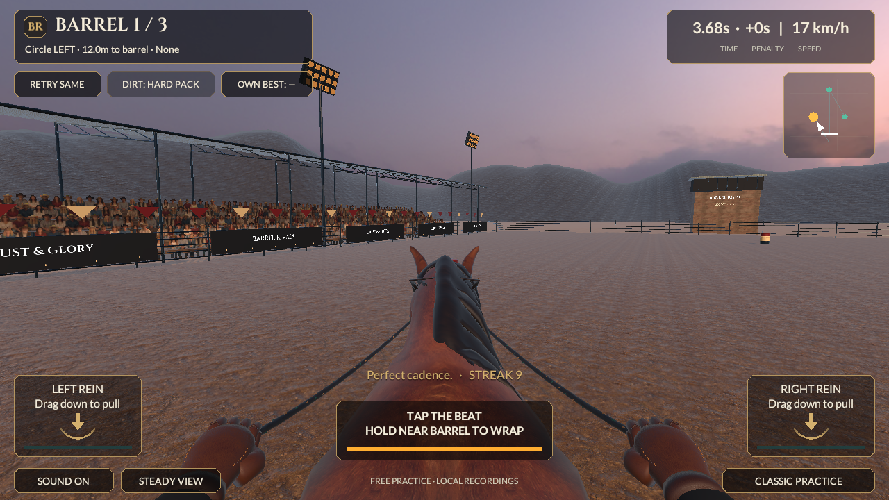

# Reins graphics — photographed materials and foreground tack

September 20, 2026. This continues the first reference-graphics source checkpoint in the same Unity project. Native identity remains **0.4.0/build 4**, with unchanged `reins-lab-v1` rules. It is not a new phone installation or acceptance of photographic quality. The approved 0.5 moving-alley launch remains a separate pending integration.

The subsequently supplied **MyStable/Tack/Rider Gear reference** now directs the separate stable source: enclosed timber showroom, horse roster, real rendered equipment cards and rotatable glove inspection. The [current feature checkpoint](../Features/MyStable-and-Gear.md) owns that newer 20-cosmetic/five-slot implementation and its separate desktop verification. The gameplay test/capture results below remain the earlier graphics boundary; they do not verify the newer stable reference work or establish photographic acceptance.

## Reference and implemented direction

The user's additional nine-panel reference describes the whole race: rider POV at entry, approach and turns at all three barrels, the home stretch and the result. Use the believable horse/hand scale, detailed ground, warm dusk light, layered arena and compact readable HUD as the benchmark. Reference pixels and real sponsor logos are not game assets.

This source adds:

- Seventeen verified CC0 photographic material/sky source files: dirt, weathered wood, corrugated galvanized sheet, worn painted steel, brown leather and a dusk panorama. URP materials use albedo, OpenGL normals and derived linear metallic/smoothness masks; originals are preserved byte for byte. [Source provenance](Reins-Premium-Materials-Provenance.md) records licenses, creators, sizes and hashes.
- Six independently tintable dirt regions with continuous world UVs, shallow visual relief and an outer apron. Region transforms remain at their own centers so mixed footing keeps its existing rules. No visual terrain or props add gameplay collision.
- Original covered stands, roof trusses/corrugation, tubular fences, banner panels, lighting fixtures, announcer booth, finish gantry and distant mountain geometry. Original Barrel Rivals lettering replaces any reference sponsor branding. The existing 70 distant crowd cards remain a temporary solution.
- Detailed three-band barrels with rolled profiles and lids. Moving barrel visuals are not marked static. Their canonical roots, contacts and scoring are unchanged.
- Darker mane/coat treatment; original modeled leather gloves, sleeves, headstall and bit hardware; turquoise/flax braided reins. Tack follows the horse head; the hands and reins respond only to accepted presentation input. Reins clone their saved topology before deformation and release those private meshes when destroyed. This is an original foreground study, not a finished full rider rig or production horse replacement.
- A smaller charcoal/gold HUD with licensed Cinzel and Lato fonts, preserving existing invisible thumb hit areas and v1 control bindings. Font source records and complete OFL licenses are included.
- Linear HDR rendering with a panoramic sky, ACES tone mapping, FXAA, warm directional lighting and atmospheric distance fade. No additional real-time arena lights or bloom were added. HDR and the extra art require phone profiling; source size and Editor captures are not performance evidence.

## Verification

| Check | Recorded result |
|---|---|
| Unity import/compile, scene generation, save/reopen | Passed with Unity 6000.6.0f1; persisted-scene validation passed |
| Editor tests | **77/77 passed**; [result XML](../../Evidence/PremiumGraphics-EditMode.xml) |
| Play Mode tests | **15/15 passed**; [result XML](../../Evidence/PremiumGraphics-PlayMode.xml) |
| Accepted full replay | **35,120 ms, 0 knocks, 300 style, 2,156 frames**, unchanged; [run/capture record](../../Evidence/PremiumGraphics-Run.json) |
| Rendering evidence | Nine 1280 × 720 rider-view captures on Intel Iris Plus Graphics 640 / Metal; reduced-motion camera, explicitly stepped animation and actual game HUD |
| Persistence and boundaries | PBR texture/mesh references, finite arena bounds, distinct footing centers and serialized hand/grip/bit/rein bindings passed; no new art colliders |
| Source materials | All 17 downloaded source files rechecked against the recorded sizes/SHA-256; source bytes unchanged |
| Source identity | No Core or replay-contract change; rules fingerprint remains `ffd16884d534628a46d2164751c19fbf7ff51cf8e56e92d36a799cac129e4837` |
| Master scope | All eight categories and 53 original section IDs/titles retained; full-release acceptance remains **0/53** |
| Native/device | **No new export, phone install, moving-video review or measured mobile frame-time/memory/thermal qualification** |

The checks caught an invalid fractional-power mountain vertex, loss of footing sampling centers and an outdated quality-profile assertion. The generator rejects non-finite vertices before saving; the scene test checks uploaded/static-combined mesh bounds without requiring readable runtime vertex buffers. Visual review led to corrected sky exposure/HDR grading, depth-tested one-sided world lettering, more distant terrain, inward-facing light fixtures and lowered headstall straps. Existing ghost/input/replay checks passed with the new presentation component.

The earlier [first graphics checkpoint](Reins-Reference-Graphics-Checkpoint.md) and 0.4 native records remain historical. Forty-five historical PNG/JSON/XML files were restored unchanged after the test run; their older results were not replaced with this source's images. The new Mixed image below is separately named. No local HTTP verifier rerun was needed for unchanged Core/contracts; its 46-check result remains historical.

## Actual Unity captures

[Ready](../../Evidence/PremiumGraphics-Ready.png) · [Approach 1](../../Evidence/PremiumGraphics-Approach-1.png) · [Turn 1](../../Evidence/PremiumGraphics-Turn-1.png) · [Cross to 2](../../Evidence/PremiumGraphics-Cross-2.png) · [Turn 2](../../Evidence/PremiumGraphics-Turn-2.png) · [Approach 3](../../Evidence/PremiumGraphics-Approach-3.png) · [Turn 3](../../Evidence/PremiumGraphics-Turn-3.png) · [Home stretch](../../Evidence/PremiumGraphics-Drive.png) · [Finish](../../Evidence/PremiumGraphics-Finish.png)

[Separate Mixed-footing check](../../Evidence/PremiumGraphics-Mixed-Footing.png)

All nine frames were inspected. They demonstrate integrated assets and consistent rider POV, not a match to the reference. The camera stays aligned with accepted riding heading, so the target barrel moves outside the forward view in the sampled tight turns. Turn awareness needs further ergonomic review without giving camera effects steering/scoring authority. The south-facing Drive/Finish frames also show a thin vertical sky artifact to diagnose before visual acceptance. Neither issue is hidden by substituting an art-preview camera.

## Remaining visual work

The free horse still has its existing low-detail anatomy and three basic gait studies. Natural planted locomotion, mane motion, rider/body synchronization, close-range character detail, convincing crowd depth and a finished alley are not complete. The mane remains visibly chunky, ground/terrain tiling and highlight response need art direction, and the stands use repeated flat people. These are concrete gaps against the reference, not accepted final art. Nine static captures cannot establish animation quality, comfort or sustained phone performance. The reference remains the target; the current work must be judged as an incremental graphics pass.

Do not expand horses or arena themes before the representative race is accepted in motion. Complete the approved v2 approach/release/input/audio transition alongside the remaining character art, then create a versioned device build and measure it on the actual iPhone. Use [the 0.5 implementation contract](../Plan/Reins-Racing-0.5-Implementation.md) for the cross-stack changes.

## Reproduction

Use one Unity 6000.6.0f1 Editor at a time. Generate with `BarrelRivals.Editor.ReinsLabBuilder.Generate`. GPU-enabled Play Mode is required for the nine captures; use distinct `Evidence/PremiumGraphics-*` test result filenames. Existing older capture tests still write their historical filenames, so preserve those historical files before running and restore them after recording the new checkpoint.

Authored assets live outside Generated under `Assets/_Project/Art/Reins/Premium`; generated scene/mesh references persist across save/reopen. Reviewed PNG/JPG/HDR/FBX assets are ordinary Git binaries under explicit path overrides, not unresolved LFS pointers. Source material files are each below 10 MiB. No paid purchase was made, and the user's private reference image is excluded.
