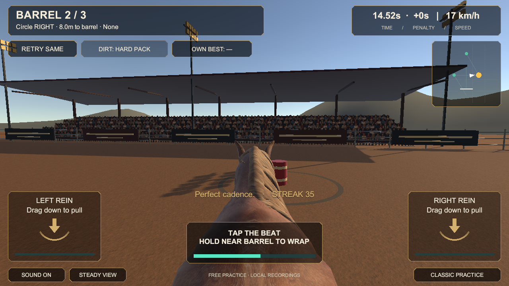

# Reins reference graphics — first integration checkpoint

September 19, 2026. **Working source checkpoint, not a new phone build and not acceptance of the reference image’s visual quality.** Rules/native version remains 0.4.0/build 4. The approved 0.5 moving-alley release, v2 replay and startup changes remain pending.

## What changed

The supplied image now defines the direction throughout Reins gameplay: a stable first-person horse view, believable western arena, textured dirt, populated stands, natural warm light and restrained charcoal/gold controls. Its pixels and sponsor logos are not shipped.

- Reins now uses the evaluated CC0 skinned horse, source coat/normal/hair/eye maps and original first-pass Idle, Walk and Gallop clips. An identity presentation wrapper preserves the FBX conversion; a documented Unity yaw correction points the head along canonical +Z. Root motion is disabled. The procedural Classic horse remains in its historical mode.
- `ReinsHorsePresentation` interpolates a collider-free art child from accepted Core samples. `RiderCameraRig` keeps the view in the rider’s seat across Ready, Preview, Gate, Racing, Drive and finish, with a persisted reduced-motion option. Camera/animation never own scoring or steering.
- Imported ghosts retain their cloned skeleton and material slots. Unknown scripts are removed while the clone is inactive, including dependency ordering, so their Awake cannot activate effects or interaction. Source components remain untouched.
- Original generated clay base color, a low-strength original procedural micro-normal, warmer Linear-space URP lighting/grade, preserved material assets and additional fixture/roof props are integrated. The sky remains procedural; this is not a full photogrammetry/PBR environment.
- Distant stand cards use an original transparent crowd strip: 70 cards, 140 triangles before engine batching. They are static flat background art, not animated people. No extra real-time arena lights or new gameplay colliders were added.
- Chamfered charcoal/gold panels, vector rein arrows, compact map and teal meters replace the earlier HUD styling. Existing thumb hit areas and v1 control behavior remain. Bright training-zone rings are hidden; the brown ground scuffs remain. Classic navigation stays available until the v2 startup change.

## Verification performed on this source

| Check | Result / evidence |
|---|---|
| Unity import, compile, scene generation, save and reopen | Passed on Unity 6000.6.0f1; builder validation completed |
| Editor tests | **77/77 passed**; [ReferenceGraphics-EditMode.xml](../../Evidence/ReferenceGraphics-EditMode.xml) |
| Play Mode tests | **13/13 passed**; [ReferenceGraphics-PlayMode.xml](../../Evidence/ReferenceGraphics-PlayMode.xml) |
| Imported rig | Persisted avatar, 3 looping clips, valid materials/bones, no model colliders or missing scripts; [inspection](../../Evidence/ReferenceGraphics-ArtInspection.json) |
| Posed body bounds | Approximately 0.857 × 2.175 × 2.935 metres; head is ahead in +Z. This is an import sanity check, not a veterinary/anatomical approval |
| Canonical replay | **35,120 ms, 0 knocks, 300 style, 2,156 frames**, unchanged; [run record](../../Evidence/ReferenceGraphics-Run.json) |
| Shared rules identity | Four-source SHA-256 unchanged: `ffd16884d534628a46d2164751c19fbf7ff51cf8e56e92d36a799cac129e4837` |
| Gameplay renders | Five real 1280×720 Unity captures reviewed below; actual HUD and steady rider view, explicit animation stepping during canonical replay |
| Native/device | **Not rebuilt or installed for this checkpoint.** No new iPhone/Android performance, thermals, memory, animation-comfort or touch acceptance claim |

Historical `Evidence/Reins-*` XML/PNGs were retained as the earlier 0.4 evidence. The new tests use the `ReferenceGraphics-*` record. No HTTP verifier suite rerun was needed for unchanged Core/contracts; its 46-check record is still historical, not a new claim.

The first integrated test runs exposed and led to fixes for invalid new GUIDs, imported rig/avatar and forward orientation, a renamed tension-meter binding, stale capture text meshes, unsafe ghost Awake behavior, and a mesh measurement that applied imported scale twice. The final suites above passed; screenshots are engine output, not generated concept images. The capture helper invalidates uGUI text after switching canvas scale. Mesh measurement uses explicit scale compensation as described by [Unity’s BakeMesh API](https://docs.unity3d.com/6000.0/Documentation/ScriptReference/SkinnedMeshRenderer.BakeMesh.html).

## Actual gameplay captures

[Ready](../../Evidence/ReferenceGraphics-Ready.png) · [Barrel 1](../../Evidence/ReferenceGraphics-Barrel-1.png) · [Barrel 2](../../Evidence/ReferenceGraphics-Barrel-2.png) · [Barrel 3](../../Evidence/ReferenceGraphics-Barrel-3.png) · [Home stretch](../../Evidence/ReferenceGraphics-Drive.png)

## Visual acceptance is still open

**The current scene does not match the supplied photographic reference.** The horse and first-person framing are a stronger starting point, but the arena’s flat structures/horizon, repeated dirt and lighting remain visibly simple. The three gait studies are basic rotations, not finished natural horse animation. There are no finished rider hands, reins, western tack, synchronized rider, turn/brake/contact clips or validated foot planting. Background crowd repetition is visible. Static captures cannot establish animation quality or phone frame rate.

Continue one representative horse/rider/arena before expanding themes or the roster:

1. Finish the foreground character: natural neck/ear silhouette, correctly attached mane/tail, western tack and first-person hands/reins; author and review gait/turn/brake/contact motion and blend transitions.
2. Replace simple arena foreground structures with detailed original/free meshes and coherent wood/steel/barrel materials; align dirt texel density and add localized ruts/hoof detail. Keep competitive geometry synchronized separately.
3. Improve sky, distant terrain, baked ambient/reflection detail and lighting balance; retain restrained effects and clear barrel visibility. Give the HUD a final licensed typeface and phone-safe spacing pass.
4. Implement the approved v2 walking launch and timing/input/audio contracts across Core, Unity, replay/verifier and saves; this graphics work does not substitute for R2.1.
5. Export a new versioned device build, review a moving full race on iPhone, and measure sustained frame time/memory/thermals before claiming mobile visual quality. Keep the 60 FPS target and lower-tier budget honest.

Full-release section acceptance remains **0/53**. This advances S10/S12/S17–20/S23–24/S28/S50; it does not finish those cards or R2.

## Reproduction and art ownership

Use `Tools/run-reins.sh generate`, then `playmode` and `editmode` with one Editor at a time. Existing generic commands write `Evidence/Reins-*`; archive new evidence under a distinct checkpoint name and preserve the historical files when publishing. Authored assets live under `Assets/_Project/Art/Reins`, outside builder-owned Generated folders; regeneration preserves authored materials and existing clip settings.

Read [asset provenance](Reins-Reference-Graphics-Provenance.md), [dirt prompt](Reins-Dirt-Generation.md) and [crowd prompt](Reins-Crowd-Generation.md). Native image-generation outputs were copied unchanged. The licensed/free maps and FBX are ordinary Git binaries under explicit path overrides, each below 8 MiB; no undeclared LFS download is needed for these assets. The upstream Blend file, Blender DMG, private user reference and raw logs are not in the repository.
