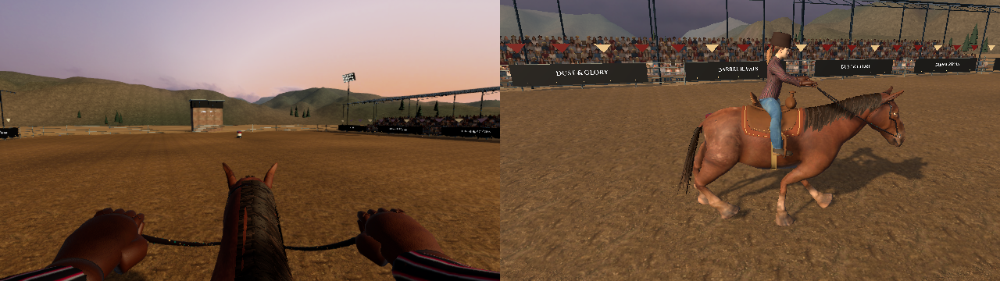
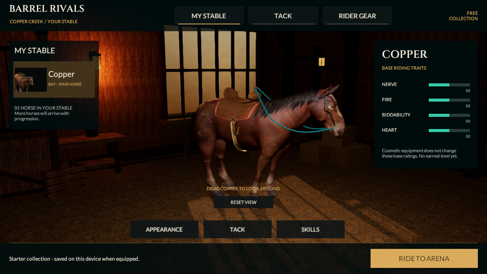

# Reins seated rider checkpoint

September 20, 2026. Continuation from `059b85ebfc27eaf09c7663b996c18f0915c10421`. Source remains **0.5.0/build 5, reins-v2**. Last installed iPhone build remains 0.4.0/build 4. This source checkpoint does not close R2, any full S01–S53 section, phone performance or photographic-quality acceptance.

## Connected change

The saved racing scene now includes a complete clothed, skinned rider: head/neck, shirt/jeans, boots, eyes, ponytail and an original felt hat. Existing equipped gloves remain attached to the reins. The former separate sleeve meshes are hidden in racing; actual skinned shirt sleeves now meet the glove cuffs. This supplies the missing rider body and moving silhouette, but is an initial character integration, not finished premium animation or a selectable outfit catalogue.

Free CC0 MakeHuman body/rig, system clothing, skin, eyes and ponytail are combined with Margaret Toigo/MRT's CC0 ankle boots. An original Blender orchestration script fits the adult body, bakes morphs, removes hidden body/helper geometry and creates the hat. The pinned MPFB authoring program is external and is not shipped in the game. [Asset provenance and reproduction](../../Assets/_Project/Art/Reins/Rider/README.md) and [archive/source hashes](../../Assets/_Project/Art/Reins/Rider/Source-Provenance.json) identify the selected inputs. No paid asset, service, sponsor art or reference-image pixels were imported.

The original runtime two-bone limb solver observes the existing horse gait. It resets the rig to its stored neutral pose, follows the actual animated saddle, adds restrained forward lean and solves both arms and legs toward glove/stirrup anchors. It runs after tack and before the camera, without creating frame arrays or writing Core movement, input, collision, race time, rewards or replay. Limb endpoints preserve their authored orientation. The horse's root remains controlled exclusively by Core.

The saddle's fenders are shorter, and the stirrup openings now face forward beneath the boots. The old openings faced sideways and hung well below the new seated rider. MyStable, tack thumbnails and the horse portrait use the same updated saddle geometry. MyStable continues to show the horse without a rider, as in the supplied reference. The stable still contains one horse and 20 local cosmetic styles in five slots; no additional roster, rarity, gear bonuses, levels or paid ownership is implied.

The first-person bodycam anchor moves forward of the new torso. Head, hair, eyes and hat cast shadows without blocking the player's camera; their meshes remain visible on the separate ghost rider. The ghost retains its own seated pose and alpha-masked ponytail material without modifying player materials or shadow visibility. Camera controls, reduced-motion behavior, HUD, race rules and the existing six-source v2 fingerprint are unchanged.

## Verification

- The actual Unity 6000.6.0f1 generator saved Reins and MyStable with the new art. **138/138 Editor and 37/37 Play Mode checks passed**, zero skipped: [Editor XML](../../Evidence/RiderBody-EditMode.xml) / [Play Mode XML](../../Evidence/RiderBody-PlayMode.xml).
- [Rig proof](../../Evidence/RiderBody-Rig-Proof.json) covers 48 poses: four speeds, three opposing rein pairs and four gait phases. The clothing actually deforms, with approximately 0.159 m maximum sampled vertex displacement in rider-local metres. Maximum endpoint error is below 0.001 mm in this controlled set; this numerical alignment does not prove collision-free anatomy or natural movement. Both actual boot soles remain within approximately 3.58 mm of the sampled stirrup treads. The test also keeps Core tick/pose unchanged.
- The ghost test verifies independent posing and ponytail atlas/material ownership, while preserving the player's hidden-head shadows. Existing lifetime, persistence, equip/cancel, input, replay and saved-material checks remain passing.
- Canonical Unity replay remains **1,893 frames, 33,860 ms, zero knocks, 300 style, Perfect launch/error 0**: [race result and views](../../Evidence/RiderBody-Race-Run.json). Core/contracts/verifier are unchanged; the earlier 78/78 HTTP proof remains historical, with no new HTTP run claimed.
- New [launch footage](../../Evidence/RiderBody-Launch.mp4) and [rider/side motion footage](../../Evidence/RiderBody-Motion.mp4) contain 161 and 220 actual Unity frames. These are silent, controlled 25 fps capture studies, not measured device frame rates or a planted-gait qualification. [Decoded-frame verification](../../Evidence/RiderBody-Video-Verification.json) checks the encoding against actual Unity pixels.
- New race, stable, saddles and glove screenshots use `RiderBody-*`. All **474** earlier tracked PNG/JSON/XML/MP4 evidence records remain byte-identical: [integrity record](../../Evidence/RiderBody-Historical-Integrity.json). [Checkpoint metadata](../../Evidence/RiderBody-Checkpoint.json) pins changed source hashes and limits.

The first import used `None` and produced static meshes; the final importer uses Generic and requires six genuinely skinned surfaces. Early live macro targets were baked before the final export. Initial diagnostic deformation units were FBX buffer units, corrected to rider-local metres. An optional budget reader attempted inaccessible CPU triangle data; the final reader uses submesh index counts, without enabling unnecessary runtime read/write on other meshes. The first full suite also exposed a horse-only texture assumption: the original solid felt hat is now explicitly exempt, while all imported character surfaces still require their maps. These failed iterations are not reported as passing evidence. Static capture helpers now solve the rider after tack before rendering; moving studies already yield a real player-loop frame for each sample.

## Budget and remaining work

The new rider itself contains **23,914 triangles**, six material slots and 53 authoring bones. The current active horse/tack/rider has **78,030 triangles, 21 renderers and 26 material slots**, including shadows-only surfaces. About 51,676 triangles are color-eligible in the player's first-person view. The 60k nearest-LOD and six-material targets are exceeded; no lower LODs exist. These are saved-renderer counts, not measured draw calls or device memory. [Budget evidence](../../Evidence/RiderBody-Character-Budget.json).

Selected maps import at 2K maximum; a 4K source clothing normal map is capped at import. The bodycam position needs phone comfort review. Clothing folds, hat shape, glove anatomy, facial/hair detail and the horse's anatomy/gait/crowd/environment still fall below the photographic references. The solver supplies a seated pose; it does not add authored planted turns, braking, Wrap leg actions, cloth simulation or realistic rider effort. Do not present the large section count or source tests as release acceptance.

Next, reduce character draw/material and geometry cost while improving the silhouette and gait. Review the actual moving first-person/side views, then generate fresh native 0.5 artifacts and qualify controls, audio alignment, interruptions, stable/equip persistence and 20 minutes of device performance. Keep the existing R2 → M1N → multiplayer/progression/economy/release sequence and all eight categories/53 sections intact.

