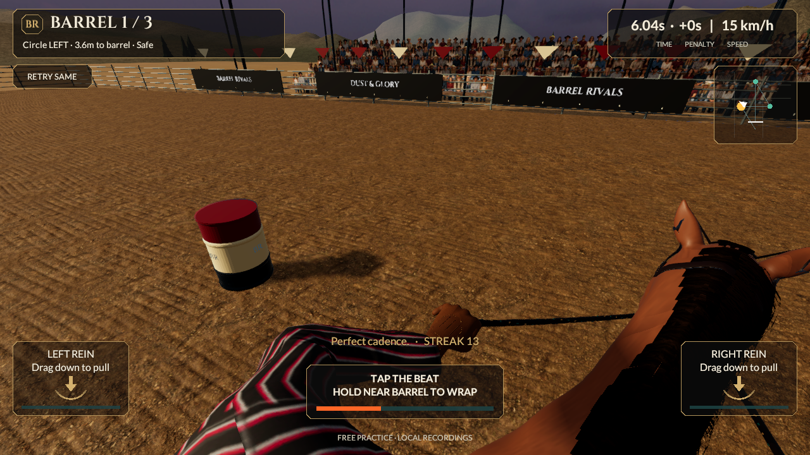
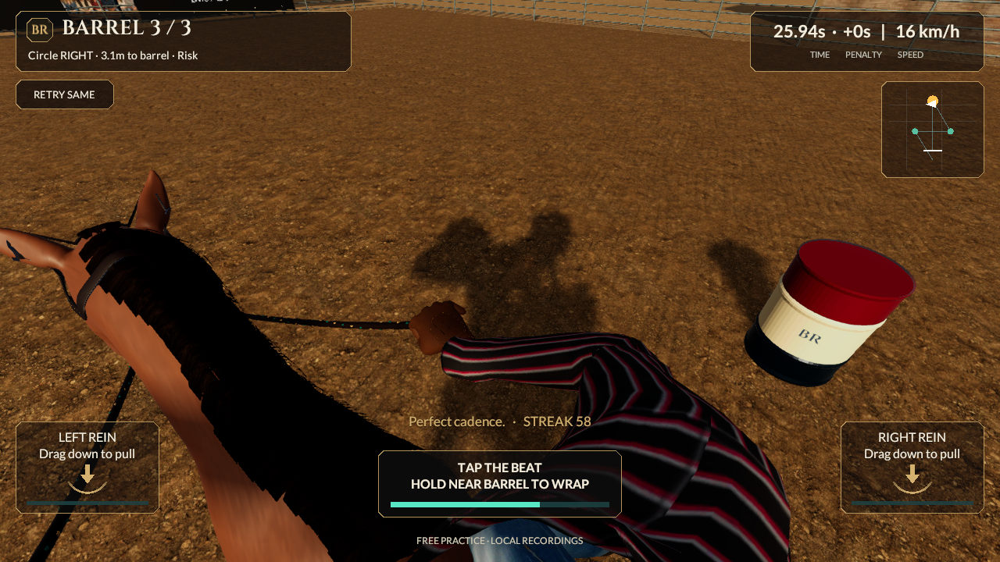

# Rider turn view — actual course review

September 21, 2026. Continues `ee30bac54d406063c460de490e8d9ffd29dacaf9`. The replacement horse's saved racing review now includes a bounded rider glance into barrel turns. It remains first-person and development-only. Source stays **0.5.0/build 5, reins-v2**; no mobile build or installation occurred.

## Riding view

The earlier strictly forward view lost the active barrel during most tight circles. Using steering direction alone would also look the wrong way while setting up some approaches. `RiderCameraRig` now optionally reads the existing course state to glance toward the nearby active barrel, beginning gradually inside fourteen metres and reaching full proximity weight at five metres. The yaw is limited to **52 degrees**, eased and capped at **110 degrees/second**. It returns toward forward as the target changes or the race leaves its turn phase; targets well behind a rider travelling away fade out instead of twisting the view backward.

A close barrel can also fall behind the touch controls. A bounded downward gaze uses the barrel's shared flat-floor position and radius, reserving lower-screen room for the HUD. Extra pitch is limited to **18 degrees**, eased and capped at **40 degrees/second**; open stretches return toward the authored forward view. The camera remains at the measured seated eye, with no roll, orbit around the horse, overhead cut or change of owner. It does not rotate the horse or redirect held rein inputs.

The horse still follows accepted yaw directly. Camera gaze does not change steering, rein ownership, contact, speed, cadence, launch or race results. The course/HUD/control geometry and original player scenes are unchanged. The new profile is enabled only in `HeroHorseRaceReview.unity`; the shared component's default maximum glance is zero, retaining the old player view.

Reduced motion still removes stride bob and speed FOV. It retains the informative course glance, and changing the setting preserves the current glance rather than snapping it forward. Retry/cancel resets it. Horizontal composition is preserved on 4:3 displays by adapting vertical FOV; aspect changes do not interpolate through an unintended zoom. A side glance can naturally carry the outer hand off screen: both grips are required in the forward view and at least one riding hand remains visible through the checked turns, while both rein touch controls stay fixed.

## Verification and limits

**Nine focused Play Mode checks pass, zero skipped.** Two new full-course checks cover normal and reduced-motion views; existing candidate full-race/ghost/all-style checks, three earlier camera/authority regressions and the candidate stable-to-race gear navigation also pass.

For each mode, **677/677 active-turn samples** keep the entire projected bounds of the actual detailed drum inside the side margins and the vertical band above the controls/below the header, on both 16:9 and 4:3. The middle-turn subset is **420/420** in each view. With the same pose/FOV but the previous forward rotation, only the baseline counts listed in the reports clear that band. These are projection checks over the canonical replay, not proof for every possible manoeuvre or pixel occlusion. The associated actual stage captures were visually inspected.

The same replay remains **33,860 ms**, zero knocks and 300 style points; its rules fingerprint is unchanged. Existing ghost independence, all twenty equipment styles, active-run navigation restrictions, camera/hand/rider and retry/comfort regressions retain their own checks. Both forward grips and at least one grip during glances remain visible. The full character's rendering cost, materials and geometry are unchanged by this camera increment.

The retained full ride contains **948 actual Unity frames at 1280×720**, 25 encoded fps, **37.92 seconds**, silent. It advances the accepted simulation, character, rider/reins and camera together; skin matrices refresh per render. Native AVFoundation verifies dimensions/timing and decodes frames 0/947. The last 20 ms simulation interval occupies one 40 ms video frame. Encoded fps is not measured gameplay performance, and still-frame inspection is not phone comfort acceptance.

[Normal visibility report](../../Evidence/TurnView-Normal.json) · [reduced-motion report](../../Evidence/TurnView-Comfort.json) · [focused tests](../../Evidence/TurnView-PlayMode.xml) · [actual full ride](../../Evidence/TurnView-Full-Course.mp4) · [checkpoint and hashes](../../Evidence/TurnView-Checkpoint.json).

All **794 earlier evidence files remain byte-identical**. Normal player scenes, source horse/rider assets, rules/contracts, build lists, original art credits and existing mobile packages remain unchanged. Incidental Unity serialization changes were inspected and restored. No new full Editor/Core/HTTP suite is claimed; last verified installed iPhone remains **0.4.0/build 4**.

## Remaining quality work

This improves the reference's first-person composition and course readability; it is not a claim of photographic quality, natural rider head/turn animation, universal visibility or device comfort. The current coat, regular mane edges, striped clothing, saddle/glove construction, ground and crowd still fall below the supplied images. Authored turn/brake/canter/contact/Wrap actions and world-space foot planting remain open. The retained source-fidelity target still fails at 0.364 mm versus 0.2 mm. Character geometry/material budgets and LODs remain unqualified.

Next improve the visible character materials, clothing/tack construction and natural actions while reducing their rendering cost; review the connected stable/racing/ghost character, then promote a qualified shared version with a new build identity and actual phone testing. Test this gaze with real thumbs, arbitrary routes, interruptions, close contacts and sustained play before player acceptance. All eight categories/53 sections and later multiplayer, trusted progression/economy and release requirements remain active.

## Reproduce

Use one Unity 6000.6.0f1 Editor. Generate with `BarrelRivals.Editor.HeroHorseRaceBuilder.Build`, open `Assets/_Project/Development/HeroHorse/HeroHorseRaceReview.unity`, and press Play. The paired stable review remains accessible through the existing menu. `RiderCourseLookTests` saves normal/comfort stage captures and reports when `BARREL_COURSE_LOOK_OUTPUT` names a fresh private directory. `HeroHorseRaceTests` records the full ride with `BARREL_HORSE_RACE_OUTPUT` and `BARREL_HORSE_RACE_MOVIE=1`. Preserve earlier evidence and keep raw logs/intermediate frames private.
