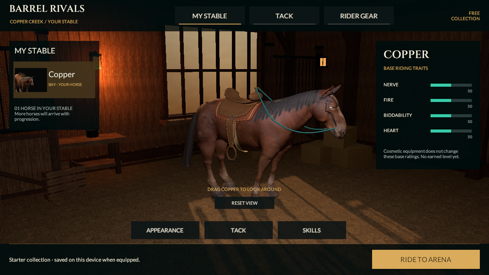

# Horse surface, fitted bridle and continuous scenery

September 20, 2026. Source-only graphics increment following `5a90d8b`. Native identity remains **0.4.0/build 4**, rules **reins-lab-v1**. No new phone install or photographic-quality acceptance is claimed.

## Implemented

- Original cheek/flank contour correction and one constrained upper-body subdivision of the existing CC0 horse. Body topology rises from 7,390 to **29,564 triangles**; the 19-bone skeleton, eye placement, four texture files and equipment IDs remain intact. Upper-body facets soften while retaining the established rig.
- Explicit normalized **four-weight skinning**, authored before regenerating the existing in-place Idle/Walk/Gallop studies. The prior source could have seven influences and relied on importer reduction; this makes the authoring policy explicit. Core still owns movement and scoring.
- Protected low hoof vertices project onto the original triangulated source. All 949 such exported vertices lie within 0.0003 mm of the prior surface. **Retessellated triangle interiors are not identical**: sampled differences reach 7.22 mm in the reverse comparison. Fresh imported-gait measurements below qualify this change; projection alone is not gait proof.
- Live-surface western headstall: thin fitted crown/brow/cheek leather, compact rings at the mouth, measured eye clearance and named rein endpoints. Three existing material batches and head parenting are retained. The old floating nose hoop is removed.
- One connected scenery mesh with irregular world-space hills and valleys replaces overlapping circular ridges. It has shared boundary normals, source rock maps, pines placed on actual triangles, and **24,672 triangles / three opaque material batches**. No new collision, lights or gameplay authority.

The existing MyStable/Tack/Rider Gear flow retains one horse and 20 free local cosmetics, real item renders, preview/equip/cancel and isolated saves. This does not add earned progression or ownership services.

## Verification

| Boundary | Result |
|---|---|
| Unity generation, save/reopen | Passed on Unity 6000.6.0f1 |
| Editor / Play Mode | **110 / 21 passed**, no skips |
| Imported body | 15,510 Unity vertices, including import splits; 2.12 m neutral height |
| Imported gait geometry | 121 samples per clip; no object-root movement, no vertex loop seam; maximum nominal Gallop stance drift **6.318 mm** |
| Canonical v1 replay | 35,120 ms, 0 knocks, 300 style, 2,156 frames; unchanged Core/contracts |
| Runtime visuals | Nine full-course captures, seven stable/gear captures and 220-frame moving study |
| History | All **194** prior PNG/JSON/XML/MP4 records restored byte for byte |
| Native / device | No export/install, sustained phone performance or v2 gameplay acceptance |

See [machine-readable checkpoint](../../Evidence/SurfaceFit-Checkpoint.json), [Editor XML](../../Evidence/SurfaceFit-EditMode.xml), [runtime XML](../../Evidence/SurfaceFit-PlayMode.xml), [Unity gait geometry](../../Evidence/SurfaceFit-Unity-Gait-Geometry.json), [export comparison](../../Evidence/SurfaceFit-Export-Comparison.json), [character budget](../../Evidence/SurfaceFit-Character-Budget.json) and [moving study](../../Evidence/SurfaceFit-Motion.mp4). Animation is explicitly stepped over real player-loop frames; encoded 25 fps is not measured runtime performance.

## Actual images

[MyStable](../../Evidence/SurfaceFit-MyStable.png) · [Saddles](../../Evidence/SurfaceFit-SaddlesEquipped.png) · [Rider Gear](../../Evidence/SurfaceFit-RiderEquipped.png) · [Approach 1](../../Evidence/SurfaceFit-Race-Approach-1.png) · [Approach 3](../../Evidence/SurfaceFit-Race-Approach-3.png) · [Drive](../../Evidence/SurfaceFit-Race-Drive.png)

The [prior clay head](../../Evidence/SurfaceFit-Clay-current-head.png) and [refined clay head](../../Evidence/SurfaceFit-Clay-candidate-head.png) are isolated geometry diagnostics, not game captures.

## Remaining quality and release work

The current horse still inherits coarse eye/hoof anatomy and a sparse rig without separate hoof joints. Visible mane cards, a full rider, turn/brake/blend contact, realistic crowd/arena depth, animated stowed-rein clearance and final lighting remain unfinished. The cheek strap now clears the eyelid but its visible detour still needs a more natural leather shape; the scenery remains coarse and its rock mapping visibly stretched. The user's photographic references remain the target.

The equipped character is **54,260 triangles** (including the shadow-only player saddle), under the nearest-LOD 60k target, but **25 material slots / 14 unique materials exceed the planned six-slot target**. The stable character is 50,780 triangles; a visible ghost adds another 54,260 before culling/pass effects. These are source geometry counts, not measured draw calls. Material consolidation, LODs and real-phone profiling remain required before visual acceptance.

The alternative b2przemo static horse was evaluated but not imported; [the options record](Horse-and-Rider-Options.md) records its better base shape, missing textures/rig and retargeting work. No purchase or new service was made. Complete the hero-character benchmark before expanding the roster.

Continue the approved [0.5 contract](../Plan/Reins-Racing-0.5-Implementation.md): moving alley/release rules, input/audio/replay integration, representative character/arena benchmark and device qualification. All eight categories and 53 section IDs remain; full-release acceptance is still 0/53.

## Reproduction and provenance

`Tools/Art/export_reference_horse.py` calls the original `refine_horse_surface.py` before gait authoring. Run Blender 4.5.13 LTS with `--background --disable-autoexec --python-exit-code 1`; keep upstream script execution disabled. The unchanged CC0 source/hash/creators are in [horse provenance](Reins-Reference-Graphics-Provenance.md). The derived FBX SHA-256 is `f84dfcd930b61adc51a81130df4c12bbb7b5753920ed81691cb2cc1c77a537a0`. Surface and source-inspection JSON records are under the fresh `SurfaceFit-*` evidence prefix.

Use one GPU-enabled Unity Editor at a time. Generate with `BarrelRivals.Editor.ReinsLabBuilder.Generate`; then run Editor and Play Mode suites. Set fresh absolute `BARREL_GAIT_GEOMETRY_REPORT` and `BARREL_MOTION_CAPTURE_DIRECTORY` paths. Preserve earlier evidence before capture tests and restore it after copying fresh records to a unique prefix.
