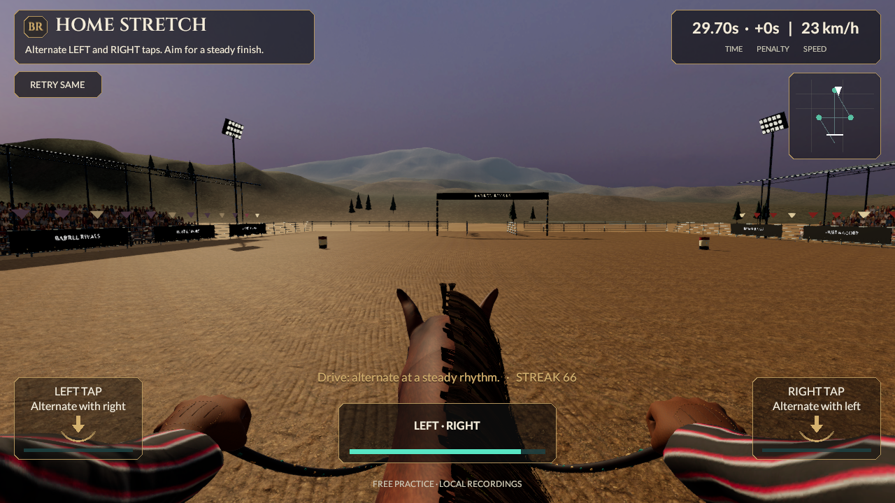
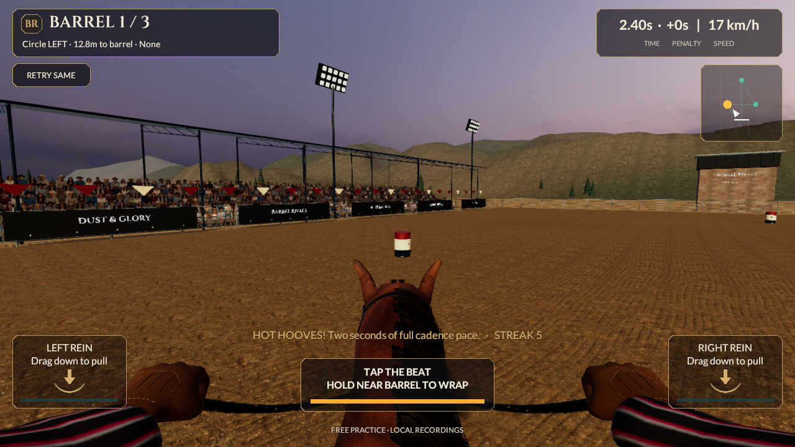

# Worked arena footing checkpoint

September 21, 2026. Continues `2318ee1996d3649de8c85fe3012a40e362837ba0`. Source remains **0.5.0/build 5, reins-v2**. This changes the actual racing arena material; no native build or installation occurred.

## Shared surface change

The riding arena now combines two orientations/scales of the existing photographed soil with original hoof impressions, longer scuffs and dragged furrows. Broad world-space arcs replace the first draft’s visibly repeating waves. The shader transforms the corresponding normal gradients consistently with those arcs. A short, bounded height-based view offset adds near-ground depth and fades before the horizon. It changes neither mesh silhouettes nor contact geometry.

One original 1024-square linear data texture contains signed slopes, height and disturbed soil. Its offline generator uses periodic fields and wrapped stamps; it has no runtime stamping loop or collider. All **17 reviewed photographic source files and seven existing ground meshes remain byte-identical**. The material keeps continuous world coordinates across six separately positioned footing regions and the apron. Existing Hard Pack/Sand/Clay/Mud manifest identities drive tint, relief and wetness; selecting a dry profile clears wet settings. No grip, time, contact or replay rules changed. These are static authored marks, not persistent live hoofprints or simulated soil deformation.

The new material is separate from the stable’s existing packed-earth material. MyStable/Gear preview, equip and save flows remain intact. Refresh only the surface with `BarrelRivals.Editor.ReinsFootingArtBuilder.Refresh`; use the normal Reins generator when changing the whole scene. Keep the apron’s original mesh identity when replacing its material.

## Evidence

**Eight focused Play Mode tests pass, zero skipped.** [Results](../../Evidence/WorkedFooting-PlayMode.xml). No new full Editor, Core or HTTP suite is claimed for this material-only change.

- The actual saved shader has forward, shadow, depth and depth-normal passes. Its map is mipmapped, repeats correctly and has no readable runtime CPU copy.
- A rendered plane and two translated/rotated/scaled pieces with unrelated UVs produce the same world-mapped image: mean channel difference **0.00284/255**, maximum **1/255**. This checks the actual shader, not a CPU imitation of its coordinates.
- Opposite light directions reverse the relief response in **15,442 pixels**. Mean relief change is .01351, and wetness change .03329 on a normalized channel scale. These controlled material checks do not establish photographic quality. [Material report](../../Evidence/WorkedFooting-Material-Proof.json).
- The new source map has no clipped slope or height samples. [Data report](../../Evidence/WorkedFooting-Source-Map.json), [unchanged geometry](../../Evidence/WorkedFooting-Geometry-Preserved.json), [unchanged photographs](../../Evidence/WorkedFooting-Photo-Sources-Preserved.json).
- Canonical actual Unity replay remains **33,860 ms**, with the preserved v2 result and fingerprint. Nine actual rider-view stages and the run metadata are retained under `WorkedFooting-Race-*`. [Run](../../Evidence/WorkedFooting-Race-Run.json).
- The [actual launch movie](../../Evidence/WorkedFooting-Alley.mp4) contains 161 Unity frames, 1280×720, 6.44 seconds, silent, encoded at 25 fps. AVFoundation verifies timing and first/last decode. Encoding rate is not measured game FPS.
- All **737 prior evidence files remain byte-identical**. Fresh race/stable captures were retained before restoring historical filenames. [Checkpoint and source/capture hashes](../../Evidence/WorkedFooting-Checkpoint.json).

The first surface passed technical checks but its detail was too faint from the riding camera. A deeper second version exposed a repetitive wave pattern. The final world-space arcs and gradient correction were then checked again in actual approach, turn and home-stretch views. Passing pixel tests alone was not the visual acceptance criterion.

## Cost and remaining work

No new ground mesh, renderer, collider or gameplay behaviour was added. The original authored map is approximately **5.33 MiB of RGBA32 texels including mips**, before driver allocation; that is an estimate, not measured residency. The forward shader samples two photograph/normal/roughness orientations plus broad variation and two worked-earth lookups. Its greater fragment cost requires native/device profiling and an appropriate lower-cost quality tier if needed.

The ground has clearer worked detail, but remains an approximation using a repeated photograph and authored relief. Natural churn, loose clods, dust and full reference-level lighting are unfinished. Horse/rider anatomy and movement, clothing, crowd and wider arena presentation still fall below the supplied images. Existing character/LOD budgets remain unmet. Continue larger visible improvements rather than treating this material pass as completion.

All eight master categories and 53 sections remain in scope. No new progression, trusted ownership, multiplayer or release acceptance is claimed. The existing 0.5 mobile packages do not contain this newer material and remain unqualified on devices; last verified installed iPhone remains **0.4.0/build 4**. Build and qualify current source on phones after the representative art/gameplay work is ready.
