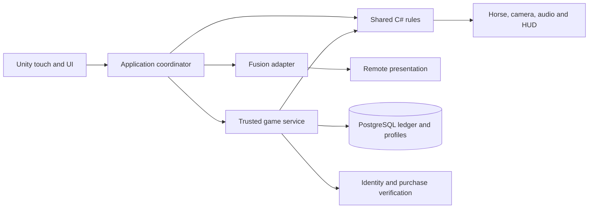

**Barrel Rivals — engineering playbook and stack contracts**  

Current implementation update: [v2 alley/source checkpoint](Reins-v2-Alley-Checkpoint.md) records connected work for S01–S03, S05, S11, S16/S19, S23, S29–S36, S40, S48/S50/S52. The current source has the approach/release/input/replay boundary; native artifacts, physical timing, production animation and R2 acceptance remain open. Card acceptance criteria below remain unchanged.
Engineering revision 6 · Gameplay revision 5 · Original eight-category, 53-section build plan

**Purpose.** This is the coding guide for the complete game: Reins Racing, three multiplayer experiences, ten horses, progression, purchases and publishable iOS/Android builds. The user has chosen Reins; Classic remains historical source/saves rather than a required player-facing mode. Every section names specialist skills, stack, dependencies, deliverables and evidence. Read its card with the matching build-plan row, gameplay blueprint and [approved 0.5 implementation plan](Reins-Racing-0.5-Implementation.md).

These are engineering contracts, not claims that named systems already exist. M0 repaired compilation/URP; M1 delivered Classic practice; [Reins v1](Reins-Lab-Implementation.md) added the offline three-barrel 0.4.0/build 4 checkpoint. Its historical evidence records 77 Editor, 8 Play Mode and 46 local HTTP checks, iPhone build/sign/install/version and Android artifact verification. The user has played Reins and selected its mechanics. No measured full-device acceptance, final rigged art or online service is established. Revision 6 governs 0.5: the launch/control/v2 source is implemented and tested; representative art and native/device acceptance remain incomplete. Older integration and decision records are context only where this revision has not superseded them.

**Current execution sequence.** R0/M1 Classic and R1 `reins-lab-v1` are historical checkpoints. Next is R2 / 0.5: Reins-only startup, first-person four-second moving alley and single-release launch, forgiving inputs, one authored horse/rider/arena and rules/contracts v2 with shared replay verification. Then complete measured phone acceptance and M1N continuous-input authority/footing/ghost fairness before online economy/content/release. The former M2 representative-course scope is carried by R2. Keep all 53 card titles/IDs unchanged. Free/original-only art and fixed-base capped earned streak defaults remain in force; no paid acquisition/service or lost-wallet insurance is authorized.

**Current adapter limits.** Current 0.5 source uses LEFT/RIGHT rein pads and CENTER armed launch hold/release, followed by a fresh-press cadence/Wrap handoff, with v2 records. The last installed 0.4 app retains its earlier three-tap gate. Bounded horse parameters and own-best playback do not implement horse selection, learned behavior, bond/streak UI, rival gaps or settlement. Prototype collision dimensions need reconciliation with the authored horse. Cards define work and acceptance, not completion.

**Standing development standard.** For every future section, inspect the actual code and pinned package APIs first; refine its contract; implement a complete connected increment; run relevant checks; review the result against the whole-game requirements; record evidence and remaining work. Source files, Unity assets, editor tooling, backend code, database migrations and native bridges are all deliverables when the section needs them. A component is complete only when its callers, data, assets and failure behavior work together.

**One coherent stack.** The following is the working recommendation. Unity 6000.6.0f1 is the verified M0 Editor baseline; release/device qualification remains open. The implementation pins URP 17.6.0, Input System 1.20.0, uGUI 2.6.0 and Test Framework 1.8.0. These versions passed the recorded foundation checks; they are not yet a qualified release stack. Package documentation links are references, not an instruction to install those particular versions. Record exact engine/package/SDK/compiler versions, licenses, platform support and verified build IDs in a compatibility register. Introduce dependencies only when the section demonstrates a need.

| Key | Working technology and responsibility | Decision / verification gate |
|---|---|---|
| CLIENT | Unity 6, C#, Input System, uGUI/TextMeshPro, Animator and explicit application/presentation adapters. Cinemachine for camera behavior where useful. | M0 clean import; M1 touch/bodycam proof. Pin packages together and use their installed API versions. |
| CORE | Engine-independent C# rules/contracts with a .NET Standard 2.1 API target and a language subset supported by the pinned Unity compiler. Integer time/IDs and reproducible course/scoring rules. | Lab uses a 20 ms fixed-step Core experiment and explicit quantization/event ordering; compile the same source for Unity and the later backend and compare fixtures on both runtimes. [Unity API compatibility](https://docs.unity3d.com/6000.0/Documentation/Manual/dotnet-profile-support.html). |
| CONTENT | ScriptableObject authoring, editor validators, immutable exported rules and Addressables for managed asset groups. Begin with local content. | Validate identities/references and loading lifetime; introduce remote content only with version, download-failure and rollback tests. |
| ART | Blender 4.5 LTS planned for the current Mac; editable source meshes, quadruped/rider rigs, FBX exports, textures and in-place animation clips. | Use original/free assets only; approve one representative horse/rider/arena on a phone before scaling; track source, commercial rights, attribution and import settings. No art tool is presumed installed. |
| RENDER | URP, lighting/volumes, Shader Graph, budgeted Particle System effects; HLSL/Render Graph passes only for required effects. | M0 restores pipeline assets; R2 verifies actual mobile appearance, comfort and GPU cost. [Render Graph](https://docs.unity3d.com/6000.0/Documentation/Manual/urp/render-graph.html). |
| NET | Photon Fusion 2 behind a transport adapter for live sessions, replicated public state and spectating. | M1N proves topology, private reveals, reconnect and independent clocks; no second multiplayer framework is added casually. [Photon topology guidance](https://doc.photonengine.com/fusion/v2/fusion-choose). |
| API | C# ASP.NET Core on .NET 10 LTS, initially one service with internal modules for profiles, matchmaking, run verification and economy. HTTPS for commands; evaluate a persistent channel for scheduled challenge/input delivery in M1N. | Working backend target, subject to the early feasibility/cost proof. A managed replacement requires a documented decision and equivalent contracts. [.NET support policy](https://dotnet.microsoft.com/en-us/platform/support/policy/dotnet-core). |
| DB | PostgreSQL, explicit migrations, transactional ledger, unique operation keys and reconciliation; object storage for larger replays/content. | M1N proves persistence/concurrency; M3 proves backup/restore and settlement. Hosting providers and database version are selected before provisioning. [Transaction isolation](https://www.postgresql.org/docs/current/transaction-iso.html). |
| PLATFORM | Unity Android/iOS build support and IL2CPP; native haptics/lifecycle/secure-storage bridges only where required. Kotlin/Java or Objective-C++/Swift as appropriate to the chosen plugin boundary. | First physical builds early; verify AOT/stripping/native binaries and modern build-machine requirements. |
| STORE / IAP | Unity IAP client adapter, Apple/Google store products and trusted backend purchase verification/fulfillment. | Store sandbox and transaction recovery before purchases go live. [Receipt validation](https://docs.unity.com/en-us/iap/receipt-validation). |
| AUDIO | Unity AudioSource/AudioMixer, scheduled cues and pooled voices with licensed sound assets. | M1 timing proof; R2 sound/latency/voice-budget review. Additional middleware needs a demonstrated requirement. |
| QA | .NET fixtures, Unity Editor/Play Mode, native artifact checks, named-device usability and later network/economy test matrices. | Keep ruleset/config/build/device identities in every result; check continuous input at variable render rates, geometry boundaries, fairness, fatigue and accessibility. |
| BUILD | Git/Git LFS where needed, Unity batch builds/Test Framework, .NET tests, GitHub Actions or an equivalent controlled runner. | M0 reproducibility; license availability, runner OS, credentials and build costs verified before relying on remote Unity builds. |
| OPS | Structured logs/metrics, bounded gameplay analytics, crash diagnostics, service health and incident procedures. | Start diagnostics at M0; choose one suitable telemetry stack at M1N and test it before beta. |

The ASP.NET service runs separately from Unity. Do not place .NET 10-only assemblies or APIs into the Unity client. Shared source targets the verified common API/language subset and has no UnityEngine, Fusion, database or web-framework dependency. Compilation is necessary but does not prove identical floating-point simulation; use explicit rounding/quantization where needed and cross-runtime reference fixtures before competitive use.

Managed identity is a separate early decision. Unity Authentication is a candidate for anonymous-to-linked accounts and cross-platform identity ([official overview](https://docs.unity.com/en-us/authentication)); M1N must prove server token verification, account recovery and platform linking before selection. Do not build an ad hoc password system or silently add multiple profile/economy backends. Hosting, identity, telemetry and replay-storage providers remain unprovisioned; choose them against reliability, total operating effort and measured costs.

**Dependency and authority boundaries.**

The diagram shows logical responsibility, not a final packet flow. Clients can predict feedback immediately; only trusted verification authorizes competitive results and rewards. A player's transport authority is not wallet authority. Future/private challenge data stays in the server-private manifest; disclosed Lab footing and schedules are equal per round. The Lab uses continuous rein samples and tap/hold edges, not Classic trace scoring. Do not give the second rider an extra rival-reference or timing-window advantage. Presentation adapters never change the accepted result. UI never writes a database balance.

**Proposed code ownership.** Preserve the existing project during recovery and introduce these boundaries incrementally. Paths below are relative to the future canonical repository and do not imply existing files.

| Location | Contents and allowed dependencies |
|---|---|
| `Packages/com.barrelrivals.core/Runtime/` | Shared contracts and rules, separated into explicit assembly definitions; companion .NET Standard projects compile the same source. No generated binaries or service-only source included by Unity. |
| `Assets/_Project/Scripts/Application/` | Race/session coordination and service interfaces; depends on CORE. |
| `Assets/_Project/Scripts/Presentation/` | Horse/camera/audio/HUD presenters; consumes state and events. |
| `Assets/_Project/Scripts/Integrations/` | Input, Fusion, API, IAP and platform implementations; depends on application interfaces. |
| `Assets/_Project/Editor/` and `Assets/_Project/Tests/` | Authoring/export validators and Unity tests in separate editor/test assemblies. |
| `Assets/_Project/{Scenes,Prefabs,Data,Art,Audio}/` | Versioned assets and metadata; use bounded loading and explicit references. |
| `Server/` and `Server.Tests/` | ASP.NET host, modules, persistence and integration tests; shares CORE and owns migrations. |
| `Docs/Sections/` and `Docs/Decisions/` | Actual section evidence, API/schema decisions and version/cost records. |
| `Build/` and `.github/workflows/` | Build/validation entry points and CI configuration; secrets stay outside source. |

Use one intentional construction point to wire dependencies. Do not create one global manager per section. Existing useful code can satisfy multiple cards; each behavior still has one authoritative owner.

**Shared contracts to establish before integration.** Concrete fields are designed and tested in M0/M1N; these are the required meanings.

| Contract | Required meaning / owner |
|---|---|
| Rules and content version | Ruleset namespace, schema version, rules/config/course hashes, input-mode ID and compatible client range. Classic rules 1, reins-lab-v1 and new Reins v2 are distinct; the 0.5 upgrade changes fingerprints and strict schemas together. S04 owns export/validation. |
| Match assignment | Match/run/participant IDs, format, class, frozen horse/loadout and round footing/stamina schedule. Same-round conditions and reference information are equal regardless of rider order; S38/S40 own authorization. |
| Accepted input | Run/phase identity, ordered sequence, bounded timestamp, normalized left/right tension, v2 launchHeld plus cadence edges, held Wrap and side Drive/cancel events. Launch is one armed falling edge; cancellation is not a release grade. Define exclusive pointer-to-pad ownership, quantization, same-tick ordering, event/rate bounds and stale-control timeout; S02 captures, S40 validates. |
| Skill outcome | Challenge/phase ID, signed launch-release timing, launch grade, grade components and one accepted boost/knock decision; S29/S33/S34 compute. |
| Run result | Validated elapsed time, legal course progress/finish, unique geometric knocks, explicit fouls and terminal status; style is separate and boosts affect motion. S36 owns calculation; trusted service accepts it. |
| Settlement | Match/purchase/streak-cycle/milestone keys, reservations, fixed-base capped bonus, bond grant and correction status. S42 applies one transaction; local Lab previews cannot mutate wallets/ownership. |
| Replay | Ruleset/config/course/footing/horse-class/input-mode identity, accepted inputs/events and legal progress crossings. Reject Classic/v1/v2 mismatch; S52 owns bounded playback, disclosure, gap validity and lifetime. |

**How to execute a section.** Record the card's scope, affected whole-game requirement IDs R01–R08, actual file/API names and pinned references before coding. Distinguish prerequisites needed now from interfaces agreed with later sections: numbering is ownership, not a demand to finish 1–53 serially. First milestone below means the first usable pass; the original build plan defines full completion.

For each increment, implement rules and failure handling, wire callers and serialized assets, validate the appropriate boundary, then retain proof: commit/build ID, exact command or device procedure, expected/observed outcome and unresolved limitations. Use tests for consequential rules, transitions, concurrency and regressions; inspect visual/art changes in the actual scene/device. A mock API proves client integration only and is labelled as such. Maintain Planned → Implemented → Verified → Release-ready honestly.

The section cards below make these obligations specific. Resource IDs DOC01–DOC21 resolve to primary documentation at the end; always consult the version matching the installed dependency before coding.

**S01 — Project Setup & Architecture**

- **Stack / first pass:** CLIENT, CORE, BUILD · M0.
- **Expertise and resources:** Unity assembly/package management, C# boundaries, Git recovery; DOC01, DOC02, DOC15.
- **Inputs / dependencies:** The technical audit, both local projects and the newer GitHub commit; preserve local changes before reconciliation.
- **Build:** One canonical Unity project with pinned packages, shared-core build and repeatable commands. For 0.5 open Reins directly and remove player-facing Classic navigation; preserve legacy source/saves/history.
- **Connect:** A composition root explicitly connects input, rules, presentation and service adapters; scene creation persists assets and metadata.
- **Proof:** Clean-checkout import, core/client compilation and reopened startup scene pass; document the actual Android/iOS build path.

**S02 — Input System Foundation**

- **Stack / first pass:** CLIENT, CORE · R1 → R2
- **Expertise and resources:** Two-thumb pad ownership, timestamps and mobile lifecycle; DOC03.
- **Inputs / dependencies:** Reins phase/input schema; side/center safe areas and a declared input-mode ID.
- **Build:** LEFT/RIGHT drags reach full rein pull at 50% pad-height travel. CENTER down in Ready starts approach; first intentional release grades launch. Preserve held steering at GO; the launch pointer cannot become cadence or Wrap. Fresh racing presses supply cadence, then eligible 300 ms holds request Wrap; Drive alternates sides.
- **Connect:** S11 consumes reins; S29 derives one launch release from launchHeld. Cancellation/lost focus cancels, rather than scores release. Clear stale inputs/audio on retry; do not blanket-clear legitimate steering at GO.
- **Proof:** Two-thumb phone play, exact timing boundaries, quick taps, re-hold spam, cancel/slide-off/hand swap and 30/60/120 Hz capture; no launch release becomes cadence, Wrap or Drive.

**S03 — Game State Machine**

- **Stack / first pass:** CORE, CLIENT, API · R1 → M1N
- **Expertise and resources:** Explicit fixed-step run/match states and immutable outcomes; DOC01, DOC09.
- **Inputs / dependencies:** Lab gate/course/barrel/Drive/finish contracts and ruleset namespace.
- **Build:** One Reins v2 run owner with Ready/approach/race/Drive and legal route/cancel/timeout/finish outcomes. Third beep is the fixed GO boundary; preserve Classic/v1 evidence without exposing the old mode.
- **Connect:** S29–36 publish accepted event identities; S37–41 later admit/settle each run once.
- **Proof:** Invalid phase/input order, duplicate finish, skips, restart and stale controls never create extra boost, result or reward.

**S04 — Data Architecture (ScriptableObjects)**

- **Stack / first pass:** CONTENT, CORE, CLIENT · R1
- **Expertise and resources:** Authoring/export schemas and bounded configuration; DOC04.
- **Inputs / dependencies:** V2 ruleset/launch/course/collision/beat/Drive/footing/horse IDs and the approved 0.5 values.
- **Build:** Versioned authored manifests/hashes, strict input/result schemas and fingerprint generation. Freeze approved launch/cadence defaults in v2; retain historical v1 definitions and reject ambiguous cross-version data.
- **Connect:** Unity/verifier consume identical public conditions; private future data stays protected. Classic/Lab decoders never infer compatibility from version number alone.
- **Proof:** Reject duplicate IDs, NaN/out-of-range curves, impossible dimensions and mismatched hashes; export round-trip is stable.

**S05 — Save/Load & Cloud Sync**

- **Stack / first pass:** CLIENT, CORE, API, DB · R1 → M3
- **Expertise and resources:** Namespaced saves/replays, migrations, concurrency and account recovery; DOC09–11.
- **Inputs / dependencies:** Classic/v1 historical schema/hash identities and new v2 identity; future trusted profile contracts.
- **Build:** Separate v2 settings/bests/replays with safe session fallback; preserve old bytes and never rescore them under v2. Later server profiles and transactional bond/streak grants remain independent work.
- **Connect:** S52 validates playback; S42 owns later wallet/bond writes. Offline previews never claim cloud sync or authority.
- **Proof:** Corrupt/old/cross-ruleset data cannot block play; restore/restart/duplicate settlement/concurrent account writes preserve ownership.

**S06 — iOS & Android Platform Layer**

- **Stack / first pass:** PLATFORM, BUILD, CLIENT · M0.
- **Expertise and resources:** IL2CPP/AOT, signing, lifecycle and native integration; DOC16 and the technical review.
- **Inputs / dependencies:** Named supported phones, engine/package lock and a compatible Mac/Xcode build environment.
- **Build:** Both mobile build routes produce 0.5/build 5 with Reins startup after implementation. Preserve prior development artifacts; use a clean unsynced native export and verified compiler/runtime inputs. Document lifecycle, signing and future release-host requirements.
- **Connect:** Pause/background notifications enter S02/S41; platform identity and purchase adapters remain outside race rules.
- **Proof:** Install signed development builds on both platforms; test backgrounding, stripping/native-plugin behavior and cold start.

**S07 — Performance Budget & Quality Tiers**

- **Stack / first pass:** RENDER, CLIENT, BUILD · R0 → R2.
- **Expertise and resources:** CPU/GPU profiling, memory ownership and thermal testing; DOC06.
- **Inputs / dependencies:** Named device tiers and the representative horse/arena from R2.
- **Build:** Start R2 with 60k character triangles, 2K maximum character textures, 150 visible batches and 650 MB peak application memory. Target sustained 60 FPS on iPhone with a 30 FPS profile; these budgets are not current measured results.
- **Connect:** Art, crowd, particles, cameras and UI receive measured budgets; presets alter presentation only.
- **Proof:** Record named device/build and a 20-minute session with CPU/GPU frame times, memory and thermal behavior; verify quality profiles preserve simulation rules and readable controls.
- **Reins integration:** R2 measures rein/cadence/Drive latency, two-thumb fatigue and temperature alongside frame time. No quality tier alters horse collision bounds, timing windows or ghost gap meaning.

**S08 — Horse Data Model & Breeds**

- **Stack / first pass:** CONTENT, CORE, ART · R1 → M6
- **Expertise and resources:** Horse data, trait envelopes and free-asset provenance; DOC04–05.
- **Inputs / dependencies:** Ten-horse full-roster requirement, event caps and Nerve/Fire/Biddability/Heart definitions.
- **Build:** Versioned trait/stamina/bond preview profiles with explicit practical tradeoffs and eventual distinct horse/rig records.
- **Connect:** S09 computes bounded movement coefficients; S10–13 present them; S38 freezes a legal match snapshot.
- **Proof:** All profiles validate; identical input exposes intended tradeoffs without random knocks, input lag or automated steering.

**S09 — Horse Stats & Leveling**

- **Stack / first pass:** CORE, CONTENT, API, DB · R1 → M6
- **Expertise and resources:** Balance, capped response curves and settled progression; DOC01, DOC09–10.
- **Inputs / dependencies:** Legal class caps, base horse/gear traits and disclosed per-round stamina schedule.
- **Build:** Bounded speed/grip/turn-response/effort terms; immediate input capture. Plan a labelled bond preview; it is not implemented in the current Lab. Persist earned bond only through later trusted settlement.
- **Connect:** S11 consumes coefficients; S38 freezes profile; S42 grants progression for a later match. No paid timing windows or artificial 80 ms delay.
- **Proof:** Cross-profile same-input matrix, cleaner weak-profile wins and no mid-round drift. No purchase can erase a normal knock via hidden control advantages.

**S10 — Horse Animation State Machine**

- **Stack / first pass:** ART, CLIENT · R1 → R2.
- **Expertise and resources:** Quadruped/rider rigging, blend trees and procedural alignment; DOC05.
- **Inputs / dependencies:** A licensed rigged horse/rider, locomotion reference and S11 movement/turn events.
- **Build:** One properly skinned horse/rider with western tack, visible hands/reins and in-place idle/walk/canter/gallop/sprint/braking/turn/contact clips. Evaluate the free candidate before accepting its anatomy/rig; repair or replace with original art.
- **Connect:** Core pose/speed/turn drives Animator and rider synchronization. Keep source/exported production art outside generated folders; root motion never moves the race simulation.
- **Proof:** Review first-person walk-to-gallop and full-race captures on phone: reins/hands align, no obvious foot sliding or clipping, and gait transitions are coherent. Further primitive-only polish does not complete this card.
- **Reins integration:** Reins adds leg/hip wrap, rein/brake contact and capped Drive effort. Imported animation/controller assets observe the Core pose; they cannot auto-steer, move the race root or determine knocks.

**S11 — Horse Physics & Movement Controller**

- **Stack / first pass:** CORE, CLIENT · R1 → R2
- **Expertise and resources:** Kinematic steering, swept collision and fixed-step numerical rules; DOC01.
- **Inputs / dependencies:** 20 ms step, two rein tensions, horse/barrel bounds, legal course and footing/trait manifest.
- **Build:** Preserve bounded differential steering/braking/footing/cadence/Wrap/Drive. Add the deterministic six-metre/four-second approach, graded positive acceleration and new start anchor. Match alley-wall and barrel geometry between Core and visuals.
- **Connect:** S19/S31/S36 consume the same contact IDs; S10/12/23 interpolate presentation, never decide collision/time.
- **Proof:** Symmetric left/right controls, finite bounds, high-speed tunnelling, legal turns/finish, render-rate replay and later IL2CPP/verifier equality.

**S12 — Horse Gait System**

- **Stack / first pass:** ART, CLIENT · R1 → R2.
- **Expertise and resources:** Stride phase, gait transitions and sound synchronization; DOC05, DOC13.
- **Inputs / dependencies:** Validated movement speed and the animation/hoof-contact specification.
- **Build:** Blend in-place gait/stride and synchronize rider/hooves/reins from accepted speed/turn/effort; author walk-to-gallop and sprint/braking transitions without moving the simulation root.
- **Connect:** S10 animation, S23 camera and S48 hoof audio share locomotion phase; gait presentation never adds race time.
- **Proof:** Check foot sliding, blended contacts, duplicate hoof sounds and camera jolts across all legal speed ranges.
- **Reins integration:** Lab cadence/Drive sound and movement gait share accepted speed/phase, with explicit hoof-contact coordination. A rhythmic tap does not directly teleport animation phase or change the simulation clock.

**S13 — Horse Visual Customization (Colors/Markings)**

- **Stack / first pass:** ART, CONTENT, CLIENT, API · R2 → M6.
- **Expertise and resources:** Material variants, UV/mask authoring and entitlement checks; DOC04, DOC07.
- **Inputs / dependencies:** Horse meshes, approved coat/marking catalogue and ownership records.
- **Build:** Reusable material/mask setup, customization preview and versioned saved cosmetic selections.
- **Connect:** Stable, first-person riding, spectator and replay resolve the same cosmetic IDs with a safe missing-asset fallback.
- **Proof:** Unauthorized selections fail; owned appearances persist after reinstall; measure memory/material batching across the roster.

**S14 — Horse Aging & Career System**

- **Stack / first pass:** CORE, API, DB · M6.
- **Expertise and resources:** Career modeling, migration and explainable progression; DOC09, DOC10.
- **Inputs / dependencies:** Approved maturity/experience rules, milestone rewards and preserved-ownership policy.
- **Build:** Career state transitions and persistence with explicit earned milestones and any approved condition effects.
- **Connect:** Apply changes after settlement; freeze the match snapshot and show progression in the stable.
- **Proof:** Duplicate results cannot age/advance twice; migrations retain horses; career effects do not drift between Championship runs.
- **Reins integration:** Also owns Horse IQ Bond: plan a local bounded-trait/bond preview, then grant experience/bond exactly once after later trusted match settlement. No learned auto-steer or mid-round trait changes.

**S15 — Horse Injury & Recovery System**

- **Stack / first pass:** CORE, API, DB, CLIENT · M6.
- **Expertise and resources:** Reversible condition rules and recovery UX; DOC09, DOC10.
- **Inputs / dependencies:** A tested decision on injury effects, durations and always-available play/recovery routes.
- **Build:** Condition/recovery state machine, trusted completion time and clear stable UI; ownership remains intact.
- **Connect:** S09 reads legal condition at entry; S42 applies any approved recovery cost; no device-clock authority.
- **Proof:** Test zero balance, all owned horses affected, clock changes, reconnect and duplicate recovery; a playable route always remains.
- **Reins integration:** Also owns disclosed per-round Horse IQ stamina/recovery. Equal round schedule and immutable pre-round profile avoid second-rider bias; no hidden random fatigue, irreversible loss or paid-only route to play.

**S16 — Arena Geometry & WPRA Standards**

- **Stack / first pass:** CORE, CONTENT, ART · R1 → R2.
- **Expertise and resources:** Course geometry, units and level-authoring tools; DOC17.
- **Inputs / dependencies:** Verified WPRA reference, deliberate arcade variants and start/finish convention.
- **Build:** Retain measured three-barrel course; author the six-metre approach from z=-6 to invisible z=0. Update first-barrel progress anchor; match alley collision to visible rails, including backward approaches and homestretch return.
- **Connect:** S11/S36 consume a versioned geometry export; visual arena variants cannot silently move scoring boundaries.
- **Proof:** Validate dimensions, clearance, barrel order, turn completion and legal finish; compare rendered course with baked rules.

**S17 — Arena Lighting System**

- **Stack / first pass:** RENDER, ART · R0 → R2.
- **Expertise and resources:** URP lighting, lightmaps, probes and shadow budgets; DOC06, DOC07.
- **Inputs / dependencies:** Correct pipeline assets, representative arena and phone GPU budgets.
- **Build:** Linear color, URP Forward, one shadowed sun, baked ambient lighting and coherent warm arena materials; keep stable reduced-cost quality profiles. Preserve cue/barrel visibility from first person.
- **Connect:** S21/S22 select approved profiles; gameplay prompts remain readable in every supported quality mode.
- **Proof:** Check materials and shadows in actual mobile builds, including transitions; record GPU cost and shader compatibility.

**S18 — Arena Ground Surface (Dirt/Footing)**

- **Stack / first pass:** CORE, CONTENT, RENDER, AUDIO · R1 → R2
- **Expertise and resources:** Spatial footing, grip curves and fair round manifests; DOC01, DOC07.
- **Inputs / dependencies:** Hard Pack/Sand/Clay/Mud/Mixed profiles and course-space patch geometry.
- **Build:** Bounded speed/grip map plus deterministic between-round degradation, disclosed equally to both riders.
- **Connect:** S11 physics and S17/22/27/48 visuals/audio share profile identity; cosmetic ruts do not mutate gameplay.
- **Proof:** Patch-boundary fixtures, order reversal and same-round manifest/hash equality. Validate surface readability and feel on phones.

**S19 — Arena Props (Barrels, Fences, Gates, Chutes)**

- **Stack / first pass:** CORE, CONTENT, CLIENT, ART · R1 → R2
- **Expertise and resources:** Collider bounds, swept contact, reset and event identity; DOC01, DOC06.
- **Inputs / dependencies:** Versioned horse/barrel geometry and clean-pass/contact thresholds.
- **Build:** Author detailed foreground alley fencing, barrels and gates outside builder-owned output, with shared wall/barrel collision bounds. Reset and animate accepted contacts once; preserve the finish route.
- **Connect:** S31 measures surface clearance; S36 adds one five-second penalty; physics decoration cannot reroll accepted outcomes.
- **Proof:** Different visual/LOD scales retain legal collision bounds; near-pass/contact, tunnelling, duplicate callbacks and reset agree with replay.

**S20 — Crowd System (Stands, Fans, Animation)**

- **Stack / first pass:** ART, RENDER, AUDIO · R2 → M6.
- **Expertise and resources:** Crowd LOD, instancing and reaction scheduling; DOC06, DOC13.
- **Inputs / dependencies:** Arena stands, crowd asset rights and performance allocations.
- **Build:** Scalable crowd presentation and deduplicated reaction groups responding to race events.
- **Connect:** S48 mixes reactions; spectator and local views use the same accepted event identity.
- **Proof:** Profile low/high crowd tiers, audio overlap and repeated matches; disabling crowd detail leaves all race rules unchanged.

**S21 — Arena Themes & Variants**

- **Stack / first pass:** CONTENT, ART, RENDER · R2 → M6.
- **Expertise and resources:** Environment kits, content loading and visual consistency; DOC07, DOC08.
- **Inputs / dependencies:** One approved arena benchmark, five-tier proposal and course identity catalogue.
- **Build:** Five coherent arena presentations with local content groups, loading/unloading rules and validated references.
- **Connect:** S45 event eligibility selects content; S16 supplies matching course data and S07 supplies quality constraints.
- **Proof:** Every arena loads within budget; interrupted loading recovers; rules and visual catalogue versions agree.

**S22 — Weather & Time-of-Day System**

- **Stack / first pass:** CORE, CONTENT, RENDER · R1 → R2.
- **Expertise and resources:** Seeded randomness, environment presets and visibility testing; DOC01, DOC07.
- **Inputs / dependencies:** Missing RNG repair, versioned weather presets and paired-match conditions.
- **Build:** Reproducible weather selection plus visual transition adapters; trusted manifests freeze any handling effects.
- **Connect:** Gameplay RNG streams are separate from cosmetic particles/crowds and private challenge generation.
- **Proof:** Same manifest produces equal gameplay conditions; extra cosmetic RNG calls cannot change shapes, weather or results.

**S23 — Bodycam Camera Controller**

- **Stack / first pass:** CLIENT, ART · M1.
- **Expertise and resources:** First-person framing, camera damping and comfort; DOC12.
- **Inputs / dependencies:** Authored horse/rider seat target, interpolated accepted poses and compact rein/heartbeat UI.
- **Build:** First-person from idle through finish with steady horizon and restrained seat bob. Reduced motion disables bob/roll/speed-FOV changes. Avoid a third-person introduction or overhead course-preview cut.
- **Connect:** S11/12 supply pose/gait cues without animation authority; S50 controls remain stable. Spectator/replay cameras have separate ownership.
- **Proof:** Phone comfort and visibility across walking, acceleration, tight turns, knocks and sprint; no hands/mane/rein clipping or camera ownership changes that alter timing.
- **Reins integration:** Reins HUD must remain steady/readable while looking into turns; ghost pressure/clutch effects cannot obscure cadence or force active split-screen. Reduced motion changes presentation only.

**S24 — Post-Processing Shader Pipeline**

- **Stack / first pass:** RENDER, BUILD · R0 → R2.
- **Expertise and resources:** URP configuration, shader variants and render-pass compatibility; DOC07.
- **Inputs / dependencies:** Pinned engine/URP versions, renderer assets and named device profiles.
- **Build:** Linear-space URP Forward assignments, deliberate lighting/grading volumes and necessary shader variants only. Inspect imported horse/tack/materials on Metal and Android; no new rendering framework without need.
- **Connect:** S25–28 extend this one rendering pipeline; include required shader variants in mobile builds.
- **Proof:** No missing GUIDs or magenta materials; verify Metal and Android graphics paths, build stripping and measured pass costs.

**S25 — Lens Effects (Fisheye, Chromatic, Flare)**

- **Stack / first pass:** RENDER, CLIENT · R2.
- **Expertise and resources:** Optical shader effects and screen-space composition; DOC07.
- **Inputs / dependencies:** Approved art direction and effect budgets from S07/S24.
- **Build:** Bounded lens/flare profiles using stock URP or Shader Graph; HLSL only for a demonstrated visual requirement.
- **Connect:** World effects exclude the readable input surface; comfort settings use the same gameplay rules.
- **Proof:** Compare phone captures with effects on/off; check edge readability, artifacts and GPU cost.
- **Reins integration:** For Reins, preserve side rein guides, center cadence/Wrap meter and pocket labels; behind/ahead never changes visual noise or skill readability.

**S26 — Motion Effects (Blur, Speed Lines)**

- **Stack / first pass:** RENDER, CLIENT · R2.
- **Expertise and resources:** Motion cues, camera comfort and mobile overdraw; DOC06, DOC07.
- **Inputs / dependencies:** Validated speed/turn events and reduced-motion preferences.
- **Build:** Speed lines and restrained motion effects driven by presentation data with independent intensity settings.
- **Connect:** S35 local slow motion affects presentation curves per rider, without changing global competitive scheduling.
- **Proof:** Check phase transitions and small-screen readability; no cue, barrel or drawn trace is obscured by the chosen presets.
- **Reins integration:** Home Stretch Drive spectacle is optional. Ghost gap or clutch detection cannot modify input thresholds, speed policy or timing windows.

**S27 — Environmental VFX (Dust, Particles, Sweat)**

- **Stack / first pass:** RENDER, ART, CLIENT · R2.
- **Expertise and resources:** Particle authoring, pooling and texture overdraw; DOC06, DOC07.
- **Inputs / dependencies:** Hoof/barrel events, surface identity and effect budget.
- **Build:** Pooled Unity Particle System effects for dust/contact/sweat as appropriate; introduce heavier VFX tooling only after a measured need.
- **Connect:** Accepted event IDs trigger effects once; S18 surface and S48 audio use matching contact information.
- **Proof:** No unbounded allocations or leaked emitters during repeated races; profile worst-case dust on the slowest supported phone.
- **Reins integration:** Use accepted clearance/contact and footing events; particle wobble/dust cannot introduce a different knock verdict or surface grip for the next rider.

**S28 — Dynamic Exposure & Color Grading**

- **Stack / first pass:** RENDER, ART · R2.
- **Expertise and resources:** Color grading and luminance transitions; DOC07.
- **Inputs / dependencies:** Arena lighting profiles and camera/readability reference captures.
- **Build:** Approved color/exposure profiles with bounded transitions; any automatic exposure requires a proven compatible implementation.
- **Connect:** S17/S22 supply environment state; stable gameplay UI is composed with deliberate exposure behavior.
- **Proof:** Bright/dark transitions preserve barrel and prompt visibility; inspect captures across the supported phone profiles.

**S29 — Phase 1 — Beep Gate System**

- **Stack / first pass:** CORE, CLIENT, AUDIO · R1 → R2
- **Expertise and resources:** Fixed-step hold/release grading, motion/timing synchronization and scheduled audio; DOC03, DOC13.
- **Inputs / dependencies:** V2 launchHeld state, first-release timestamp, four-second approach, fixed GO origin and exact accepted windows.
- **Build:** CENTER hold starts 6 m/4 s walk; beeps at 2/3/4 s. First release Perfect ±120 ms, Good ±240 ms, otherwise normal. Positive acceleration ×1.35/×1.15/default until GO+1.2 s; late release gets remaining duration. Holding past GO+400 ms gives normal launch.
- **Connect:** Third beep coincides with invisible z=0 and clock/steering activation. Early release cannot leave approach early. No standstill/time credits or cadence/Wrap from launch release; scheduled audio cancels on retry.
- **Proof:** Exact window boundaries, never held/released, very short touch, duplicate/re-hold spam, early/late/deadline, lifecycle cancellation, fixed clock and actual phone audio/visual latency.

**S30 — Phase 2 — Alley Run**

- **Stack / first pass:** CORE, CLIENT, AUDIO · R1 → R2
- **Expertise and resources:** Cadence schedules, capped acceleration and transition geometry; DOC01, DOC13.
- **Inputs / dependencies:** Accepted v2 launch, fixed GO origin, held steering, fresh center pointer and cadence schedule.
- **Build:** First heartbeat at GO+600 ms, then 360–500 ms periods; grade ±60/100/140 ms. Preserve bounded streak gain/recovery and direct steering; no launch-owned hold becomes Wrap.
- **Connect:** S11 remains motion owner; S31 receives legal barrel approach; S48/50 render equal readable rhythm.
- **Proof:** Smooth launch-to-steering/heartbeat handoff, held rein continuity, no same-release cadence, bounded repeat-input gain and phone timing/recovery/fatigue.

**S31 — Phase 3 — Barrel Turn Pattern System**

- **Stack / first pass:** CORE, CLIENT, ART · R1 → R2
- **Expertise and resources:** Geometric pockets, contextual wrap and single exit outcomes; DOC01, DOC03.
- **Inputs / dependencies:** Horse/barrel surface clearance, legal progress/direction and exclusive hold ownership.
- **Build:** Retain geometric Pocket/Kiss and contextual Wrap with bounded control/speed tradeoff; require racing-owned input. Legacy drawing/exit code remains historical, not part of the new player flow.
- **Connect:** S33 evaluates path/contact; S11 applies physical exit boost; S19/S36 share knock identity; S10/27 animate accepted events.
- **Proof:** No hidden RNG, center-only kiss band, collision immunity or repeated exit gain. Two-thumb wrapped/unwrapped turns and skipped/re-entered barrel fixtures.

**S32 — Pattern Library & Generation**

- **Stack / first pass:** CORE, CONTENT, API · R1 → M1N
- **Expertise and resources:** Versioned challenge generation and symmetric disclosure; DOC04, DOC18.
- **Inputs / dependencies:** V2 course/launch/beat/footing/round/horse/config manifest; historical Classic/v1 catalogues remain distinct.
- **Build:** Immutable v2 assignments and explicit hash/input-mode identity; regenerate canonical fixtures/fingerprint and update Unity/.NET decoders with the same field contract.
- **Connect:** S33/35 consume assigned config; S39/S52 receive only permitted compatible rival data; both riders get equal preview/reference access.
- **Proof:** Reproducible valid manifests, shared footing and no order-based information leak or Classic replay import.

**S33 — Touch Input & Path Scoring Algorithm**

- **Stack / first pass:** CORE, CLIENT, API · R1 → M1N
- **Expertise and resources:** Continuous/discrete input admission, computational geometry and timing; DOC01, DOC03. DOC18 remains a Classic recognizer reference only.
- **Inputs / dependencies:** Normalized reins, launchHeld and signed release timing, fresh cadence/held Wrap, side Drive, timestamp/sequence/quantization bounds and collider envelopes.
- **Build:** Exclusive pointer ownership and one armed launch-release edge, cadence/Drive grading, declared fresh-press-to-Wrap timeline and swept clearance/contact. Preserve historical trace/v1 validation records.
- **Connect:** Shared Core supplies diagnostic events to UI and future verifier. No purchase/rival lead changes the grading definition.
- **Proof:** Boundary/NaN/spam/duplicate/reorder tests; no third touch required; real-phone intent/error samples and cross-runtime fixtures.

**S34 — Phase 4 — Home Sprint**

- **Stack / first pass:** CORE, CLIENT, AUDIO · R1 → R2
- **Expertise and resources:** Alternating input windows, capped boost/stamina and accessibility; DOC03, DOC13.
- **Inputs / dependencies:** Legal barrel-three exit, side event ownership, disclosed carryover and finish boundary.
- **Build:** Home Stretch Drive with bounded rolling/cadence policy; same-side repeats earn no gain. Prototype attainable cap rather than requiring 14 taps/s.
- **Connect:** S11 applies physical gain; S36 ends it at finish; S48/50 remain readable with effects off.
- **Proof:** Side-order/spam/timing/cap/finish tests; compare fatigue and accessible input modes. Ghost clutch state cannot lower thresholds.

**S35 — Slow Motion System**

- **Stack / first pass:** CORE, CLIENT, NET, API · R1 → M1N
- **Expertise and resources:** Fixed-step clocks, input timestamp policy and network admission; DOC01, DOC19.
- **Inputs / dependencies:** Lab 20 ms simulation step, canonical ordering/quantization, deadlines and stale-input timeout.
- **Build:** Separate capture, simulation and presentation timelines. Lab does not inherit Classic drawing slowdown; any configured slow motion is per-rider/versioned/equal.
- **Connect:** Third beep is the common race origin for all graders/S36. Capture timestamps apply to first subsequent 20 ms boundary; presentation interpolation, audio and network transport cannot move the result clock.
- **Proof:** Same accepted sequence under variable render steps; later IL2CPP/verifier equality, independent riders, delay/reorder/pause/reconnect with no deadline rewind.

**S36 — Run Timer & Penalty Calculator**

- **Stack / first pass:** CORE, API, CLIENT · R1 → M1N
- **Expertise and resources:** Legal finish, immutable result, integer time and deduplication; DOC01, DOC09.
- **Inputs / dependencies:** Official start cue, legal three-barrel progress, unique contacts and explicit foul policy.
- **Build:** Elapsed simulation from fixed third beep to legal finish plus once-per-barrel five-second knock, explicit terminal statuses and separate style. Approach is outside clock; release never resets it or adds a standstill.
- **Connect:** S11/19/31/34 supply accepted events; trusted verifier accepts result; S42 settles once later.
- **Proof:** Start/finish anchoring, early/late/missing release, skips/wrong direction/tunnelling, duplicate knocks/finish, overflow, rounding, DNF/tie and replay agreement.

**S37 — Multiplayer Networking (Photon Fusion 2)**

- **Stack / first pass:** NET, API, CLIENT · M1N → M3
- **Expertise and resources:** Transport topology, continuous input authority and bounded replication; DOC19.
- **Inputs / dependencies:** Rules/config hashes, accepted analog/discrete sequence, equal footing and state/privacy contracts.
- **Build:** Minimal Photon candidate adapter and independent verifier proof before production service adoption.
- **Connect:** S38 authorizes participants; S40 validates input/time/results; S39/52 stream compatible permitted state only.
- **Proof:** Two devices under delay/loss/reorder/reconnect; no stale held controls, unequal conditions or duplicate outcomes. Record capacity/cost and unproven limits.

**S38 — Matchmaking & ELO/Trophy System**

- **Stack / first pass:** API, DB, NET, CLIENT · M1N → M3
- **Expertise and resources:** Eligibility, compatible rulesets, information fairness and rating updates; DOC09–10, DOC19.
- **Inputs / dependencies:** Frozen event/class/horse/config/input-mode and per-round footing/stamina schedule.
- **Build:** Eligible Quick Duel/Championship assignment with common comparison contract and equal rival-reference policy.
- **Connect:** S37 admits only assigned players; S42 grants trusted result/bond/streak once. Reins rules version and recorded/live modes are explicitly identified; legacy formats cannot enter new queues.
- **Proof:** Order swap, low population, stale tickets, version/input-mode mismatch, extreme legal traits and concurrent matches do not create unfair admission or reward.

**S39 — Spectator Mode**

- **Stack / first pass:** NET, CLIENT, CORE · M1N → M5
- **Expertise and resources:** Fair ghost disclosure, course-progress alignment and remote presentation; DOC12, DOC19.
- **Inputs / dependencies:** Compatible recorded input/manifest and elapsed-time crossings at legal progress markers.
- **Build:** Optional rival ghost and cosmetic pressure/clutch cues; mark gap unavailable without valid comparable progress.
- **Connect:** S52 validates replay; S40 controls data release. Equal preassigned reference or post-both-runs ghost prevents second-rider advantage.
- **Proof:** No Classic import, fabricated live rival or window/Drive-threshold/noisy-UI advantage. Test gap sign, penalties, overlap, incomplete progress and display-off parity.

**S40 — Anti-Cheat & Server Validation**

- **Stack / first pass:** CORE, API, DB · M1N → M3
- **Expertise and resources:** Input admission, independent simulation verification and abuse diagnostics; DOC09–10.
- **Inputs / dependencies:** Authenticated run/manifest/config identity, bounded rein samples/tap/hold rates, sequence and timestamp limits.
- **Build:** Update local verification to strict v2 inputs/results and matching Core fingerprint; regenerate Unity/.NET canonical conformance fixtures. Update the unapplied database draft compatibility constraint only; no DB migration/deployment or trusted reward authority is established by loopback tests.
- **Connect:** S42 accepts only one verified result; local style/bond/streak/stopwatch claims have no authority. Fixed stepping is not sufficient cross-runtime proof.
- **Proof:** Malformed/NaN, spoofed config, impossible/spam samples, physics disagreement, rollback/reconnect and duplicate settlement cases; document macro/collusion limits.

**S41 — Disconnect Handling & Reconnection**

- **Stack / first pass:** CORE, API, NET, CLIENT · M1N → M3.
- **Expertise and resources:** Distributed recovery, deadlines and idempotent correction; DOC09, DOC19.
- **Inputs / dependencies:** Match-state snapshots and the cause-specific settlement matrix.
- **Build:** Reconnect/resume contract, bounded grace policy, terminal outcomes and clear player recovery messages.
- **Connect:** S06 lifecycle signals and S37 transport events converge on one recovery owner; S42 corrections use unique keys.
- **Proof:** Disconnect at every phase and during settlement; no input rewind, stuck reservation, duplicate refund or lost authoritative result.
- **Reins integration:** For continuous reins, bound stale held input and release/cancel both rein/wrap ownership correctly on lost focus/transport. No reconnect replays missed cadence/gate opportunities or rewinds course progress.

**S42 — Currency System (Coins, Diamonds, Trophies)**

- **Stack / first pass:** API, DB, CORE · M3 → M6
- **Expertise and resources:** Transactional rewards, fixed-base caps and settled horse progress; DOC09–10.
- **Inputs / dependencies:** Accepted match/result, event reward B, streak-cycle/milestone and bond eligibility/version.
- **Build:** Wallet ledger and capped earned streak extras; no accumulated-pot recursion, existing-winnings loss or premium insurance under current recommendation. No Lab reward UI/calculator is implemented; any future local preview must remain non-awarding.
- **Connect:** S44/46 define eligible milestones; S05 stores profile; S47 later verifies allowed purchases. One grant key per match/cycle/milestone.
- **Proof:** Cap/overflow, duplicate/concurrent grant, void/draw/DNF/refund and bond retries reconcile. Existing balance never becomes the streak stake.

**S43 — Gear & Equipment System**

- **Stack / first pass:** CORE, API, DB, CLIENT · R2 → M3.
- **Expertise and resources:** Loadout composition, entitlements and consumable lifecycle; DOC10.
- **Inputs / dependencies:** Gear catalogue, stacking/cap rules and one-match duration contract.
- **Build:** Effective-loadout resolver, equip UI and server reservations/consumption/restoration for gear.
- **Connect:** S09 creates the frozen snapshot; S42 atomically consumes inventory; all Championship runs share the same legal loadout.
- **Proof:** Concurrent matches cannot spend one item twice; temporary modifiers stay bounded and service void restores only once.
- **Reins integration:** Lab horse/gear effects are bounded movement/effort curves only; no paid timing windows, input-delay removal, auto-steering or hidden contact forgiveness. Freeze the loadout and disclosed stamina schedule.

**S44 — Loot Crate & Reward System**

- **Stack / first pass:** CORE, API, DB, CONTENT, CLIENT · M3 → M6
- **Expertise and resources:** Reward design, eligibility, caps and grant idempotence; DOC09–10.
- **Inputs / dependencies:** Fixed base reward, approved milestone table and settled match/streak-cycle identity.
- **Build:** Earned streak/mission/crate policies with explicit claims/reset/caps; illustrative milestone values stay unactivated until balance approval.
- **Connect:** S42 atomically grants base/bonus; When implemented, UI must label local Lab calculations as previews. No premium loss insurance product.
- **Proof:** Original recursive example is not implemented. Table/example sums agree; tie/void, cap, repeated claim and offline result cannot mint rewards.

**S45 — Trophy Road & Arena Unlocks**

- **Stack / first pass:** CORE, API, DB, CLIENT · M3 → M6.
- **Expertise and resources:** Progression graphs, eligibility predicates and economy simulation; DOC09, DOC10.
- **Inputs / dependencies:** Five-tier proposal, trophies, horse readiness and free-entry recovery rules.
- **Build:** Server eligibility checks and trophy-road views backed by one versioned progression model.
- **Connect:** S38 uses the same predicates shown in S50; purchasing ownership never directly grants earned tier access.
- **Proof:** Simulate a complete free route, zero balance and repeated losses; test account migration and anti-farming without blocking recovery.
- **Reins integration:** Do not import Lab style/streak/bond previews as progression. Later event eligibility and fixed-base reward amounts are frozen and validated by trusted services.

**S46 — Daily Missions & Season Pass**

- **Stack / first pass:** API, DB, CONTENT, CLIENT · M6.
- **Expertise and resources:** Scheduled progression, event aggregation and claim consistency; DOC09, DOC10.
- **Inputs / dependencies:** Mission/pass definitions, trusted calendar and free/premium reward tracks.
- **Build:** Deduplicated progression from accepted gameplay events, season rollover and exactly-once reward claims.
- **Connect:** S42 grants rewards; S47 proves pass entitlement; S53 observes progress without becoming the reward authority.
- **Proof:** Test device-clock changes, late events, boundary rollover and double claims; paid and free tracks reflect published contents.
- **Reins integration:** Streak extras use fixed-base capped earned milestones under S42/S44. No current-wallet staking or premium loss insurance; stopping play does not forfeit awarded balances.

**S47 — In-App Purchase & Store**

- **Stack / first pass:** STORE / IAP, API, DB, CLIENT · M6 → M7
- **Expertise and resources:** Allowed entitlement products and trusted store fulfillment; DOC20.
- **Inputs / dependencies:** Approved content/power policy and working service ledger; no live Lab purchases.
- **Build:** Mobile storefront, fixed-content offers, verification/restore/refund when introduced. Exclude paid timing windows, input lag removal, auto-steering, rival-information advantage and streak-loss insurance.
- **Connect:** S42 grants verified entitlements once; S09 caps legal strength. Free-only development art acquisition remains separate from future player-store scope.
- **Proof:** Store sandbox/pending/duplicate/refund recovery and zero-spend route pass before selling. No product is inferred from a local preview.

**S48 — Adaptive Audio Engine**

- **Stack / first pass:** AUDIO, CLIENT, CONTENT · R1 → R2
- **Expertise and resources:** Rhythm cue latency, contact/gait mix and bounded voices; DOC13.
- **Inputs / dependencies:** Shared approach tick/DSP origin, three launch beeps, first heartbeat GO+600 ms and accepted gait/contact/Wrap/Drive events.
- **Build:** Preschedule all three beep voices from a common origin and use separate heartbeat audio. Sync hoof contacts and restrained feedback; cancellation/retry stops every future cue.
- **Connect:** S12 movement/animation phase and S18 footing drive presentation; ghost pressure may change cosmetic music, never mask skill cues.
- **Proof:** Phone timing/volume/fatigue, repeated starts and backgrounding leave no duplicate/stale voices; sound-off timing cues stay usable.

**S49 — Haptics & Feedback System**

- **Stack / first pass:** PLATFORM, CLIENT · R1 → R2
- **Expertise and resources:** Optional native impacts and accessibility; DOC14, DOC16.
- **Inputs / dependencies:** Accepted outcome IDs and settings/lifecycle state.
- **Build:** Short causal feedback for selected meaningful gate/turn/contact/Drive events, not continuous vibration on every sample.
- **Connect:** S48/50 communicate the same outcomes; unsupported/off haptics preserve timing and readability.
- **Proof:** No duplicate/stale pulses after cancel/retry, bounded frequency and actual phone comfort checks.

**S50 — UI/UX Design System**

- **Stack / first pass:** CLIENT, CONTENT, API · R1 → M6
- **Expertise and resources:** Two-thumb HUD, honest comparison and accessible feedback; DOC03, DOC12.
- **Inputs / dependencies:** Reins-only startup, first-person approach, per-phase ownership, local/trusted result labels and future compatible ghost.
- **Build:** Compact side reins and center heartbeat/Wrap, hold-to-approach prompt, brief launch grades and one coaching tip. No visible start line, Classic navigation or oversized panels obscuring horse/alley/first barrel. Rival-gap/bond/streak UI remains future work.
- **Connect:** S02 assigns pointer ownership and captures phase-specific edges; S36/39/42 provide displayable truths. Reduced motion/ghost off never changes competitive rules.
- **Proof:** Uncoached phone tasks with no third touch; input occlusion, color-independent zones, unavailable gap and no noisy behind-state UI.

**S51 — Tutorial & Onboarding Flow**

- **Stack / first pass:** CORE, CLIENT, CONTENT · R1 → R2
- **Expertise and resources:** Progressive skill teaching and observed learning; DOC03.
- **Inputs / dependencies:** All ten mechanics and the current side-rein/center-action layout; no three simultaneous touches. The alternative two-zone classifier is not implemented.
- **Build:** Teach hold→walking beeps→release→fresh heartbeat taps and steering, then pockets/Wrap/footing/Drive. Mistimed starts keep moving. Explain own-best versus future trusted rivals/rewards; no Classic tutorial in main flow.
- **Connect:** S50 gives one useful correction; controls/settings and reduced-effects teaching use identical rules.
- **Proof:** Fresh testers complete legal three-barrel practice and explain knock/boost/footing effects; record misclassification, strain and confusion rather than assumed addiction.

**S52 — Replay System & Highlights**

- **Stack / first pass:** CORE, CLIENT, CONTENT, API · R1 → M4
- **Expertise and resources:** Versioned continuous-input replay, bounded storage and progress gaps; DOC01, DOC19.
- **Inputs / dependencies:** V2 schema/config/course/footing/horse/input-mode plus launchHeld, release result and accepted sequence; historical namespaces remain separate.
- **Build:** Isolated v2 replay and local bests with strict hash/version parsing; preserve existing Classic/v1 files without playback under v2. Update recorder/decoder/fixtures/verifier together; authorized rivals remain later work.
- **Connect:** S39 displays validated compatible ghost/gap; S40 owns trusted acceptance/disclosure; S05 bounds/migrates storage.
- **Proof:** Corrupt/old/mismatched data, hold-origin ordering, deterministic playback, missing progress, penalties and equal reference information. No silent rescore or invented gap.

**S53 — Analytics & Telemetry**

- **Stack / first pass:** OPS, API, CLIENT, QA, BUILD · R1 → M7
- **Expertise and resources:** Minimal diagnostics, fairness/skill analysis and release operations; DOC06, DOC09, DOC15.
- **Inputs / dependencies:** Rules/config/build identity and declared data/retention policy.
- **Build:** Versioned minimal launch release/grade/handoff diagnostics plus cadence/Wrap/contact/Drive and replay/fairness/settlement faults. Record real device evidence separately from builds and subjective preference.
- **Connect:** S02/40/42 emit bounded causes, not unrestricted raw touch/identity collections. Observe voluntary retries, clarity and fatigue alongside engagement.
- **Proof:** Correct events, opt-out/retention where applicable, diagnosable failures and controlled comparisons. Longer sessions alone do not prove enjoyment or addiction.

**Resource register.** Checked September 16, 2026. These are implementation references; package-version URLs do not establish compatibility with the current project. The stack and architecture are our recommendations, not features claimed by these sources.

| ID | Primary reference / use |
|---|---|
| DOC01 | [Unity .NET compatibility](https://docs.unity3d.com/6000.0/Documentation/Manual/dotnet-profile-support.html): shared-code API boundary. |
| DOC02 | [Unity Test Framework](https://docs.unity3d.com/Packages/com.unity.test-framework@1.4/manual/index.html): Edit Mode, Play Mode and platform test support. |
| DOC03 | [Input System touch support](https://docs.unity3d.com/Packages/com.unity.inputsystem@1.17/manual/Touch.html): touch capture and EnhancedTouch. |
| DOC04 | [ScriptableObject](https://docs.unity3d.com/6000.0/Documentation/Manual/class-ScriptableObject.html): Unity authoring data; export runtime/server contracts separately. |
| DOC05 | [Unity animation system](https://docs.unity3d.com/6000.0/Documentation/Manual/AnimationOverview.html): animation states and blending; use quadruped-appropriate rigging/reference. |
| DOC06 | [Unity Profiler](https://docs.unity3d.com/6000.0/Documentation/Manual/Profiler.html): device performance diagnosis. |
| DOC07 | [URP Render Graph](https://docs.unity3d.com/6000.0/Documentation/Manual/urp/render-graph.html): compatible rendering extensions. |
| DOC08 | [Addressables](https://docs.unity3d.com/Packages/com.unity.addressables@2.7/manual/index.html): asset groups and loading lifecycle. Replay storage is a separate service concern. |
| DOC09 | [ASP.NET Core fundamentals](https://learn.microsoft.com/en-us/aspnet/core/fundamentals/?view=aspnetcore-10.0): service configuration and application structure. |
| DOC10 | [PostgreSQL transaction isolation](https://www.postgresql.org/docs/current/transaction-iso.html): concurrent transactions and whole-transaction retries where required. |
| DOC11 | [Unity Authentication](https://docs.unity.com/en-us/authentication): managed-identity candidate; prove backend verification and linking before adoption. |
| DOC12 | [Cinemachine](https://docs.unity3d.com/Packages/com.unity.cinemachine@3.1/manual/index.html): camera tooling, if selected. |
| DOC13 | [Unity AudioMixer](https://docs.unity3d.com/6000.0/Documentation/Manual/AudioMixer.html): audio routing and mixing. |
| DOC14 | [Apple Core Haptics](https://developer.apple.com/documentation/corehaptics) and [Android haptics](https://developer.android.com/develop/ui/views/haptics/haptics-principles): platform feedback. |
| DOC15 | [GitHub Actions](https://docs.github.com/en/actions/get-started/understand-github-actions): CI workflows; Unity licensing/build support still need verification. |
| DOC16 | The accompanying technical review links [Apple toolchain requirements](https://developer.apple.com/xcode/system-requirements) and [Android page sizes](https://developer.android.com/guide/practices/page-sizes); recheck at implementation/release. |
| DOC17 | [WPRA pattern reference](https://wpra.com/the-proof-is-in-the-dirt-in-the-wilderness-circuit/) and [rule book](https://wpra.com/rule-book/): regulation layout and explicit arcade differences. |
| DOC18 | [University of Washington $1 recognizer](https://depts.washington.edu/acelab/proj/dollar/index.html): template-matching candidate, not a ready-made competitive accuracy score. |
| DOC19 | [Photon Fusion topology guidance](https://doc.photonengine.com/fusion/v2/fusion-choose): mobile networking tradeoffs. |
| DOC20 | [Unity IAP verification](https://docs.unity.com/en-us/iap/receipt-validation), [Apple review guidelines](https://developer.apple.com/app-store/review/guidelines/) and [Google payments policy](https://support.google.com/googleplay/android-developer/answer/9858738?hl=en): purchase integration and disclosures. |
| DOC21 | [Unity UI comparison](https://docs.unity3d.com/6000.0/Documentation/Manual/UI-system-compare.html): runtime/editor UI choices; this project uses uGUI/TMP as its working runtime choice. |

**Review and release gates.** Before a section is called verified, inspect correctness, integration, maintainability and the specific risk it introduces. Before release, also check real-device performance, asset quality/rights, operational recovery and the relevant store/account requirements. Meaningful tests cover rules and failure modes; visual review covers final animation, comfort, sound and readability. Store test outputs, captures and decisions with the section evidence. Do not substitute coverage percentages, a compiler pass or a premium-quality label for those outcomes.

**The next connected implementation.** Follow [Reins Racing 0.5](Reins-Racing-0.5-Implementation.md): launch/input/v2 contracts first, then one properly rigged horse/rider/arena benchmark, then complete presentation and mobile qualification. User selection of Reins supersedes the earlier additive default; preserve Classic and v1 data/history, not their player-facing menus. Only measured evidence completes R2. M1N then proves the continuous-input/network/authority boundary before competitive economy or roster expansion. The root [AI handoff](../../Barrel-Rivals-AI-Handoff.md) and master status define the exact checkpoint.

This playbook changes design/acceptance contracts only; it does not provision a service, migrate a database, activate IAP or claim implementation/tests complete.

**September 20 connected MyStable/Gear source increment (S05/S08/S13/S43/S50).** The user has now supplied the warm stable/roster, saddle-grid and rider-glove reference. The [feature checkpoint](../Features/MyStable-and-Gear.md) records the current 20-cosmetic/five-slot source, original showroom/glove art, real rendered thumbnails, shared pure-C# ID validation, isolated cosmetic-v2 migration, preview/equip/cancel and frozen race appearance. Its current verification status is separate from the earlier six-item checkpoint; cosmetic v2 does not implement Reins gameplay v2. This adds a real client connection without claiming server entitlements, levels, bond, currency, ranked gear, a ten-horse roster or section completion. Those full-card requirements above remain in force.

**September 20 seated rider source increment (S10/S12/S23/S43).** The [rider checkpoint](../Art/Reins-Rider-Body-Checkpoint.md) connects credited CC0 skinned art, original seat/limb solving, glove/rein endpoints, corrected stirrups and the forward bodycam. Ghost pose/ponytail alpha and shared MyStable/tack previews are preserved. The 48-pose deformation/contact proof and 138 Editor / 37 Play Mode tests pass; current 78,030 triangles/26 slots exceed the 60k/six targets. No natural planted animation, selectable outfit catalogue, new phone qualification or full-card completion is implied. Preserve Core authority, the master section IDs and previous evidence.

**September 20 connected glove source increment (S13/S23/S43/S50).** The [glove checkpoint](../Art/Reins-Glove-Anatomy-Checkpoint.md) replaces separated tube anatomy with credited connected hand surfaces in riding, inspection and actual item thumbnails. New topology, boundary, winding and rein-clearance checks pass alongside all six-style equip/save/ghost regressions: 140 Editor / 37 Play Mode. The inspection assembly shrinks; the racing character adds 584 triangles and still exceeds its budget. No new gear stats, ownership, articulated fingers, photographic or device acceptance is implied. Fresh native 0.5 feedback and all original section acceptance gates remain necessary.

<!-- REINS05_MOBILE_START -->
S06 mobile increment: Fresh 0.5 iOS export, native compilation, signing and IPA integrity are verified; installation/play/performance remain pending. The last verified installed phone app remains 0.4.0/build 4. The 0.5 player contains Reins/MyStable, ARM64 IL2CPP and explicit Metal. Fresh generated runtime files matched the installed engine; all prior source/evidence remains preserved. See [checkpoint](../Build/Reins-0.5-iPhone-Checkpoint.md). S07/S50 device performance and full R2 acceptance remain open.
<!-- REINS05_MOBILE_END -->
