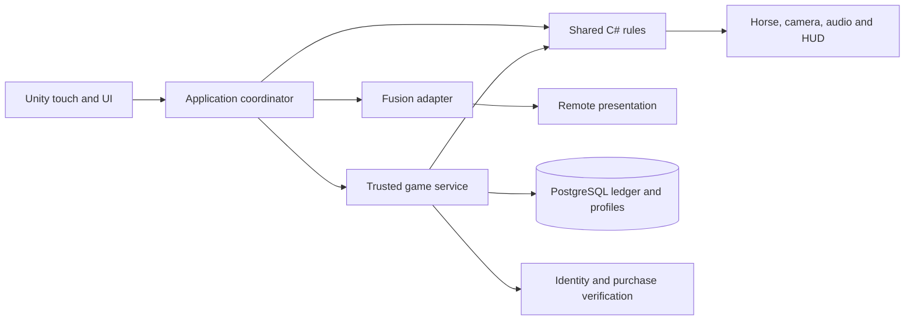

**Barrel Rivals — engineering playbook and stack contracts**  
September 16, 2026 · Engineering revision 4 · Companion to the original eight-category, 53-section build plan

**Purpose.** This is the coding guide for the complete game: automatic bodycam racing, skill challenges, three multiplayer experiences, ten horses, progression, purchases and publishable iOS/Android builds. Each section below names the expertise, stack, dependencies, concrete deliverables, integration obligations and evidence needed to contribute to that outcome. Read its card with the matching build-plan row and gameplay blueprint before implementing it.

These are proposed engineering contracts. The named components, service stack and folders are implementation targets, not claims that they already exist. M0 has repaired compilation and added a verified URP arena preview in the isolated project; [M0 implementation report](Barrel-Rivals-M0-Report.md) records the implemented subset. Original full-section acceptance checks and physical-device qualification remain open. Revision 4 preserves the revision 3 gameplay choices and adds implementation detail.

**Standing development standard.** For every future section, inspect the actual code and pinned package APIs first; refine its contract; implement a complete connected increment; run relevant checks; review the result against the whole-game requirements; record evidence and remaining work. Source files, Unity assets, editor tooling, backend code, database migrations and native bridges are all deliverables when the section needs them. A component is complete only when its callers, data, assets and failure behavior work together.

**One coherent stack.** The following is the working recommendation. Unity 6000.6.0f1 is the verified M0 Editor baseline; release/device qualification remains open. The implementation pins URP 17.6.0, Input System 1.20.0, uGUI 2.6.0 and Test Framework 1.8.0. These versions passed the recorded foundation checks; they are not yet a qualified release stack. Package documentation links are references, not an instruction to install those particular versions. Record exact engine/package/SDK/compiler versions, licenses, platform support and verified build IDs in a compatibility register. Introduce dependencies only when the section demonstrates a need.

| Key | Working technology and responsibility | Decision / verification gate |
|---|---|---|
| CLIENT | Unity 6, C#, Input System, uGUI/TextMeshPro, Animator and explicit application/presentation adapters. Cinemachine for camera behavior where useful. | M0 clean import; M1 touch/bodycam proof. Pin packages together and use their installed API versions. |
| CORE | Engine-independent C# rules/contracts with a .NET Standard 2.1 API target and a language subset supported by the pinned Unity compiler. Integer time/IDs and reproducible course/scoring rules. | Compile the same source for Unity and the backend; compare fixtures on both runtimes. [Unity API compatibility](https://docs.unity3d.com/6000.0/Documentation/Manual/dotnet-profile-support.html). |
| CONTENT | ScriptableObject authoring, editor validators, immutable exported rules and Addressables for managed asset groups. Begin with local content. | Validate identities/references and loading lifetime; introduce remote content only with version, download-failure and rollback tests. |
| ART | Blender or equivalent licensed modeling/rigging tools; editable source meshes, quadruped/rider rigs, FBX exports, textures and animation clips. | Approve one final-quality horse/arena on a phone before scaling; track source, commercial rights and import settings. No art tool is presumed installed. |
| RENDER | URP, lighting/volumes, Shader Graph, budgeted Particle System effects; HLSL/Render Graph passes only for required effects. | M0 restores pipeline assets; M2 verifies actual mobile appearance, comfort and GPU cost. [Render Graph](https://docs.unity3d.com/6000.0/Documentation/Manual/urp/render-graph.html). |
| NET | Photon Fusion 2 behind a transport adapter for live sessions, replicated public state and spectating. | M1N proves topology, private reveals, reconnect and independent clocks; no second multiplayer framework is added casually. [Photon topology guidance](https://doc.photonengine.com/fusion/v2/fusion-choose). |
| API | C# ASP.NET Core on .NET 10 LTS, initially one service with internal modules for profiles, matchmaking, run verification and economy. HTTPS for commands; evaluate a persistent channel for scheduled challenge/input delivery in M1N. | Working backend target, subject to the early feasibility/cost proof. A managed replacement requires a documented decision and equivalent contracts. [.NET support policy](https://dotnet.microsoft.com/en-us/platform/support/policy/dotnet-core). |
| DB | PostgreSQL, explicit migrations, transactional ledger, unique operation keys and reconciliation; object storage for larger replays/content. | M1N proves persistence/concurrency; M3 proves backup/restore and settlement. Hosting providers and database version are selected before provisioning. [Transaction isolation](https://www.postgresql.org/docs/current/transaction-iso.html). |
| PLATFORM | Unity Android/iOS build support and IL2CPP; native haptics/lifecycle/secure-storage bridges only where required. Kotlin/Java or Objective-C++/Swift as appropriate to the chosen plugin boundary. | First physical builds early; verify AOT/stripping/native binaries and modern build-machine requirements. |
| STORE | Unity IAP client adapter, Apple/Google store products and trusted backend purchase verification/fulfillment. | Store sandbox and transaction recovery before purchases go live. [Receipt validation](https://docs.unity.com/en-us/iap/receipt-validation). |
| AUDIO | Unity AudioSource/AudioMixer, scheduled cues and pooled voices with licensed sound assets. | M1 timing proof; M2 sound/latency/voice-budget review. Additional middleware needs a demonstrated requirement. |
| BUILD | Git/Git LFS where needed, Unity batch builds/Test Framework, .NET tests, GitHub Actions or an equivalent controlled runner. | M0 reproducibility; license availability, runner OS, credentials and build costs verified before relying on remote Unity builds. |
| OPS | Structured logs/metrics, bounded gameplay analytics, crash diagnostics, service health and incident procedures. | Start diagnostics at M0; choose one suitable telemetry stack at M1N and test it before beta. |

The ASP.NET service runs separately from Unity. Do not place .NET 10-only assemblies or APIs into the Unity client. Shared source targets the verified common API/language subset and has no UnityEngine, Fusion, database or web-framework dependency. Compilation is necessary but does not prove identical floating-point simulation; use explicit rounding/quantization where needed and cross-runtime reference fixtures before competitive use.

Managed identity is a separate early decision. Unity Authentication is a candidate for anonymous-to-linked accounts and cross-platform identity ([official overview](https://docs.unity.com/en-us/authentication)); M1N must prove server token verification, account recovery and platform linking before selection. Do not build an ad hoc password system or silently add multiple profile/economy backends. Hosting, identity, telemetry and replay-storage providers remain unprovisioned; choose them against reliability, total operating effort and measured costs.

**Dependency and authority boundaries.**

The diagram shows logical responsibility, not a final packet flow. Clients can predict feedback immediately; only trusted verification authorizes competitive results and rewards. A player's transport authority is not wallet authority. Future targets and generation seeds stay in the server-private manifest; send only the reveal that the participant is permitted to see. Presentation adapters never change the accepted result. UI never writes a database balance.

**Proposed code ownership.** Preserve the existing project during recovery and introduce these boundaries incrementally. Paths below are relative to the future canonical repository and do not imply existing files.

| Location | Contents and allowed dependencies |
|---|---|
| `Packages/com.barrelrivals.core/Runtime/` | Shared contracts and rules, separated into explicit assembly definitions; companion .NET Standard projects compile the same source. No generated binaries or service-only source included by Unity. |
| `Assets/_Project/Scripts/Application/` | Race/session coordination and service interfaces; depends on CORE. |
| `Assets/_Project/Scripts/Presentation/` | Horse/camera/audio/HUD presenters; consumes state and events. |
| `Assets/_Project/Scripts/Integrations/` | Input, Fusion, API, IAP and platform implementations; depends on application interfaces. |
| `Assets/_Project/Editor/` and `Assets/_Project/Tests/` | Authoring/export validators and Unity tests in separate editor/test assemblies. |
| `Assets/_Project/{Scenes,Prefabs,Data,Art,Audio}/` | Versioned assets and metadata; use bounded loading and explicit references. |
| `Server/` and `Server.Tests/` | ASP.NET host, modules, persistence and integration tests; shares CORE and owns migrations. |
| `Docs/Sections/` and `Docs/Decisions/` | Actual section evidence, API/schema decisions and version/cost records. |
| `Build/` and `.github/workflows/` | Build/validation entry points and CI configuration; secrets stay outside source. |

Use one intentional construction point to wire dependencies. Do not create one global manager per section. Existing useful code can satisfy multiple cards; each behavior still has one authoritative owner.

**Shared contracts to establish before integration.** Concrete fields are designed and tested in M0/M1N; these are the required meanings.

| Contract | Required meaning / owner |
|---|---|
| Rules and content version | Schema version, rules hash, course version and compatible client range; S04 owns export and validation. |
| Match assignment | Match/run/participant IDs, format, class, frozen loadout and rules version; S38/S40 own authorization. Private challenges use a separate server record. |
| Accepted input | Run/phase identity, ordered sequence, pointer data where needed, bounded timestamps and permitted payload sizes; S02 captures, S40 validates. |
| Skill outcome | Challenge/phase ID, grade components and one accepted boost/knock decision; S29/S33/S34 compute. |
| Run result | Integer raw time, unique knock events, penalized time and terminal status; S36 owns calculation, trusted service accepts it. |
| Settlement | Match/purchase-linked operation key, reservations, debits/grants/refunds and final status; S42 owns transactional application. |
| Replay | Compatible rules/manifest reference, accepted inputs/events, cosmetic IDs and bounded visual samples; S52 owns version/lifetime. |

**How to execute a section.** Record the card's scope, affected whole-game requirement IDs R01–R08, actual file/API names and pinned references before coding. Distinguish prerequisites needed now from interfaces agreed with later sections: numbering is ownership, not a demand to finish 1–53 serially. First milestone below means the first usable pass; the original build plan defines full completion.

For each increment, implement rules and failure handling, wire callers and serialized assets, validate the appropriate boundary, then retain proof: commit/build ID, exact command or device procedure, expected/observed outcome and unresolved limitations. Use tests for consequential rules, transitions, concurrency and regressions; inspect visual/art changes in the actual scene/device. A mock API proves client integration only and is labelled as such. Maintain Planned → Implemented → Verified → Release-ready honestly.

The section cards below make these obligations specific. Resource IDs DOC01–DOC21 resolve to primary documentation at the end; always consult the version matching the installed dependency before coding.

**S01 — Project Setup & Architecture**

- **Stack / first pass:** CLIENT, CORE, BUILD · M0.
- **Expertise and resources:** Unity assembly/package management, C# boundaries, Git recovery; DOC01, DOC02, DOC15.
- **Inputs / dependencies:** The technical audit, both local projects and the newer GitHub commit; preserve local changes before reconciliation.
- **Build:** One canonical Unity project, pinned package/assembly references, bootstrap scene, shared-core build and repeatable import/build commands.
- **Connect:** A composition root explicitly connects input, rules, presentation and service adapters; scene creation persists assets and metadata.
- **Proof:** Clean-checkout import, core/client compilation and reopened startup scene pass; document the actual Android/iOS build path.

**S02 — Input System Foundation**

- **Stack / first pass:** CLIENT, CORE · M0 → M1.
- **Expertise and resources:** Input System actions, EnhancedTouch, mobile gesture ownership; DOC03.
- **Inputs / dependencies:** Phase identifiers from S03 and the gesture sample schema used by S33.
- **Build:** A phase-aware touch adapter emitting pointer ID, phase, normalized coordinates, ordered sequence and capture timestamp.
- **Connect:** Launch, drawing and exit handlers share one ownership policy; menu touches cannot also become race input.
- **Proof:** Test cancellation, two fingers, focus loss, safe areas and 30/60/120 Hz capture; physical-phone traces retain intentional geometry.

**S03 — Game State Machine**

- **Stack / first pass:** CORE, CLIENT, API · M0 → M1.
- **Expertise and resources:** Explicit state machines, event ordering and recoverable workflows; DOC01, DOC09.
- **Inputs / dependencies:** Blueprint race phases, Quick Duel/Championship rules and interruption outcomes.
- **Build:** Pure run/match transitions plus a Unity application coordinator; immutable accepted result and rematch reset contracts.
- **Connect:** Own phase changes consumed by S29–36 and turn changes consumed by S37–41; settlement is requested once by match ID.
- **Proof:** Invalid order, duplicate finish, reset, draw, DNF and retry scenarios have expected transitions and no stale subscriptions.

**S04 — Data Architecture (ScriptableObjects)**

- **Stack / first pass:** CONTENT, CORE, CLIENT · M0.
- **Expertise and resources:** ScriptableObject authoring, schema design and editor validation; DOC04.
- **Inputs / dependencies:** Stable IDs and version fields for horses, gear, courses, challenges and event rules.
- **Build:** Authoring assets, validators and an export step producing immutable engine-independent configuration and hashes.
- **Connect:** Unity and the server consume the same approved rules version; Unity objects and secret challenge seeds do not enter public DTOs.
- **Proof:** Reject duplicate IDs, missing assets, invalid values and incompatible schema versions; export round-trips preserve meaning.

**S05 — Save/Load & Cloud Sync**

- **Stack / first pass:** API, DB, CLIENT · M1N → M3.
- **Expertise and resources:** Identity, save migrations, optimistic concurrency and secure local storage; DOC09, DOC10, DOC11.
- **Inputs / dependencies:** Profile/entitlement schema, account-linking policy and selected identity-provider proof.
- **Build:** Profile API, migrations, account linking/recovery and local settings/practice cache; tokens use platform-supported secure storage.
- **Connect:** Wallet/inventory writes go through authoritative services; offline practice merges only allowed noncompetitive data.
- **Proof:** Reinstall, expired tokens, conflicting devices, interrupted writes and account-link collision recover without lost ownership.

**S06 — iOS & Android Platform Layer**

- **Stack / first pass:** PLATFORM, BUILD, CLIENT · M0.
- **Expertise and resources:** IL2CPP/AOT, signing, lifecycle and native integration; DOC16 and the technical review.
- **Inputs / dependencies:** Named supported phones, engine/package lock and a compatible Mac/Xcode build environment.
- **Build:** Android/iOS build configurations, safe-area/lifecycle adapters and documented signing/release procedures.
- **Connect:** Pause/background notifications enter S02/S41; platform identity and purchase adapters remain outside race rules.
- **Proof:** Install signed development builds on both platforms; test backgrounding, stripping/native-plugin behavior and cold start.

**S07 — Performance Budget & Quality Tiers**

- **Stack / first pass:** RENDER, CLIENT, BUILD · M0 → M2.
- **Expertise and resources:** CPU/GPU profiling, memory ownership and thermal testing; DOC06.
- **Inputs / dependencies:** Named device tiers and the representative horse/arena from M2.
- **Build:** Per-device frame, memory, download and thermal budgets; quality assets and recorded profiling captures.
- **Connect:** Art, crowd, particles, cameras and UI receive measured budgets; presets alter presentation only.
- **Proof:** Run the build-plan 20-minute device benchmark; retain traces and identify CPU/GPU bottlenecks before adding complexity.

**S08 — Horse Data Model & Breeds**

- **Stack / first pass:** CONTENT, CORE, ART · M1 → M6.
- **Expertise and resources:** Data modeling, equine reference and roster balance; DOC04, DOC05.
- **Inputs / dependencies:** Ten-horse minimum, tier allocation proposal, stat definitions and asset-rights inventory.
- **Build:** Horse definitions with stable identity, permitted classes, development ceilings, rig/material references and ten finished entries.
- **Connect:** S09 computes effective stats; S10–13 present the owned horse; S45 controls earned eligibility.
- **Proof:** All entries validate and load; each has a distinct role/identity and a complete acquisition and upgrade path.

**S09 — Horse Stats & Leveling**

- **Stack / first pass:** CORE, API, DB · M1 → M3.
- **Expertise and resources:** Bounded numerical models and progression transactions; DOC01, DOC10.
- **Inputs / dependencies:** Horse definitions, gear modifiers, class caps and versioned upgrade costs.
- **Build:** One stat resolver for owned stats and frozen event-effective snapshots; server-owned upgrade transactions.
- **Connect:** S11 consumes the snapshot; S38 matches on effective power; S50 explains caps before entry.
- **Proof:** Test overflow, modifier stacking, cap edges and concurrent upgrades; compare cleaner low-power runs against legal premium loadouts.

**S10 — Horse Animation State Machine**

- **Stack / first pass:** ART, CLIENT · M1 → M2.
- **Expertise and resources:** Quadruped/rider rigging, blend trees and procedural alignment; DOC05.
- **Inputs / dependencies:** A licensed rigged horse/rider, locomotion reference and S11 movement/turn events.
- **Build:** Animator controller, clips/blends and a presentation adapter for clean, wide, knock, sprint and finish behavior.
- **Connect:** Validated movement drives animation; horse/rider root motion cannot independently change official speed or collisions.
- **Proof:** Inspect feet, saddle/reins, bodycam clipping and contact timing at speed extremes; final pass covers the complete roster.

**S11 — Horse Physics & Movement Controller**

- **Stack / first pass:** CORE, CLIENT · M1.
- **Expertise and resources:** Fixed-step simulation, course geometry and reproducible movement; DOC01.
- **Inputs / dependencies:** Baked course geometry, effective stats, skill outcomes and simulation-clock contract.
- **Build:** Automatic path-following rules, progress/checkpoint validation and Unity motion presentation driven from accepted state.
- **Connect:** Own logical knock/progress events for S19/S36; camera, animation and Fusion consume snapshots without changing rules.
- **Proof:** Replay fixtures across client/server runtimes; verify legal turns, skipped checkpoints and boundaries without relying on PhysX determinism.

**S12 — Horse Gait System**

- **Stack / first pass:** ART, CLIENT · M1 → M2.
- **Expertise and resources:** Stride phase, gait transitions and sound synchronization; DOC05, DOC13.
- **Inputs / dependencies:** Validated movement speed and the animation/hoof-contact specification.
- **Build:** Gait blending and stride-phase outputs for walk/trot/canter/gallop with smooth acceleration transitions.
- **Connect:** S10 animation, S23 camera and S48 hoof audio share locomotion phase; gait presentation never adds race time.
- **Proof:** Check foot sliding, blended contacts, duplicate hoof sounds and camera jolts across all legal speed ranges.

**S13 — Horse Visual Customization (Colors/Markings)**

- **Stack / first pass:** ART, CONTENT, CLIENT, API · M2 → M6.
- **Expertise and resources:** Material variants, UV/mask authoring and entitlement checks; DOC04, DOC07.
- **Inputs / dependencies:** Horse meshes, approved coat/marking catalogue and ownership records.
- **Build:** Reusable material/mask setup, customization preview and versioned saved cosmetic selections.
- **Connect:** Stable, introduction, spectator and replay resolve the same cosmetic IDs with a safe missing-asset fallback.
- **Proof:** Unauthorized selections fail; owned appearances persist after reinstall; measure memory/material batching across the roster.

**S14 — Horse Aging & Career System**

- **Stack / first pass:** CORE, API, DB · M6.
- **Expertise and resources:** Career modeling, migration and explainable progression; DOC09, DOC10.
- **Inputs / dependencies:** Approved maturity/experience rules, milestone rewards and preserved-ownership policy.
- **Build:** Career state transitions and persistence with explicit earned milestones and any approved condition effects.
- **Connect:** Apply changes after settlement; freeze the match snapshot and show progression in the stable.
- **Proof:** Duplicate results cannot age/advance twice; migrations retain horses; career effects do not drift between Championship runs.

**S15 — Horse Injury & Recovery System**

- **Stack / first pass:** CORE, API, DB, CLIENT · M6.
- **Expertise and resources:** Reversible condition rules and recovery UX; DOC09, DOC10.
- **Inputs / dependencies:** A tested decision on injury effects, durations and always-available play/recovery routes.
- **Build:** Condition/recovery state machine, trusted completion time and clear stable UI; ownership remains intact.
- **Connect:** S09 reads legal condition at entry; S42 applies any approved recovery cost; no device-clock authority.
- **Proof:** Test zero balance, all owned horses affected, clock changes, reconnect and duplicate recovery; a playable route always remains.

**S16 — Arena Geometry & WPRA Standards**

- **Stack / first pass:** CORE, CONTENT, ART · M1 → M2.
- **Expertise and resources:** Course geometry, units and level-authoring tools; DOC17.
- **Inputs / dependencies:** Verified WPRA reference, deliberate arcade variants and start/finish convention.
- **Build:** Arena authoring tool/data, center-distance checks, baked legal course and visual/debug checkpoint overlays.
- **Connect:** S11/S36 consume a versioned geometry export; visual arena variants cannot silently move scoring boundaries.
- **Proof:** Validate dimensions, clearance, barrel order, turn completion and legal finish; compare rendered course with baked rules.

**S17 — Arena Lighting System**

- **Stack / first pass:** RENDER, ART · M0 → M2.
- **Expertise and resources:** URP lighting, lightmaps, probes and shadow budgets; DOC06, DOC07.
- **Inputs / dependencies:** Correct pipeline assets, representative arena and phone GPU budgets.
- **Build:** Lighting profiles, baked assets where appropriate and bounded real-time lights/shadows.
- **Connect:** S21/S22 select approved profiles; gameplay prompts remain readable in every supported quality mode.
- **Proof:** Check materials and shadows in actual mobile builds, including transitions; record GPU cost and shader compatibility.

**S18 — Arena Ground Surface (Dirt/Footing)**

- **Stack / first pass:** RENDER, CONTENT, CORE · M2.
- **Expertise and resources:** Dirt materials, surface response and fair environment modeling; DOC07.
- **Inputs / dependencies:** Ground textures/meshes, bounded handling rules and immutable match conditions.
- **Build:** Dirt shader/materials plus a separate surface coefficient definition used by the rules.
- **Connect:** S11 consumes authored coefficients; S27 renders contact dust; ruts stay cosmetic unless the rules explicitly model them.
- **Proof:** Both riders receive equal traction rules; ground effects stay within visual budgets and reset correctly.

**S19 — Arena Props (Barrels, Fences, Gates, Chutes)**

- **Stack / first pass:** CONTENT, CLIENT, CORE · M1.
- **Expertise and resources:** Prefab authoring, collision layers and event-driven effects; DOC04.
- **Inputs / dependencies:** Arena scale, logical collision policy and reset lifecycle.
- **Build:** Persisted barrel/fence/gate/chute prefabs, logical contact mapping and pooled visual knock behavior.
- **Connect:** A single accepted knock event drives S36 penalty, barrel animation, sound and replay.
- **Proof:** Duplicate contacts produce one penalty; objects reset on rematch; runtime physics cannot rewrite authoritative outcomes.

**S20 — Crowd System (Stands, Fans, Animation)**

- **Stack / first pass:** ART, RENDER, AUDIO · M2 → M6.
- **Expertise and resources:** Crowd LOD, instancing and reaction scheduling; DOC06, DOC13.
- **Inputs / dependencies:** Arena stands, crowd asset rights and performance allocations.
- **Build:** Scalable crowd presentation and deduplicated reaction groups responding to race events.
- **Connect:** S48 mixes reactions; spectator and local views use the same accepted event identity.
- **Proof:** Profile low/high crowd tiers, audio overlap and repeated matches; disabling crowd detail leaves all race rules unchanged.

**S21 — Arena Themes & Variants**

- **Stack / first pass:** CONTENT, ART, RENDER · M2 → M6.
- **Expertise and resources:** Environment kits, content loading and visual consistency; DOC07, DOC08.
- **Inputs / dependencies:** One approved arena benchmark, five-tier proposal and course identity catalogue.
- **Build:** Five coherent arena presentations with local content groups, loading/unloading rules and validated references.
- **Connect:** S45 event eligibility selects content; S16 supplies matching course data and S07 supplies quality constraints.
- **Proof:** Every arena loads within budget; interrupted loading recovers; rules and visual catalogue versions agree.

**S22 — Weather & Time-of-Day System**

- **Stack / first pass:** CORE, CONTENT, RENDER · M1 → M2.
- **Expertise and resources:** Seeded randomness, environment presets and visibility testing; DOC01, DOC07.
- **Inputs / dependencies:** Missing RNG repair, versioned weather presets and paired-match conditions.
- **Build:** Reproducible weather selection plus visual transition adapters; trusted manifests freeze any handling effects.
- **Connect:** Gameplay RNG streams are separate from cosmetic particles/crowds and private challenge generation.
- **Proof:** Same manifest produces equal gameplay conditions; extra cosmetic RNG calls cannot change shapes, weather or results.

**S23 — Bodycam Camera Controller**

- **Stack / first pass:** CLIENT, ART · M1.
- **Expertise and resources:** First-person framing, camera damping and comfort; DOC12.
- **Inputs / dependencies:** Horse/rider rig, stable drawing overlay and legal movement snapshots.
- **Build:** Bodycam rig and short introduction transition, clipping controls and reduced-motion settings; use Cinemachine only for needed camera behavior.
- **Connect:** S11/12 supply motion cues; S50 drawing UI remains stable; spectator/replay cameras use explicit ownership.
- **Proof:** Real-phone comfort tests cover corners, knocks and slow motion; switching cameras never moves the horse or alters deadlines.

**S24 — Post-Processing Shader Pipeline**

- **Stack / first pass:** RENDER, BUILD · M0 → M2.
- **Expertise and resources:** URP configuration, shader variants and render-pass compatibility; DOC07.
- **Inputs / dependencies:** Pinned engine/URP versions, renderer assets and named device profiles.
- **Build:** Valid Graphics/Quality pipeline assignments, volume profiles and only necessary Render Graph-compatible custom passes.
- **Connect:** S25–28 extend this one rendering pipeline; include required shader variants in mobile builds.
- **Proof:** No missing GUIDs or magenta materials; verify Metal and Android graphics paths, build stripping and measured pass costs.

**S25 — Lens Effects (Fisheye, Chromatic, Flare)**

- **Stack / first pass:** RENDER, CLIENT · M2.
- **Expertise and resources:** Optical shader effects and screen-space composition; DOC07.
- **Inputs / dependencies:** Approved art direction and effect budgets from S07/S24.
- **Build:** Bounded lens/flare profiles using stock URP or Shader Graph; HLSL only for a demonstrated visual requirement.
- **Connect:** World effects exclude the readable input surface; comfort settings use the same gameplay rules.
- **Proof:** Compare phone captures with effects on/off; check edge readability, artifacts and GPU cost.

**S26 — Motion Effects (Blur, Speed Lines)**

- **Stack / first pass:** RENDER, CLIENT · M2.
- **Expertise and resources:** Motion cues, camera comfort and mobile overdraw; DOC06, DOC07.
- **Inputs / dependencies:** Validated speed/turn events and reduced-motion preferences.
- **Build:** Speed lines and restrained motion effects driven by presentation data with independent intensity settings.
- **Connect:** S35 local slow motion affects presentation curves per rider, without changing global competitive scheduling.
- **Proof:** Check phase transitions and small-screen readability; no cue, barrel or drawn trace is obscured by the chosen presets.

**S27 — Environmental VFX (Dust, Particles, Sweat)**

- **Stack / first pass:** RENDER, ART, CLIENT · M2.
- **Expertise and resources:** Particle authoring, pooling and texture overdraw; DOC06, DOC07.
- **Inputs / dependencies:** Hoof/barrel events, surface identity and effect budget.
- **Build:** Pooled Unity Particle System effects for dust/contact/sweat as appropriate; introduce heavier VFX tooling only after a measured need.
- **Connect:** Accepted event IDs trigger effects once; S18 surface and S48 audio use matching contact information.
- **Proof:** No unbounded allocations or leaked emitters during repeated races; profile worst-case dust on the slowest supported phone.

**S28 — Dynamic Exposure & Color Grading**

- **Stack / first pass:** RENDER, ART · M2.
- **Expertise and resources:** Color grading and luminance transitions; DOC07.
- **Inputs / dependencies:** Arena lighting profiles and camera/readability reference captures.
- **Build:** Approved color/exposure profiles with bounded transitions; any automatic exposure requires a proven compatible implementation.
- **Connect:** S17/S22 supply environment state; stable gameplay UI is composed with deliberate exposure behavior.
- **Proof:** Bright/dark transitions preserve barrel and prompt visibility; inspect captures across the supported phone profiles.

**S29 — Phase 1 — Beep Gate System**

- **Stack / first pass:** CORE, CLIENT, AUDIO · M1.
- **Expertise and resources:** Reaction grading, audio scheduling and timestamp handling; DOC03, DOC13.
- **Inputs / dependencies:** Launch schedule, trusted deadline contract and Bad/Good/Great/Perfect thresholds.
- **Build:** Launch grader and cue presenter with explicit early, late, missed and auto-launch behavior.
- **Connect:** S02 owns touch; S35 supplies clocks; S11 applies the accepted launch outcome and S36 starts official time.
- **Proof:** Boundary timestamps grade consistently; test audio/visual latency and focus loss without accepting client-chosen cue schedules.

**S30 — Phase 2 — Alley Run**

- **Stack / first pass:** CORE, CLIENT · M1.
- **Expertise and resources:** Acceleration curves and phase-trigger geometry; DOC01.
- **Inputs / dependencies:** Legal course, effective horse stats and launch result.
- **Build:** Automatic alley movement and reproducible triggers for the first challenge preview.
- **Connect:** S11 remains the movement owner; S31 receives a phase event with a stable occurrence ID.
- **Proof:** A trigger fires once under varied rendering rates and maximum legal acceleration; no skipped preview or teleport.

**S31 — Phase 3 — Barrel Turn Pattern System**

- **Stack / first pass:** CORE, CLIENT · M1.
- **Expertise and resources:** Interaction choreography and event/state design; DOC03, DOC18.
- **Inputs / dependencies:** Challenge reveal, accepted drawing result, turn window and exit timing rules.
- **Build:** One barrel-phase controller coordinating preview, trace, turn line, knock/recovery and separate exit input.
- **Connect:** S33 grades geometry; S11 applies line/boost; S19/S36 share knock identity; S10 animates the same outcome.
- **Proof:** A complete turn is playable and explainable; invalid/missing input and cancellation yield one consistent result.

**S32 — Pattern Library & Generation**

- **Stack / first pass:** CORE, CONTENT, API · M1 → M1N.
- **Expertise and resources:** Template curation, seeded generation and information privacy; DOC04, DOC18.
- **Inputs / dependencies:** Tier difficulty rules, recognizable templates and public/private manifest split.
- **Build:** Versioned challenge catalogue and trusted per-round assignments with timed reveals; keep seeds that reveal future targets server-side.
- **Connect:** S33 uses the assigned template; rivals receive equal challenges; S39 and S52 expose only permitted data.
- **Proof:** Generation is reproducible to the authority, varied within bounds and free of unusable templates; inspect spectator payloads for leaks.

**S33 — Touch Input & Path Scoring Algorithm**

- **Stack / first pass:** CORE, CLIENT, API · M1.
- **Expertise and resources:** Computational geometry, gesture recognition and calibration; DOC03, DOC18.
- **Inputs / dependencies:** Ordered touch traces, assigned template, permitted transforms and quality/speed rules.
- **Build:** Resampling/normalization, coverage/error grading and quality-gated speed score; curated labelled trace fixtures and debug overlays.
- **Connect:** The exact grader runs in the shared core on client and verifier; output is an immutable grade with diagnostic components.
- **Proof:** Test partials, scribbles, corners, closed-shape starting points, sampling rates and handedness; compare real-phone grades with observed intent.

**S34 — Phase 4 — Home Sprint**

- **Stack / first pass:** CORE, CLIENT, AUDIO · M2.
- **Expertise and resources:** Rhythm timing and bounded boost models; DOC03, DOC13.
- **Inputs / dependencies:** Proposed three-beat sprint schedule and accepted input deadline rules.
- **Build:** Sprint cue presenter, timing grader and capped cumulative boost policy.
- **Connect:** S02 routes taps; S11 applies legal boost; S36 closes the run at the validated finish.
- **Proof:** Spam, repeated callbacks and taps outside windows cannot add boost; identical accepted timestamps produce equal outcomes.

**S35 — Slow Motion System**

- **Stack / first pass:** CORE, CLIENT, NET, API · M1 → M1N.
- **Expertise and resources:** Clock domains, fixed-step scheduling and latency bounds; DOC01, DOC19.
- **Inputs / dependencies:** Integer time units, fixed response windows and per-rider slowdown profiles.
- **Build:** Separate trusted deadline, simulation and presentation clocks; documented timestamp conversion and reconnect rules.
- **Connect:** All graders and S36 consume explicit clocks; camera/animation/audio adapt per rider without global time-scale authority.
- **Proof:** Prove independent simultaneous windows, pause resistance and client/server agreement under delay and reordered input.

**S36 — Run Timer & Penalty Calculator**

- **Stack / first pass:** CORE, API, CLIENT · M1.
- **Expertise and resources:** Scoring invariants, integer arithmetic and terminal-state handling; DOC01.
- **Inputs / dependencies:** Validated course finish, knock IDs and Quick Duel/Championship rules.
- **Build:** One RunResult contract and result reducer using integer times, five-second penalties and explicit DNF/tie states.
- **Connect:** S31/S34/S11 supply accepted events; S50 formats results; S42 receives the authoritative match outcome.
- **Proof:** Reject negative/invalid/duplicate times and double knocks; verify totals, rounding, ties and Championship DNF without numeric sentinels.

**S37 — Multiplayer Networking (Photon Fusion 2)**

- **Stack / first pass:** NET, API, CLIENT · M1N → M3.
- **Expertise and resources:** Fusion sessions, network state ownership and service authentication; DOC19.
- **Inputs / dependencies:** Versioned message contracts, identity proof and supported network test envelope.
- **Build:** Minimal Fusion 2 adapter and topology decision, then session lifecycle, transport metrics and two-platform live state.
- **Connect:** Fusion carries permitted presentation/session state; trusted API owns challenge issuance, verified result and reward authority.
- **Proof:** Two-client delay/loss/reconnect tests pass; record bandwidth and estimated operating cost before scaling or paid commitment.

**S38 — Matchmaking & ELO/Trophy System**

- **Stack / first pass:** API, DB, NET, CLIENT · M3.
- **Expertise and resources:** Matchmaking constraints, queue policy and rating updates; DOC09, DOC10, DOC19.
- **Inputs / dependencies:** Earned eligibility, frozen effective loadouts, region/latency and trophy/skill definitions.
- **Build:** Queue/match assignment, version-compatible pools, invite authorization and server-owned rating update.
- **Connect:** S45 controls access; S37 admits assigned participants; S42 settles a match once; UI explains queue alternatives.
- **Proof:** Test low population, stale tickets, concurrent invites, version mismatch and extreme power gaps; rating retries never count twice.

**S39 — Spectator Mode**

- **Stack / first pass:** NET, CLIENT · M1N → M3.
- **Expertise and resources:** Snapshot interpolation, camera ownership and private information; DOC12, DOC19.
- **Inputs / dependencies:** Permitted public state schema, turn order and spectator HUD design.
- **Build:** Live spectator camera/HUD and buffered motion from remote snapshots.
- **Connect:** Only public run information is transmitted before paired attempts finish; replay disclosure uses the same privacy contract.
- **Proof:** Inspect packets for hidden shapes/traces; test handover and jitter with no active controls or camera ownership leaking.

**S40 — Anti-Cheat & Server Validation**

- **Stack / first pass:** CORE, API, DB · M1N → M3.
- **Expertise and resources:** Threat modeling, bounded validation and abuse diagnostics; DOC09, DOC10.
- **Inputs / dependencies:** Run IDs, rules hash, challenge assignment, authenticated participant and frozen stats.
- **Build:** Trusted run verifier with input bounds, replay protection, result validation and auditable rejection reasons.
- **Connect:** Only accepted results reach S42; cosmetics and client stopwatch values cannot authorize a reward.
- **Proof:** Try forged manifests, timestamps, roles, replayed messages and oversized traces; document macro/collusion limits and review procedures.

**S41 — Disconnect Handling & Reconnection**

- **Stack / first pass:** CORE, API, NET, CLIENT · M1N → M3.
- **Expertise and resources:** Distributed recovery, deadlines and idempotent correction; DOC09, DOC19.
- **Inputs / dependencies:** Match-state snapshots and the cause-specific settlement matrix.
- **Build:** Reconnect/resume contract, bounded grace policy, terminal outcomes and clear player recovery messages.
- **Connect:** S06 lifecycle signals and S37 transport events converge on one recovery owner; S42 corrections use unique keys.
- **Proof:** Disconnect at every phase and during settlement; no input rewind, stuck reservation, duplicate refund or lost authoritative result.

**S42 — Currency System (Coins, Diamonds, Trophies)**

- **Stack / first pass:** API, DB, CORE · M1N → M3.
- **Expertise and resources:** Transactional ledgers, concurrency and integer money models; DOC09, DOC10.
- **Inputs / dependencies:** Currency definitions, fee/prize rules and authoritative match/purchase identity.
- **Build:** Append-only ledger entries, reservation/settlement functions, unique idempotency keys and reconciliation tools.
- **Connect:** One database transaction owns balance and grant changes; other sections request typed operations, never direct balance edits.
- **Proof:** Test simultaneous spending, negative/overflow amounts, retry, draw, double-DNF and void; balances reconcile to the ledger.

**S43 — Gear & Equipment System**

- **Stack / first pass:** CORE, API, DB, CLIENT · M2 → M3.
- **Expertise and resources:** Loadout composition, entitlements and consumable lifecycle; DOC10.
- **Inputs / dependencies:** Gear catalogue, stacking/cap rules and one-match duration contract.
- **Build:** Effective-loadout resolver, equip UI and server reservations/consumption/restoration for gear.
- **Connect:** S09 creates the frozen snapshot; S42 atomically consumes inventory; all Championship runs share the same legal loadout.
- **Proof:** Concurrent matches cannot spend one item twice; temporary modifiers stay bounded and service void restores only once.

**S44 — Loot Crate & Reward System**

- **Stack / first pass:** API, DB, CONTENT, CLIENT · M6.
- **Expertise and resources:** Reward tables, unbiased server selection and grant idempotence; DOC10, DOC20.
- **Inputs / dependencies:** Versioned reward/drop tables, duplicate policy and any required purchase disclosures.
- **Build:** Server reward selector and durable grant result; client opening animation presents the already determined reward.
- **Connect:** S42 applies grants; S45/S46 provide earned rewards; S47 identifies any paid product and its exact version.
- **Proof:** Test duplicate claims, interruption after grant and table boundaries; verify displayed odds where applicable and prevent reroll-on-retry.

**S45 — Trophy Road & Arena Unlocks**

- **Stack / first pass:** CORE, API, DB, CLIENT · M3 → M6.
- **Expertise and resources:** Progression graphs, eligibility predicates and economy simulation; DOC09, DOC10.
- **Inputs / dependencies:** Five-tier proposal, trophies, horse readiness and free-entry recovery rules.
- **Build:** Server eligibility checks and trophy-road views backed by one versioned progression model.
- **Connect:** S38 uses the same predicates shown in S50; purchasing ownership never directly grants earned tier access.
- **Proof:** Simulate a complete free route, zero balance and repeated losses; test account migration and anti-farming without blocking recovery.

**S46 — Daily Missions & Season Pass**

- **Stack / first pass:** API, DB, CONTENT, CLIENT · M6.
- **Expertise and resources:** Scheduled progression, event aggregation and claim consistency; DOC09, DOC10.
- **Inputs / dependencies:** Mission/pass definitions, trusted calendar and free/premium reward tracks.
- **Build:** Deduplicated progression from accepted gameplay events, season rollover and exactly-once reward claims.
- **Connect:** S42 grants rewards; S47 proves pass entitlement; S53 observes progress without becoming the reward authority.
- **Proof:** Test device-clock changes, late events, boundary rollover and double claims; paid and free tracks reflect published contents.

**S47 — In-App Purchase & Store**

- **Stack / first pass:** STORE, API, DB, CLIENT · M6.
- **Expertise and resources:** Unity IAP, platform purchase verification and entitlement lifecycle; DOC20.
- **Inputs / dependencies:** Approved catalogue/prices, platform product IDs, account identity and ledger API.
- **Build:** Store adapter, pending/verified/fulfilled/refunded purchase states and backend verification/notification handlers.
- **Connect:** S42 grants atomically using store transaction identity; S05 restores account ownership and UI handles pending states.
- **Proof:** Store sandbox tests cover retries, pending/cancelled/refunded purchases, interrupted fulfillment and eligible restoration before sales.

**S48 — Adaptive Audio Engine**

- **Stack / first pass:** AUDIO, CLIENT, CONTENT · M1 → M2.
- **Expertise and resources:** Audio mixing, cue scheduling and voice budgeting; DOC13.
- **Inputs / dependencies:** Licensed audio sources, gait/contact events and timing/comfort requirements.
- **Build:** Unity AudioMixer buses, pooled sources, cue priorities, music/crowd adaptation and persisted settings.
- **Connect:** Launch/exit/sprint cues use scheduled presentation time; S12 hoof cadence and S20 crowd use accepted events.
- **Proof:** Test Bluetooth/device latency, interruption, mute and source limits; critical timing also has readable visual cues.

**S49 — Haptics & Feedback System**

- **Stack / first pass:** PLATFORM, CLIENT · M2.
- **Expertise and resources:** Native haptic capability detection and accessible feedback; DOC14.
- **Inputs / dependencies:** Cue catalogue, haptics preference and supported device capabilities.
- **Build:** An IHaptics adapter with platform patterns and a no-op fallback; use a proven compatible plugin or small native bridge.
- **Connect:** S29/S31/S34 request effects from accepted presentation events; vibration never supplies authoritative timing.
- **Proof:** Physical iOS/Android tests include disabled/unsupported hardware, backgrounding and repeated cues without crashes or gameplay differences.

**S50 — UI/UX Design System**

- **Stack / first pass:** CLIENT, CONTENT, API · M1 → M6.
- **Expertise and resources:** uGUI/TMP, responsive layout, view state and accessibility; DOC21.
- **Inputs / dependencies:** Design tokens, player journey, safe areas and typed application/service responses.
- **Build:** Reusable screen/panel prefabs, presenters and loading/empty/error states for the complete journey.
- **Connect:** Views submit commands to application/services; gameplay grades, balance and eligibility remain outside UI scripts.
- **Proof:** Test small/large phones, text scaling, touch occlusion and loss/empty-wallet/network states; rematch and navigation cannot duplicate requests.

**S51 — Tutorial & Onboarding Flow**

- **Stack / first pass:** CORE, CLIENT, CONTENT · M2.
- **Expertise and resources:** Onboarding design, contextual instruction and observed usability; DOC03, DOC21.
- **Inputs / dependencies:** The real launch/draw/exit/sprint systems and novice practice configuration.
- **Build:** Resumable tutorial steps and targeted practice exercises using the same rules and input adapters as racing.
- **Connect:** S50 presents guidance; S53 records consent-appropriate completion/confusion events; no separate imitation race logic.
- **Proof:** Use the build-plan uncoached sample target; verify skip/replay, interruption and completion without input or navigation traps.

**S52 — Replay System & Highlights**

- **Stack / first pass:** CORE, CONTENT, API, CLIENT · M1N → M4.
- **Expertise and resources:** Versioned event recording, playback and object-storage lifecycle; DOC01, DOC08.
- **Inputs / dependencies:** Run/challenge versions, accepted inputs/events and cosmetic IDs.
- **Build:** Replay schema, bounded recording, verification, playback/seek and compatible recorded challenges; storage retention policy.
- **Connect:** S11/S36 provide authoritative events; visual samples aid playback but cannot certify score; S39 privacy gates disclosure.
- **Proof:** Reject incompatible/corrupt uploads, enforce size bounds and test old-version playback; ghosts and leaderboards compare compatible rules.

**S53 — Analytics & Telemetry**

- **Stack / first pass:** OPS, API, CLIENT, BUILD · M0 → M3.
- **Expertise and resources:** Structured telemetry, privacy-aware analytics and operational diagnosis; DOC06, DOC09, DOC15.
- **Inputs / dependencies:** Event schema, data minimization/retention choices and section acceptance metrics.
- **Build:** Client crash/performance signals, server logs/metrics, match correlation and alerts/runbooks for failed services or settlement.
- **Connect:** Every section emits bounded diagnostic events; secrets and raw purchase credentials are redacted; economy remains authoritative elsewhere.
- **Proof:** Validate event counts and sampling, simulate failures and trace one match end-to-end; verify retention/deletion and alert ownership.

**Resource register.** Checked September 16, 2026. These are implementation references; package-version URLs do not establish compatibility with the current project. The stack and architecture are our recommendations, not features claimed by these sources.

| ID | Primary reference / use |
|---|---|
| DOC01 | [Unity .NET compatibility](https://docs.unity3d.com/6000.0/Documentation/Manual/dotnet-profile-support.html): shared-code API boundary. |
| DOC02 | [Unity Test Framework](https://docs.unity3d.com/Packages/com.unity.test-framework@1.4/manual/index.html): Edit Mode, Play Mode and platform test support. |
| DOC03 | [Input System touch support](https://docs.unity3d.com/Packages/com.unity.inputsystem@1.17/manual/Touch.html): touch capture and EnhancedTouch. |
| DOC04 | [ScriptableObject](https://docs.unity3d.com/6000.0/Documentation/Manual/class-ScriptableObject.html): Unity authoring data; export runtime/server contracts separately. |
| DOC05 | [Unity animation system](https://docs.unity3d.com/6000.0/Documentation/Manual/AnimationOverview.html): animation states and blending; use quadruped-appropriate rigging/reference. |
| DOC06 | [Unity Profiler](https://docs.unity3d.com/6000.0/Documentation/Manual/Profiler.html): device performance diagnosis. |
| DOC07 | [URP Render Graph](https://docs.unity3d.com/6000.0/Documentation/Manual/urp/render-graph.html): compatible rendering extensions. |
| DOC08 | [Addressables](https://docs.unity3d.com/Packages/com.unity.addressables@2.7/manual/index.html): asset groups and loading lifecycle. Replay storage is a separate service concern. |
| DOC09 | [ASP.NET Core fundamentals](https://learn.microsoft.com/en-us/aspnet/core/fundamentals/?view=aspnetcore-10.0): service configuration and application structure. |
| DOC10 | [PostgreSQL transaction isolation](https://www.postgresql.org/docs/current/transaction-iso.html): concurrent transactions and whole-transaction retries where required. |
| DOC11 | [Unity Authentication](https://docs.unity.com/en-us/authentication): managed-identity candidate; prove backend verification and linking before adoption. |
| DOC12 | [Cinemachine](https://docs.unity3d.com/Packages/com.unity.cinemachine@3.1/manual/index.html): camera tooling, if selected. |
| DOC13 | [Unity AudioMixer](https://docs.unity3d.com/6000.0/Documentation/Manual/AudioMixer.html): audio routing and mixing. |
| DOC14 | [Apple Core Haptics](https://developer.apple.com/documentation/corehaptics) and [Android haptics](https://developer.android.com/develop/ui/views/haptics/haptics-principles): platform feedback. |
| DOC15 | [GitHub Actions](https://docs.github.com/en/actions/get-started/understand-github-actions): CI workflows; Unity licensing/build support still need verification. |
| DOC16 | The accompanying technical review links [Apple toolchain requirements](https://developer.apple.com/xcode/system-requirements) and [Android page sizes](https://developer.android.com/guide/practices/page-sizes); recheck at implementation/release. |
| DOC17 | [WPRA pattern reference](https://wpra.com/the-proof-is-in-the-dirt-in-the-wilderness-circuit/) and [rule book](https://wpra.com/rule-book/): regulation layout and explicit arcade differences. |
| DOC18 | [University of Washington $1 recognizer](https://depts.washington.edu/acelab/proj/dollar/index.html): template-matching candidate, not a ready-made competitive accuracy score. |
| DOC19 | [Photon Fusion topology guidance](https://doc.photonengine.com/fusion/v2/fusion-choose): mobile networking tradeoffs. |
| DOC20 | [Unity IAP verification](https://docs.unity.com/en-us/iap/receipt-validation), [Apple review guidelines](https://developer.apple.com/app-store/review/guidelines/) and [Google payments policy](https://support.google.com/googleplay/android-developer/answer/9858738?hl=en): purchase integration and disclosures. |
| DOC21 | [Unity UI comparison](https://docs.unity3d.com/6000.0/Documentation/Manual/UI-system-compare.html): runtime/editor UI choices; this project uses uGUI/TMP as its working runtime choice. |

**Review and release gates.** Before a section is called verified, inspect correctness, integration, maintainability and the specific risk it introduces. Before release, also check real-device performance, asset quality/rights, operational recovery and the relevant store/account requirements. Meaningful tests cover rules and failure modes; visual review covers final animation, comfort, sound and readability. Store test outputs, captures and decisions with the section evidence. Do not substitute coverage percentages, a compiler pass or a premium-quality label for those outcomes.

**The first connected implementation.** M0 has repaired compilation and established package/core boundaries, a saved arena and reproducible check/build commands. Its platform acceptance remains open. M1 connects touch → launch/drawing grade → automatic horse turn → camera/audio/HUD → result. M1N sends the same contracts through two clients and the proposed trusted verifier, including independent slow motion and transaction retry. That evidence controls stack adoption before expanding the roster, environments and store. The detailed build plan retains the remaining milestones and all full-release requirements.

No game code, paid service, account or deployment was changed to create this playbook.
