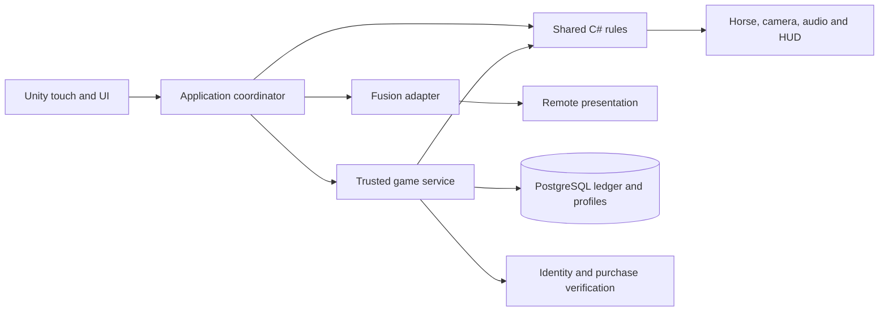

**Barrel Rivals — engineering playbook and stack contracts**  
Engineering revision 5 · Gameplay revision 4 · Original eight-category, 53-section build plan

**Purpose.** This is the coding guide for the complete game: Classic bodycam practice and the opt-in ten-mechanic Reins Lab, three multiplayer experiences, ten horses, progression, purchases and publishable iOS/Android builds. Each section below names the expertise, stack, dependencies, concrete deliverables, integration obligations and evidence needed to contribute to that outcome. Read its card with the matching build-plan row and gameplay blueprint before implementing it.

These are proposed engineering contracts. The named components, service stack and folders are implementation targets, not claims that they already exist. M0 repaired compilation and added a verified URP arena preview; M1 adds shared practice rules and a connected Unity skill loop in the same project; [M0 implementation report](Barrel-Rivals-M0-Report.md) records foundation evidence; [M1 implementation report](Barrel-Rivals-M1-Report.md) records the current practice increment. The iPhone practice app is now built, signed and installed, with first launch confirmed by the user. Original full-section acceptance checks and detailed physical-device qualification remain open. Revision 5 adopts [the Reins decision](../Decisions/Reins-Lab-Gameplay.md) and [ten-mechanic integration specification](Reins-Mechanics-Integration.md). These supersede drawing-only requirements for the Lab while preserving Classic rules version 1. Reins implementation/test/deployment status is not inferred from the Classic milestone evidence.

**Current execution sequence.** R0 checkpoints Classic 0.3.0; R1 builds the additive `reins-lab-v1` mechanical Lab; R2 validates two-thumb controls/art and the full three-barrel course/Drive on phones; M1N proves continuous-input authority/footing/ghost fairness; M3–M7 deliver online progression, content and release. The earlier M2 representative-course scope is carried by R2. All 53 card titles/IDs remain aliases; S29–35 now explicitly describe both rule families where needed. Defaults pending user preference: separate Lab and fixed-base capped earned streak bonuses, with no loss of existing winnings or premium insurance. Free-only development art remains in force.

**Current adapter limits.** Side rein pads plus an active center cadence/Gate/Wrap pad are the implemented layout; the two-zone gesture classifier is only a comparison option. Bounded Core horse parameters and local own-best playback exist, but a horse picker, learned behavior, bond/streak preview UI, rival-gap display and online settlement do not. Prototype circle/Kiss dimensions and cadence values in the integration specification remain provisional. The cards below are required work and evidence, not a completion checklist already satisfied by this source.

**Standing development standard.** For every future section, inspect the actual code and pinned package APIs first; refine its contract; implement a complete connected increment; run relevant checks; review the result against the whole-game requirements; record evidence and remaining work. Source files, Unity assets, editor tooling, backend code, database migrations and native bridges are all deliverables when the section needs them. A component is complete only when its callers, data, assets and failure behavior work together.

**One coherent stack.** The following is the working recommendation. Unity 6000.6.0f1 is the verified M0 Editor baseline; release/device qualification remains open. The implementation pins URP 17.6.0, Input System 1.20.0, uGUI 2.6.0 and Test Framework 1.8.0. These versions passed the recorded foundation checks; they are not yet a qualified release stack. Package documentation links are references, not an instruction to install those particular versions. Record exact engine/package/SDK/compiler versions, licenses, platform support and verified build IDs in a compatibility register. Introduce dependencies only when the section demonstrates a need.

| Key | Working technology and responsibility | Decision / verification gate |
|---|---|---|
| CLIENT | Unity 6, C#, Input System, uGUI/TextMeshPro, Animator and explicit application/presentation adapters. Cinemachine for camera behavior where useful. | M0 clean import; M1 touch/bodycam proof. Pin packages together and use their installed API versions. |
| CORE | Engine-independent C# rules/contracts with a .NET Standard 2.1 API target and a language subset supported by the pinned Unity compiler. Integer time/IDs and reproducible course/scoring rules. | Lab uses a 20 ms fixed-step Core experiment and explicit quantization/event ordering; compile the same source for Unity and the later backend and compare fixtures on both runtimes. [Unity API compatibility](https://docs.unity3d.com/6000.0/Documentation/Manual/dotnet-profile-support.html). |
| CONTENT | ScriptableObject authoring, editor validators, immutable exported rules and Addressables for managed asset groups. Begin with local content. | Validate identities/references and loading lifetime; introduce remote content only with version, download-failure and rollback tests. |
| ART | Blender or equivalent licensed modeling/rigging tools; editable source meshes, quadruped/rider rigs, FBX exports, textures and animation clips. | Use original/free assets only; approve one representative horse/rider/arena on a phone before scaling; track source, commercial rights, attribution and import settings. No art tool is presumed installed. |
| RENDER | URP, lighting/volumes, Shader Graph, budgeted Particle System effects; HLSL/Render Graph passes only for required effects. | M0 restores pipeline assets; R2 verifies actual mobile appearance, comfort and GPU cost. [Render Graph](https://docs.unity3d.com/6000.0/Documentation/Manual/urp/render-graph.html). |
| NET | Photon Fusion 2 behind a transport adapter for live sessions, replicated public state and spectating. | M1N proves topology, private reveals, reconnect and independent clocks; no second multiplayer framework is added casually. [Photon topology guidance](https://doc.photonengine.com/fusion/v2/fusion-choose). |
| API | C# ASP.NET Core on .NET 10 LTS, initially one service with internal modules for profiles, matchmaking, run verification and economy. HTTPS for commands; evaluate a persistent channel for scheduled challenge/input delivery in M1N. | Working backend target, subject to the early feasibility/cost proof. A managed replacement requires a documented decision and equivalent contracts. [.NET support policy](https://dotnet.microsoft.com/en-us/platform/support/policy/dotnet-core). |
| DB | PostgreSQL, explicit migrations, transactional ledger, unique operation keys and reconciliation; object storage for larger replays/content. | M1N proves persistence/concurrency; M3 proves backup/restore and settlement. Hosting providers and database version are selected before provisioning. [Transaction isolation](https://www.postgresql.org/docs/current/transaction-iso.html). |
| PLATFORM | Unity Android/iOS build support and IL2CPP; native haptics/lifecycle/secure-storage bridges only where required. Kotlin/Java or Objective-C++/Swift as appropriate to the chosen plugin boundary. | First physical builds early; verify AOT/stripping/native binaries and modern build-machine requirements. |
| STORE / IAP | Unity IAP client adapter, Apple/Google store products and trusted backend purchase verification/fulfillment. | Store sandbox and transaction recovery before purchases go live. [Receipt validation](https://docs.unity.com/en-us/iap/receipt-validation). |
| AUDIO | Unity AudioSource/AudioMixer, scheduled cues and pooled voices with licensed sound assets. | M1 timing proof; R2 sound/latency/voice-budget review. Additional middleware needs a demonstrated requirement. |
| QA | .NET fixtures, Unity Editor/Play Mode, native artifact checks, named-device usability and later network/economy test matrices. | Keep ruleset/config/build/device identities in every result; check continuous input at variable render rates, geometry boundaries, fairness, fatigue and accessibility. |
| BUILD | Git/Git LFS where needed, Unity batch builds/Test Framework, .NET tests, GitHub Actions or an equivalent controlled runner. | M0 reproducibility; license availability, runner OS, credentials and build costs verified before relying on remote Unity builds. |
| OPS | Structured logs/metrics, bounded gameplay analytics, crash diagnostics, service health and incident procedures. | Start diagnostics at M0; choose one suitable telemetry stack at M1N and test it before beta. |

The ASP.NET service runs separately from Unity. Do not place .NET 10-only assemblies or APIs into the Unity client. Shared source targets the verified common API/language subset and has no UnityEngine, Fusion, database or web-framework dependency. Compilation is necessary but does not prove identical floating-point simulation; use explicit rounding/quantization where needed and cross-runtime reference fixtures before competitive use.

Managed identity is a separate early decision. Unity Authentication is a candidate for anonymous-to-linked accounts and cross-platform identity ([official overview](https://docs.unity.com/en-us/authentication)); M1N must prove server token verification, account recovery and platform linking before selection. Do not build an ad hoc password system or silently add multiple profile/economy backends. Hosting, identity, telemetry and replay-storage providers remain unprovisioned; choose them against reliability, total operating effort and measured costs.

**Dependency and authority boundaries.**

The diagram shows logical responsibility, not a final packet flow. Clients can predict feedback immediately; only trusted verification authorizes competitive results and rewards. A player's transport authority is not wallet authority. Future/private challenge data stays in the server-private manifest; disclosed Lab footing and schedules are equal per round. The Lab uses continuous rein samples and tap/hold edges, not Classic trace scoring. Do not give the second rider an extra rival-reference or timing-window advantage. Presentation adapters never change the accepted result. UI never writes a database balance.

**Proposed code ownership.** Preserve the existing project during recovery and introduce these boundaries incrementally. Paths below are relative to the future canonical repository and do not imply existing files.

| Location | Contents and allowed dependencies |
|---|---|
| `Packages/com.barrelrivals.core/Runtime/` | Shared contracts and rules, separated into explicit assembly definitions; companion .NET Standard projects compile the same source. No generated binaries or service-only source included by Unity. |
| `Assets/_Project/Scripts/Application/` | Race/session coordination and service interfaces; depends on CORE. |
| `Assets/_Project/Scripts/Presentation/` | Horse/camera/audio/HUD presenters; consumes state and events. |
| `Assets/_Project/Scripts/Integrations/` | Input, Fusion, API, IAP and platform implementations; depends on application interfaces. |
| `Assets/_Project/Editor/` and `Assets/_Project/Tests/` | Authoring/export validators and Unity tests in separate editor/test assemblies. |
| `Assets/_Project/{Scenes,Prefabs,Data,Art,Audio}/` | Versioned assets and metadata; use bounded loading and explicit references. |
| `Server/` and `Server.Tests/` | ASP.NET host, modules, persistence and integration tests; shares CORE and owns migrations. |
| `Docs/Sections/` and `Docs/Decisions/` | Actual section evidence, API/schema decisions and version/cost records. |
| `Build/` and `.github/workflows/` | Build/validation entry points and CI configuration; secrets stay outside source. |

Use one intentional construction point to wire dependencies. Do not create one global manager per section. Existing useful code can satisfy multiple cards; each behavior still has one authoritative owner.

**Shared contracts to establish before integration.** Concrete fields are designed and tested in M0/M1N; these are the required meanings.

| Contract | Required meaning / owner |
|---|---|
| Rules and content version | Ruleset namespace, schema version, rules/config/course hashes, input-mode ID and compatible client range. Classic Practice rules 1 and reins-lab-v1 are distinct; S04 owns export/validation. |
| Match assignment | Match/run/participant IDs, format, class, frozen horse/loadout and round footing/stamina schedule. Same-round conditions and reference information are equal regardless of rider order; S38/S40 own authorization. |
| Accepted input | Run/phase identity, ordered sequence, bounded timestamp, normalized left/right tension, center cadence/Gate edges, held Wrap state and side Drive/cancel events. Define exclusive pointer-to-pad ownership, quantization, same-tick ordering, event/rate bounds and stale-control timeout; S02 captures, S40 validates. |
| Skill outcome | Challenge/phase ID, grade components and one accepted boost/knock decision; S29/S33/S34 compute. |
| Run result | Validated elapsed time, legal course progress/finish, unique geometric knocks, explicit fouls and terminal status; style is separate and boosts affect motion. S36 owns calculation; trusted service accepts it. |
| Settlement | Match/purchase/streak-cycle/milestone keys, reservations, fixed-base capped bonus, bond grant and correction status. S42 applies one transaction; local Lab previews cannot mutate wallets/ownership. |
| Replay | Ruleset/config/course/footing/horse-class/input-mode identity, accepted inputs/events and legal progress crossings. Reject Classic/Lab mismatch; S52 owns bounded playback, disclosure, gap validity and lifetime. |

**How to execute a section.** Record the card's scope, affected whole-game requirement IDs R01–R08, actual file/API names and pinned references before coding. Distinguish prerequisites needed now from interfaces agreed with later sections: numbering is ownership, not a demand to finish 1–53 serially. First milestone below means the first usable pass; the original build plan defines full completion.

For each increment, implement rules and failure handling, wire callers and serialized assets, validate the appropriate boundary, then retain proof: commit/build ID, exact command or device procedure, expected/observed outcome and unresolved limitations. Use tests for consequential rules, transitions, concurrency and regressions; inspect visual/art changes in the actual scene/device. A mock API proves client integration only and is labelled as such. Maintain Planned → Implemented → Verified → Release-ready honestly.

The section cards below make these obligations specific. Resource IDs DOC01–DOC21 resolve to primary documentation at the end; always consult the version matching the installed dependency before coding.

**S01 — Project Setup & Architecture**

- **Stack / first pass:** CLIENT, CORE, BUILD · M0.
- **Expertise and resources:** Unity assembly/package management, C# boundaries, Git recovery; DOC01, DOC02, DOC15.
- **Inputs / dependencies:** The technical audit, both local projects and the newer GitHub commit; preserve local changes before reconciliation.
- **Build:** One canonical Unity project, pinned package/assembly references, bootstrap scene, shared-core build and repeatable import/build commands.
- **Connect:** A composition root explicitly connects input, rules, presentation and service adapters; scene creation persists assets and metadata.
- **Proof:** Clean-checkout import, core/client compilation and reopened startup scene pass; document the actual Android/iOS build path.

**S02 — Input System Foundation**

- **Stack / first pass:** CLIENT, CORE · R1
- **Expertise and resources:** Two-thumb pad ownership, timestamps and mobile lifecycle; DOC03.
- **Inputs / dependencies:** Reins phase/input schema; side/center safe areas and a declared input-mode ID.
- **Build:** LEFT/RIGHT drag reins plus CENTER cadence/Gate press and eligible 300 ms hold for Wrap; Drive uses alternating side presses. Initial center cadence and later held Wrap are separate events, with no hold-generated repeated cadence. Keep Classic isolated.
- **Connect:** S11 consumes normalized reins; S29/30/31/34 consume discrete edges. Menu/lost touches cannot leave held steering or count twice.
- **Proof:** Two-thumb phone play with no third required touch; center reach, cancel/slide-off/hand swap and 30/60/120 Hz capture. No drag release becomes an extra cadence/Drive tap.

**S03 — Game State Machine**

- **Stack / first pass:** CORE, CLIENT, API · R1 → M1N
- **Expertise and resources:** Explicit fixed-step run/match states and immutable outcomes; DOC01, DOC09.
- **Inputs / dependencies:** Lab gate/course/barrel/Drive/finish contracts and ruleset namespace.
- **Build:** One Reins run state owner with legal route, missed/foul/cancel/timeout/finish outcomes; preserve the separate Classic state machine.
- **Connect:** S29–36 publish accepted event identities; S37–41 later admit/settle each run once.
- **Proof:** Invalid phase/input order, duplicate finish, skips, restart and stale controls never create extra boost, result or reward.

**S04 — Data Architecture (ScriptableObjects)**

- **Stack / first pass:** CONTENT, CORE, CLIENT · R1
- **Expertise and resources:** Authoring/export schemas and bounded configuration; DOC04.
- **Inputs / dependencies:** Ruleset, course, collision bounds, beat/gate/Drive, footing and horse IDs.
- **Build:** Versioned ScriptableObject authoring to immutable Core manifests/hashes; all attachment percentages remain provisional until configured and tested.
- **Connect:** Unity/verifier consume identical public conditions; private future data stays protected. Classic/Lab decoders never infer compatibility from version number alone.
- **Proof:** Reject duplicate IDs, NaN/out-of-range curves, impossible dimensions and mismatched hashes; export round-trip is stable.

**S05 — Save/Load & Cloud Sync**

- **Stack / first pass:** CLIENT, CORE, API, DB · R1 → M3
- **Expertise and resources:** Namespaced saves/replays, migrations, concurrency and account recovery; DOC09–11.
- **Inputs / dependencies:** Classic checkpoint and reins-lab-v1 schema/hash/record identity; future trusted profile contracts.
- **Build:** Isolated Lab settings/local records; later server profiles and transactional bond/streak grants. Do not migrate Classic bests into Lab rivals.
- **Connect:** S52 validates playback; S42 owns later wallet/bond writes. Offline previews never claim cloud sync or authority.
- **Proof:** Corrupt/old/cross-ruleset data cannot block play; restore/restart/duplicate settlement/concurrent account writes preserve ownership.

**S06 — iOS & Android Platform Layer**

- **Stack / first pass:** PLATFORM, BUILD, CLIENT · M0.
- **Expertise and resources:** IL2CPP/AOT, signing, lifecycle and native integration; DOC16 and the technical review.
- **Inputs / dependencies:** Named supported phones, engine/package lock and a compatible Mac/Xcode build environment.
- **Build:** Android/iOS build configurations, safe-area/lifecycle adapters and documented signing/release procedures.
- **Connect:** Pause/background notifications enter S02/S41; platform identity and purchase adapters remain outside race rules.
- **Proof:** Install signed development builds on both platforms; test backgrounding, stripping/native-plugin behavior and cold start.

**S07 — Performance Budget & Quality Tiers**

- **Stack / first pass:** RENDER, CLIENT, BUILD · R0 → R2.
- **Expertise and resources:** CPU/GPU profiling, memory ownership and thermal testing; DOC06.
- **Inputs / dependencies:** Named device tiers and the representative horse/arena from R2.
- **Build:** Per-device frame, memory, download and thermal budgets; quality assets and recorded profiling captures.
- **Connect:** Art, crowd, particles, cameras and UI receive measured budgets; presets alter presentation only.
- **Proof:** Run the build-plan 20-minute device benchmark; retain traces and identify CPU/GPU bottlenecks before adding complexity.
- **Reins integration:** R2 measures rein/cadence/Drive latency, two-thumb fatigue and temperature alongside frame time. No quality tier alters horse collision bounds, timing windows or ghost gap meaning.

**S08 — Horse Data Model & Breeds**

- **Stack / first pass:** CONTENT, CORE, ART · R1 → M6
- **Expertise and resources:** Horse data, trait envelopes and free-asset provenance; DOC04–05.
- **Inputs / dependencies:** Ten-horse full-roster requirement, event caps and Nerve/Fire/Biddability/Heart definitions.
- **Build:** Versioned trait/stamina/bond preview profiles with explicit practical tradeoffs and eventual distinct horse/rig records.
- **Connect:** S09 computes bounded movement coefficients; S10–13 present them; S38 freezes a legal match snapshot.
- **Proof:** All profiles validate; identical input exposes intended tradeoffs without random knocks, input lag or automated steering.

**S09 — Horse Stats & Leveling**

- **Stack / first pass:** CORE, CONTENT, API, DB · R1 → M6
- **Expertise and resources:** Balance, capped response curves and settled progression; DOC01, DOC09–10.
- **Inputs / dependencies:** Legal class caps, base horse/gear traits and disclosed per-round stamina schedule.
- **Build:** Bounded speed/grip/turn-response/effort terms; immediate input capture. Plan a labelled bond preview; it is not implemented in the current Lab. Persist earned bond only through later trusted settlement.
- **Connect:** S11 consumes coefficients; S38 freezes profile; S42 grants progression for a later match. No paid timing windows or artificial 80 ms delay.
- **Proof:** Cross-profile same-input matrix, cleaner weak-profile wins and no mid-round drift. No purchase can erase a normal knock via hidden control advantages.

**S10 — Horse Animation State Machine**

- **Stack / first pass:** ART, CLIENT · R1 → R2.
- **Expertise and resources:** Quadruped/rider rigging, blend trees and procedural alignment; DOC05.
- **Inputs / dependencies:** A licensed rigged horse/rider, locomotion reference and S11 movement/turn events.
- **Build:** Animator controller, clips/blends and a presentation adapter for clean, wide, knock, sprint and finish behavior.
- **Connect:** Validated movement drives animation; horse/rider root motion cannot independently change official speed or collisions.
- **Proof:** Inspect feet, saddle/reins, bodycam clipping and contact timing at speed extremes; final pass covers the complete roster.
- **Reins integration:** Reins adds leg/hip wrap, rein/brake contact and capped Drive effort. Imported animation/controller assets observe the Core pose; they cannot auto-steer, move the race root or determine knocks.

**S11 — Horse Physics & Movement Controller**

- **Stack / first pass:** CORE, CLIENT · R1 → R2
- **Expertise and resources:** Kinematic steering, swept collision and fixed-step numerical rules; DOC01.
- **Inputs / dependencies:** 20 ms step, two rein tensions, horse/barrel bounds, legal course and footing/trait manifest.
- **Build:** Differential steering, combined braking, bounded grip/slip/counter-rein, cadence/wrap/Drive boosts and legal geometric course progression. Classic keeps its automatic path.
- **Connect:** S19/S31/S36 consume the same contact IDs; S10/12/23 interpolate presentation, never decide collision/time.
- **Proof:** Symmetric left/right controls, finite bounds, high-speed tunnelling, legal turns/finish, render-rate replay and later IL2CPP/verifier equality.

**S12 — Horse Gait System**

- **Stack / first pass:** ART, CLIENT · R1 → R2.
- **Expertise and resources:** Stride phase, gait transitions and sound synchronization; DOC05, DOC13.
- **Inputs / dependencies:** Validated movement speed and the animation/hoof-contact specification.
- **Build:** Gait blending and stride-phase outputs for walk/trot/canter/gallop with smooth acceleration transitions.
- **Connect:** S10 animation, S23 camera and S48 hoof audio share locomotion phase; gait presentation never adds race time.
- **Proof:** Check foot sliding, blended contacts, duplicate hoof sounds and camera jolts across all legal speed ranges.
- **Reins integration:** Lab cadence/Drive sound and movement gait share accepted speed/phase, with explicit hoof-contact coordination. A rhythmic tap does not directly teleport animation phase or change the simulation clock.

**S13 — Horse Visual Customization (Colors/Markings)**

- **Stack / first pass:** ART, CONTENT, CLIENT, API · R2 → M6.
- **Expertise and resources:** Material variants, UV/mask authoring and entitlement checks; DOC04, DOC07.
- **Inputs / dependencies:** Horse meshes, approved coat/marking catalogue and ownership records.
- **Build:** Reusable material/mask setup, customization preview and versioned saved cosmetic selections.
- **Connect:** Stable, introduction, spectator and replay resolve the same cosmetic IDs with a safe missing-asset fallback.
- **Proof:** Unauthorized selections fail; owned appearances persist after reinstall; measure memory/material batching across the roster.

**S14 — Horse Aging & Career System**

- **Stack / first pass:** CORE, API, DB · M6.
- **Expertise and resources:** Career modeling, migration and explainable progression; DOC09, DOC10.
- **Inputs / dependencies:** Approved maturity/experience rules, milestone rewards and preserved-ownership policy.
- **Build:** Career state transitions and persistence with explicit earned milestones and any approved condition effects.
- **Connect:** Apply changes after settlement; freeze the match snapshot and show progression in the stable.
- **Proof:** Duplicate results cannot age/advance twice; migrations retain horses; career effects do not drift between Championship runs.
- **Reins integration:** Also owns Horse IQ Bond: plan a local bounded-trait/bond preview, then grant experience/bond exactly once after later trusted match settlement. No learned auto-steer or mid-round trait changes.

**S15 — Horse Injury & Recovery System**

- **Stack / first pass:** CORE, API, DB, CLIENT · M6.
- **Expertise and resources:** Reversible condition rules and recovery UX; DOC09, DOC10.
- **Inputs / dependencies:** A tested decision on injury effects, durations and always-available play/recovery routes.
- **Build:** Condition/recovery state machine, trusted completion time and clear stable UI; ownership remains intact.
- **Connect:** S09 reads legal condition at entry; S42 applies any approved recovery cost; no device-clock authority.
- **Proof:** Test zero balance, all owned horses affected, clock changes, reconnect and duplicate recovery; a playable route always remains.
- **Reins integration:** Also owns disclosed per-round Horse IQ stamina/recovery. Equal round schedule and immutable pre-round profile avoid second-rider bias; no hidden random fatigue, irreversible loss or paid-only route to play.

**S16 — Arena Geometry & WPRA Standards**

- **Stack / first pass:** CORE, CONTENT, ART · R1 → R2.
- **Expertise and resources:** Course geometry, units and level-authoring tools; DOC17.
- **Inputs / dependencies:** Verified WPRA reference, deliberate arcade variants and start/finish convention.
- **Build:** Arena authoring tool/data, center-distance checks, baked legal course and visual/debug checkpoint overlays.
- **Connect:** S11/S36 consume a versioned geometry export; visual arena variants cannot silently move scoring boundaries.
- **Proof:** Validate dimensions, clearance, barrel order, turn completion and legal finish; compare rendered course with baked rules.

**S17 — Arena Lighting System**

- **Stack / first pass:** RENDER, ART · R0 → R2.
- **Expertise and resources:** URP lighting, lightmaps, probes and shadow budgets; DOC06, DOC07.
- **Inputs / dependencies:** Correct pipeline assets, representative arena and phone GPU budgets.
- **Build:** Lighting profiles, baked assets where appropriate and bounded real-time lights/shadows.
- **Connect:** S21/S22 select approved profiles; gameplay prompts remain readable in every supported quality mode.
- **Proof:** Check materials and shadows in actual mobile builds, including transitions; record GPU cost and shader compatibility.

**S18 — Arena Ground Surface (Dirt/Footing)**

- **Stack / first pass:** CORE, CONTENT, RENDER, AUDIO · R1 → R2
- **Expertise and resources:** Spatial footing, grip curves and fair round manifests; DOC01, DOC07.
- **Inputs / dependencies:** Hard Pack/Sand/Clay/Mud/Mixed profiles and course-space patch geometry.
- **Build:** Bounded speed/grip map plus deterministic between-round degradation, disclosed equally to both riders.
- **Connect:** S11 physics and S17/22/27/48 visuals/audio share profile identity; cosmetic ruts do not mutate gameplay.
- **Proof:** Patch-boundary fixtures, order reversal and same-round manifest/hash equality. Validate surface readability and feel on phones.

**S19 — Arena Props (Barrels, Fences, Gates, Chutes)**

- **Stack / first pass:** CORE, CONTENT, CLIENT, ART · R1 → R2
- **Expertise and resources:** Collider bounds, swept contact, reset and event identity; DOC01, DOC06.
- **Inputs / dependencies:** Versioned horse/barrel geometry and clean-pass/contact thresholds.
- **Build:** Saved props and one authoritative knock event per barrel; presentation wobble/contact restores reliably.
- **Connect:** S31 measures surface clearance; S36 adds one five-second penalty; physics decoration cannot reroll accepted outcomes.
- **Proof:** Different visual/LOD scales retain legal collision bounds; near-pass/contact, tunnelling, duplicate callbacks and reset agree with replay.

**S20 — Crowd System (Stands, Fans, Animation)**

- **Stack / first pass:** ART, RENDER, AUDIO · R2 → M6.
- **Expertise and resources:** Crowd LOD, instancing and reaction scheduling; DOC06, DOC13.
- **Inputs / dependencies:** Arena stands, crowd asset rights and performance allocations.
- **Build:** Scalable crowd presentation and deduplicated reaction groups responding to race events.
- **Connect:** S48 mixes reactions; spectator and local views use the same accepted event identity.
- **Proof:** Profile low/high crowd tiers, audio overlap and repeated matches; disabling crowd detail leaves all race rules unchanged.

**S21 — Arena Themes & Variants**

- **Stack / first pass:** CONTENT, ART, RENDER · R2 → M6.
- **Expertise and resources:** Environment kits, content loading and visual consistency; DOC07, DOC08.
- **Inputs / dependencies:** One approved arena benchmark, five-tier proposal and course identity catalogue.
- **Build:** Five coherent arena presentations with local content groups, loading/unloading rules and validated references.
- **Connect:** S45 event eligibility selects content; S16 supplies matching course data and S07 supplies quality constraints.
- **Proof:** Every arena loads within budget; interrupted loading recovers; rules and visual catalogue versions agree.

**S22 — Weather & Time-of-Day System**

- **Stack / first pass:** CORE, CONTENT, RENDER · R1 → R2.
- **Expertise and resources:** Seeded randomness, environment presets and visibility testing; DOC01, DOC07.
- **Inputs / dependencies:** Missing RNG repair, versioned weather presets and paired-match conditions.
- **Build:** Reproducible weather selection plus visual transition adapters; trusted manifests freeze any handling effects.
- **Connect:** Gameplay RNG streams are separate from cosmetic particles/crowds and private challenge generation.
- **Proof:** Same manifest produces equal gameplay conditions; extra cosmetic RNG calls cannot change shapes, weather or results.

**S23 — Bodycam Camera Controller**

- **Stack / first pass:** CLIENT, ART · M1.
- **Expertise and resources:** First-person framing, camera damping and comfort; DOC12.
- **Inputs / dependencies:** Horse/rider rig, stable drawing overlay and legal movement snapshots.
- **Build:** Bodycam rig and short introduction transition, clipping controls and reduced-motion settings; use Cinemachine only for needed camera behavior.
- **Connect:** S11/12 supply motion cues; S50 drawing UI remains stable; spectator/replay cameras use explicit ownership.
- **Proof:** Real-phone comfort tests cover corners, knocks and slow motion; switching cameras never moves the horse or alters deadlines.
- **Reins integration:** Reins HUD must remain steady/readable while looking into turns; ghost pressure/clutch effects cannot obscure cadence or force active split-screen. Reduced motion changes presentation only.

**S24 — Post-Processing Shader Pipeline**

- **Stack / first pass:** RENDER, BUILD · R0 → R2.
- **Expertise and resources:** URP configuration, shader variants and render-pass compatibility; DOC07.
- **Inputs / dependencies:** Pinned engine/URP versions, renderer assets and named device profiles.
- **Build:** Valid Graphics/Quality pipeline assignments, volume profiles and only necessary Render Graph-compatible custom passes.
- **Connect:** S25–28 extend this one rendering pipeline; include required shader variants in mobile builds.
- **Proof:** No missing GUIDs or magenta materials; verify Metal and Android graphics paths, build stripping and measured pass costs.

**S25 — Lens Effects (Fisheye, Chromatic, Flare)**

- **Stack / first pass:** RENDER, CLIENT · R2.
- **Expertise and resources:** Optical shader effects and screen-space composition; DOC07.
- **Inputs / dependencies:** Approved art direction and effect budgets from S07/S24.
- **Build:** Bounded lens/flare profiles using stock URP or Shader Graph; HLSL only for a demonstrated visual requirement.
- **Connect:** World effects exclude the readable input surface; comfort settings use the same gameplay rules.
- **Proof:** Compare phone captures with effects on/off; check edge readability, artifacts and GPU cost.
- **Reins integration:** For Reins, preserve side rein guides, center cadence/Wrap meter and pocket labels; behind/ahead never changes visual noise or skill readability.

**S26 — Motion Effects (Blur, Speed Lines)**

- **Stack / first pass:** RENDER, CLIENT · R2.
- **Expertise and resources:** Motion cues, camera comfort and mobile overdraw; DOC06, DOC07.
- **Inputs / dependencies:** Validated speed/turn events and reduced-motion preferences.
- **Build:** Speed lines and restrained motion effects driven by presentation data with independent intensity settings.
- **Connect:** S35 local slow motion affects presentation curves per rider, without changing global competitive scheduling.
- **Proof:** Check phase transitions and small-screen readability; no cue, barrel or drawn trace is obscured by the chosen presets.
- **Reins integration:** Home Stretch Drive spectacle is optional. Ghost gap or clutch detection cannot modify input thresholds, speed policy or timing windows.

**S27 — Environmental VFX (Dust, Particles, Sweat)**

- **Stack / first pass:** RENDER, ART, CLIENT · R2.
- **Expertise and resources:** Particle authoring, pooling and texture overdraw; DOC06, DOC07.
- **Inputs / dependencies:** Hoof/barrel events, surface identity and effect budget.
- **Build:** Pooled Unity Particle System effects for dust/contact/sweat as appropriate; introduce heavier VFX tooling only after a measured need.
- **Connect:** Accepted event IDs trigger effects once; S18 surface and S48 audio use matching contact information.
- **Proof:** No unbounded allocations or leaked emitters during repeated races; profile worst-case dust on the slowest supported phone.
- **Reins integration:** Use accepted clearance/contact and footing events; particle wobble/dust cannot introduce a different knock verdict or surface grip for the next rider.

**S28 — Dynamic Exposure & Color Grading**

- **Stack / first pass:** RENDER, ART · R2.
- **Expertise and resources:** Color grading and luminance transitions; DOC07.
- **Inputs / dependencies:** Arena lighting profiles and camera/readability reference captures.
- **Build:** Approved color/exposure profiles with bounded transitions; any automatic exposure requires a proven compatible implementation.
- **Connect:** S17/S22 supply environment state; stable gameplay UI is composed with deliberate exposure behavior.
- **Proof:** Bright/dark transitions preserve barrel and prompt visibility; inspect captures across the supported phone profiles.

**S29 — Phase 1 — Beep Gate System**

- **Stack / first pass:** CORE, CLIENT, AUDIO · R1
- **Expertise and resources:** Three-wave timestamp grading, false-break bounds and audio scheduling; DOC03, DOC13.
- **Inputs / dependencies:** Lab wave/peak configuration and official clock origin; Classic hold/release contract remains separate.
- **Build:** Gate Break center-pad taps with one acceptance per peak, explicit wrong/dip/miss outcome and capped false-break standstill/recovery.
- **Connect:** S02 owns input, S35 time, S11 physical acceleration boost and S36 elapsed result. No negative time credits or double-counted standstill.
- **Proof:** Peak/deadline/duplicate/spam cases and missed cues; actual device audio/visual latency. Do not adopt the attachment heading over its three-tap action.

**S30 — Phase 2 — Alley Run**

- **Stack / first pass:** CORE, CLIENT, AUDIO · R1
- **Expertise and resources:** Cadence schedules, capped acceleration and transition geometry; DOC01, DOC13.
- **Inputs / dependencies:** Accepted gate outcome, rein/horse/footing state and cadence windows.
- **Build:** Player-steered alley and cadence grading with one opportunity acceptance, bounded Hot/Blazing gain/duration and miss recovery.
- **Connect:** S11 remains motion owner; S31 receives legal barrel approach; S48/50 render equal readable rhythm.
- **Proof:** No speed stacking from duplicate taps or pause; current provisional 300–500 ms (2–3.33 Hz) periods and timing windows require phone precision/fatigue tests.

**S31 — Phase 3 — Barrel Turn Pattern System**

- **Stack / first pass:** CORE, CLIENT, ART · R1 → R2
- **Expertise and resources:** Geometric pockets, contextual wrap and single exit outcomes; DOC01, DOC03.
- **Inputs / dependencies:** Horse/barrel surface clearance, legal progress/direction and exclusive hold ownership.
- **Build:** Lab Pocket/Kiss plus Leg/Flash Wrap with bounded control/speed tradeoff. Classic maintains its drawing/exit flow separately.
- **Connect:** S33 evaluates path/contact; S11 applies physical exit boost; S19/S36 share knock identity; S10/27 animate accepted events.
- **Proof:** No hidden RNG, center-only kiss band, collision immunity or repeated exit gain. Two-thumb wrapped/unwrapped turns and skipped/re-entered barrel fixtures.

**S32 — Pattern Library & Generation**

- **Stack / first pass:** CORE, CONTENT, API · R1 → M1N
- **Expertise and resources:** Versioned challenge generation and symmetric disclosure; DOC04, DOC18.
- **Inputs / dependencies:** Lab course/beat/gate/footing/round/config manifest; Classic template catalogue remains distinct.
- **Build:** Immutable equivalent round assignments; explicit Lab ruleset/hash/input-mode identity and public/private split.
- **Connect:** S33/35 consume assigned config; S39/S52 receive only permitted compatible rival data; both riders get equal preview/reference access.
- **Proof:** Reproducible valid manifests, shared footing and no order-based information leak or Classic replay import.

**S33 — Touch Input & Path Scoring Algorithm**

- **Stack / first pass:** CORE, CLIENT, API · R1 → M1N
- **Expertise and resources:** Continuous/discrete input admission, computational geometry and timing; DOC01, DOC03. DOC18 remains a Classic recognizer reference only.
- **Inputs / dependencies:** Normalized rein stream, center cadence/Gate and held Wrap, side Drive events, quantization/sequence/time bounds and collider envelopes.
- **Build:** Exclusive pointer-to-pad ownership plus cadence/Drive grading, the declared center press-then-hold timeline, swept clearance/contact and canonical accepted input. Classic retains trace normalization/shape scoring.
- **Connect:** Shared Core supplies diagnostic events to UI and future verifier. No purchase/rival lead changes the grading definition.
- **Proof:** Boundary/NaN/spam/duplicate/reorder tests; no third touch required; real-phone intent/error samples and cross-runtime fixtures.

**S34 — Phase 4 — Home Sprint**

- **Stack / first pass:** CORE, CLIENT, AUDIO · R1 → R2
- **Expertise and resources:** Alternating input windows, capped boost/stamina and accessibility; DOC03, DOC13.
- **Inputs / dependencies:** Legal barrel-three exit, side event ownership, disclosed carryover and finish boundary.
- **Build:** Home Stretch Drive with bounded rolling/cadence policy; same-side repeats earn no gain. Prototype attainable cap rather than requiring 14 taps/s.
- **Connect:** S11 applies physical gain; S36 ends it at finish; S48/50 remain readable with effects off.
- **Proof:** Side-order/spam/timing/cap/finish tests; compare fatigue and accessible input modes. Ghost clutch state cannot lower thresholds.

**S35 — Slow Motion System**

- **Stack / first pass:** CORE, CLIENT, NET, API · R1 → M1N
- **Expertise and resources:** Fixed-step clocks, input timestamp policy and network admission; DOC01, DOC19.
- **Inputs / dependencies:** Lab 20 ms simulation step, canonical ordering/quantization, deadlines and stale-input timeout.
- **Build:** Separate capture, simulation and presentation timelines. Lab does not inherit Classic drawing slowdown; any configured slow motion is per-rider/versioned/equal.
- **Connect:** All graders/S36 use explicit time; Unity render interpolation and network transport never author elapsed result.
- **Proof:** Same accepted sequence under variable render steps; later IL2CPP/verifier equality, independent riders, delay/reorder/pause/reconnect with no deadline rewind.

**S36 — Run Timer & Penalty Calculator**

- **Stack / first pass:** CORE, API, CLIENT · R1 → M1N
- **Expertise and resources:** Legal finish, immutable result, integer time and deduplication; DOC01, DOC09.
- **Inputs / dependencies:** Official start cue, legal three-barrel progress, unique contacts and explicit foul policy.
- **Build:** Elapsed simulation plus one five-second penalty per knocked barrel, explicit DNF/tie and separate style fields. Boosts change movement, not arbitrary time credits.
- **Connect:** S11/19/31/34 supply accepted events; trusted verifier accepts result; S42 settles once later.
- **Proof:** Skips/wrong direction/tunnelling, duplicate knocks/finish, standstill double-count, overflow, rounding, DNF/tie and replay agreement.

**S37 — Multiplayer Networking (Photon Fusion 2)**

- **Stack / first pass:** NET, API, CLIENT · M1N → M3
- **Expertise and resources:** Transport topology, continuous input authority and bounded replication; DOC19.
- **Inputs / dependencies:** Rules/config hashes, accepted analog/discrete sequence, equal footing and state/privacy contracts.
- **Build:** Minimal Photon candidate adapter and independent verifier proof before production service adoption.
- **Connect:** S38 authorizes participants; S40 validates input/time/results; S39/52 stream compatible permitted state only.
- **Proof:** Two devices under delay/loss/reorder/reconnect; no stale held controls, unequal conditions or duplicate outcomes. Record capacity/cost and unproven limits.

**S38 — Matchmaking & ELO/Trophy System**

- **Stack / first pass:** API, DB, NET, CLIENT · M1N → M3
- **Expertise and resources:** Eligibility, compatible rulesets, information fairness and rating updates; DOC09–10, DOC19.
- **Inputs / dependencies:** Frozen event/class/horse/config/input-mode and per-round footing/stamina schedule.
- **Build:** Eligible Quick Duel/Championship assignment with common comparison contract and equal rival-reference policy.
- **Connect:** S37 admits only assigned players; S42 grants trusted result/bond/streak once. Lab/Classic/recorded/live are explicitly identified.
- **Proof:** Order swap, low population, stale tickets, version/input-mode mismatch, extreme legal traits and concurrent matches do not create unfair admission or reward.

**S39 — Spectator Mode**

- **Stack / first pass:** NET, CLIENT, CORE · M1N → M5
- **Expertise and resources:** Fair ghost disclosure, course-progress alignment and remote presentation; DOC12, DOC19.
- **Inputs / dependencies:** Compatible recorded input/manifest and elapsed-time crossings at legal progress markers.
- **Build:** Optional rival ghost and cosmetic pressure/clutch cues; mark gap unavailable without valid comparable progress.
- **Connect:** S52 validates replay; S40 controls data release. Equal preassigned reference or post-both-runs ghost prevents second-rider advantage.
- **Proof:** No Classic import, fabricated live rival or window/Drive-threshold/noisy-UI advantage. Test gap sign, penalties, overlap, incomplete progress and display-off parity.

**S40 — Anti-Cheat & Server Validation**

- **Stack / first pass:** CORE, API, DB · M1N → M3
- **Expertise and resources:** Input admission, independent simulation verification and abuse diagnostics; DOC09–10.
- **Inputs / dependencies:** Authenticated run/manifest/config identity, bounded rein samples/tap/hold rates, sequence and timestamp limits.
- **Build:** Verify continuous movement/contact/route/finish from accepted input; reject stale/future/replayed/forged data before settlement.
- **Connect:** S42 accepts only one verified result; local style/bond/streak/stopwatch claims have no authority. Fixed stepping is not sufficient cross-runtime proof.
- **Proof:** Malformed/NaN, spoofed config, impossible/spam samples, physics disagreement, rollback/reconnect and duplicate settlement cases; document macro/collusion limits.

**S41 — Disconnect Handling & Reconnection**

- **Stack / first pass:** CORE, API, NET, CLIENT · M1N → M3.
- **Expertise and resources:** Distributed recovery, deadlines and idempotent correction; DOC09, DOC19.
- **Inputs / dependencies:** Match-state snapshots and the cause-specific settlement matrix.
- **Build:** Reconnect/resume contract, bounded grace policy, terminal outcomes and clear player recovery messages.
- **Connect:** S06 lifecycle signals and S37 transport events converge on one recovery owner; S42 corrections use unique keys.
- **Proof:** Disconnect at every phase and during settlement; no input rewind, stuck reservation, duplicate refund or lost authoritative result.
- **Reins integration:** For continuous reins, bound stale held input and release/cancel both rein/wrap ownership correctly on lost focus/transport. No reconnect replays missed cadence/gate opportunities or rewinds course progress.

**S42 — Currency System (Coins, Diamonds, Trophies)**

- **Stack / first pass:** API, DB, CORE · M3 → M6
- **Expertise and resources:** Transactional rewards, fixed-base caps and settled horse progress; DOC09–10.
- **Inputs / dependencies:** Accepted match/result, event reward B, streak-cycle/milestone and bond eligibility/version.
- **Build:** Wallet ledger and capped earned streak extras; no accumulated-pot recursion, existing-winnings loss or premium insurance under current recommendation. No Lab reward UI/calculator is implemented; any future local preview must remain non-awarding.
- **Connect:** S44/46 define eligible milestones; S05 stores profile; S47 later verifies allowed purchases. One grant key per match/cycle/milestone.
- **Proof:** Cap/overflow, duplicate/concurrent grant, void/draw/DNF/refund and bond retries reconcile. Existing balance never becomes the streak stake.

**S43 — Gear & Equipment System**

- **Stack / first pass:** CORE, API, DB, CLIENT · R2 → M3.
- **Expertise and resources:** Loadout composition, entitlements and consumable lifecycle; DOC10.
- **Inputs / dependencies:** Gear catalogue, stacking/cap rules and one-match duration contract.
- **Build:** Effective-loadout resolver, equip UI and server reservations/consumption/restoration for gear.
- **Connect:** S09 creates the frozen snapshot; S42 atomically consumes inventory; all Championship runs share the same legal loadout.
- **Proof:** Concurrent matches cannot spend one item twice; temporary modifiers stay bounded and service void restores only once.
- **Reins integration:** Lab horse/gear effects are bounded movement/effort curves only; no paid timing windows, input-delay removal, auto-steering or hidden contact forgiveness. Freeze the loadout and disclosed stamina schedule.

**S44 — Loot Crate & Reward System**

- **Stack / first pass:** CORE, API, DB, CONTENT, CLIENT · M3 → M6
- **Expertise and resources:** Reward design, eligibility, caps and grant idempotence; DOC09–10.
- **Inputs / dependencies:** Fixed base reward, approved milestone table and settled match/streak-cycle identity.
- **Build:** Earned streak/mission/crate policies with explicit claims/reset/caps; illustrative milestone values stay unactivated until balance approval.
- **Connect:** S42 atomically grants base/bonus; When implemented, UI must label local Lab calculations as previews. No premium loss insurance product.
- **Proof:** Original recursive example is not implemented. Table/example sums agree; tie/void, cap, repeated claim and offline result cannot mint rewards.

**S45 — Trophy Road & Arena Unlocks**

- **Stack / first pass:** CORE, API, DB, CLIENT · M3 → M6.
- **Expertise and resources:** Progression graphs, eligibility predicates and economy simulation; DOC09, DOC10.
- **Inputs / dependencies:** Five-tier proposal, trophies, horse readiness and free-entry recovery rules.
- **Build:** Server eligibility checks and trophy-road views backed by one versioned progression model.
- **Connect:** S38 uses the same predicates shown in S50; purchasing ownership never directly grants earned tier access.
- **Proof:** Simulate a complete free route, zero balance and repeated losses; test account migration and anti-farming without blocking recovery.
- **Reins integration:** Do not import Lab style/streak/bond previews as progression. Later event eligibility and fixed-base reward amounts are frozen and validated by trusted services.

**S46 — Daily Missions & Season Pass**

- **Stack / first pass:** API, DB, CONTENT, CLIENT · M6.
- **Expertise and resources:** Scheduled progression, event aggregation and claim consistency; DOC09, DOC10.
- **Inputs / dependencies:** Mission/pass definitions, trusted calendar and free/premium reward tracks.
- **Build:** Deduplicated progression from accepted gameplay events, season rollover and exactly-once reward claims.
- **Connect:** S42 grants rewards; S47 proves pass entitlement; S53 observes progress without becoming the reward authority.
- **Proof:** Test device-clock changes, late events, boundary rollover and double claims; paid and free tracks reflect published contents.
- **Reins integration:** Streak extras use fixed-base capped earned milestones under S42/S44. No current-wallet staking or premium loss insurance; stopping play does not forfeit awarded balances.

**S47 — In-App Purchase & Store**

- **Stack / first pass:** STORE / IAP, API, DB, CLIENT · M6 → M7
- **Expertise and resources:** Allowed entitlement products and trusted store fulfillment; DOC20.
- **Inputs / dependencies:** Approved content/power policy and working service ledger; no live Lab purchases.
- **Build:** Mobile storefront, fixed-content offers, verification/restore/refund when introduced. Exclude paid timing windows, input lag removal, auto-steering, rival-information advantage and streak-loss insurance.
- **Connect:** S42 grants verified entitlements once; S09 caps legal strength. Free-only development art acquisition remains separate from future player-store scope.
- **Proof:** Store sandbox/pending/duplicate/refund recovery and zero-spend route pass before selling. No product is inferred from a local preview.

**S48 — Adaptive Audio Engine**

- **Stack / first pass:** AUDIO, CLIENT, CONTENT · R1 → R2
- **Expertise and resources:** Rhythm cue latency, contact/gait mix and bounded voices; DOC13.
- **Inputs / dependencies:** Canonical beat/gate/contact/wrap/Drive events and actual speed/surface identity.
- **Build:** Scheduled readable cadence/gate cues, hoof/footing sound and restrained accepted-outcome feedback with persisted controls.
- **Connect:** S12 movement/animation phase and S18 footing drive presentation; ghost pressure may change cosmetic music, never mask skill cues.
- **Proof:** Phone latency/volume/fatigue, duplicate events, voice leaks and sound-off usability. Do not add a crowd roar on every rapid tap.

**S49 — Haptics & Feedback System**

- **Stack / first pass:** PLATFORM, CLIENT · R1 → R2
- **Expertise and resources:** Optional native impacts and accessibility; DOC14, DOC16.
- **Inputs / dependencies:** Accepted outcome IDs and settings/lifecycle state.
- **Build:** Short causal feedback for selected meaningful gate/turn/contact/Drive events, not continuous vibration on every sample.
- **Connect:** S48/50 communicate the same outcomes; unsupported/off haptics preserve timing and readability.
- **Proof:** No duplicate/stale pulses after cancel/retry, bounded frequency and actual phone comfort checks.

**S50 — UI/UX Design System**

- **Stack / first pass:** CLIENT, CONTENT, API · R1 → M6
- **Expertise and resources:** Two-thumb HUD, honest comparison and accessible feedback; DOC03, DOC12.
- **Inputs / dependencies:** Lab/Classic entry, per-phase gesture ownership, equivalent ghost and local/trusted result labels.
- **Build:** Stable side rein pads plus active center cadence/Gate/Wrap, side Drive, one coaching action, local own-best and later honest rival-gap/streak/bond UI. Current Lab has no rival-gap or bond/streak presentation.
- **Connect:** S02 assigns pointer ownership and captures phase-specific edges; S36/39/42 provide displayable truths. Reduced motion/ghost off never changes competitive rules.
- **Proof:** Uncoached phone tasks with no third touch; input occlusion, color-independent zones, unavailable gap and no noisy behind-state UI.

**S51 — Tutorial & Onboarding Flow**

- **Stack / first pass:** CORE, CLIENT, CONTENT · R1 → R2
- **Expertise and resources:** Progressive skill teaching and observed learning; DOC03.
- **Inputs / dependencies:** All ten mechanics and the current side-rein/center-action layout; no three simultaneous touches. The alternative two-zone classifier is not implemented.
- **Build:** Lab lessons for center Gate taps, side reins/braking, center cadence/held Wrap tradeoff, clearance/knock, Dirt Read, attainable side Drive, traits, own best and later honest rival/reward-preview labels. Preserve Classic tutorial separately.
- **Connect:** S50 gives one useful correction; controls/settings and reduced-effects teaching use identical rules.
- **Proof:** Fresh testers complete legal three-barrel practice and explain knock/boost/footing effects; record misclassification, strain and confusion rather than assumed addiction.

**S52 — Replay System & Highlights**

- **Stack / first pass:** CORE, CLIENT, CONTENT, API · R1 → M4
- **Expertise and resources:** Versioned continuous-input replay, bounded storage and progress gaps; DOC01, DOC19.
- **Inputs / dependencies:** reins-lab-v1 schema/config/course/footing/horse-class/input-mode plus accepted sequence and legal progress crossings.
- **Build:** Isolated Lab local replay; later authorized recorded rivals/highlights. Reject Classic replay even if seed/integer version happen to match.
- **Connect:** S39 displays validated compatible ghost/gap; S40 owns trusted acceptance/disclosure; S05 bounds/migrates storage.
- **Proof:** Corrupt/old/mismatched data, hold-origin ordering, deterministic playback, missing progress, penalties and equal reference information. No silent rescore or invented gap.

**S53 — Analytics & Telemetry**

- **Stack / first pass:** OPS, API, CLIENT, QA, BUILD · R1 → M7
- **Expertise and resources:** Minimal diagnostics, fairness/skill analysis and release operations; DOC06, DOC09, DOC15.
- **Inputs / dependencies:** Rules/config/build identity and declared data/retention policy.
- **Build:** Schema-versioned pointer/phase-input errors, cadence/wrap/contact/Drive summaries, replay mismatch, fairness and settlement diagnostics.
- **Connect:** S02/40/42 emit bounded causes, not unrestricted raw touch/identity collections. Observe voluntary retries, clarity and fatigue alongside engagement.
- **Proof:** Correct events, opt-out/retention where applicable, diagnosable failures and controlled comparisons. Longer sessions alone do not prove enjoyment or addiction.

**Resource register.** Checked September 16, 2026. These are implementation references; package-version URLs do not establish compatibility with the current project. The stack and architecture are our recommendations, not features claimed by these sources.

| ID | Primary reference / use |
|---|---|
| DOC01 | [Unity .NET compatibility](https://docs.unity3d.com/6000.0/Documentation/Manual/dotnet-profile-support.html): shared-code API boundary. |
| DOC02 | [Unity Test Framework](https://docs.unity3d.com/Packages/com.unity.test-framework@1.4/manual/index.html): Edit Mode, Play Mode and platform test support. |
| DOC03 | [Input System touch support](https://docs.unity3d.com/Packages/com.unity.inputsystem@1.17/manual/Touch.html): touch capture and EnhancedTouch. |
| DOC04 | [ScriptableObject](https://docs.unity3d.com/6000.0/Documentation/Manual/class-ScriptableObject.html): Unity authoring data; export runtime/server contracts separately. |
| DOC05 | [Unity animation system](https://docs.unity3d.com/6000.0/Documentation/Manual/AnimationOverview.html): animation states and blending; use quadruped-appropriate rigging/reference. |
| DOC06 | [Unity Profiler](https://docs.unity3d.com/6000.0/Documentation/Manual/Profiler.html): device performance diagnosis. |
| DOC07 | [URP Render Graph](https://docs.unity3d.com/6000.0/Documentation/Manual/urp/render-graph.html): compatible rendering extensions. |
| DOC08 | [Addressables](https://docs.unity3d.com/Packages/com.unity.addressables@2.7/manual/index.html): asset groups and loading lifecycle. Replay storage is a separate service concern. |
| DOC09 | [ASP.NET Core fundamentals](https://learn.microsoft.com/en-us/aspnet/core/fundamentals/?view=aspnetcore-10.0): service configuration and application structure. |
| DOC10 | [PostgreSQL transaction isolation](https://www.postgresql.org/docs/current/transaction-iso.html): concurrent transactions and whole-transaction retries where required. |
| DOC11 | [Unity Authentication](https://docs.unity.com/en-us/authentication): managed-identity candidate; prove backend verification and linking before adoption. |
| DOC12 | [Cinemachine](https://docs.unity3d.com/Packages/com.unity.cinemachine@3.1/manual/index.html): camera tooling, if selected. |
| DOC13 | [Unity AudioMixer](https://docs.unity3d.com/6000.0/Documentation/Manual/AudioMixer.html): audio routing and mixing. |
| DOC14 | [Apple Core Haptics](https://developer.apple.com/documentation/corehaptics) and [Android haptics](https://developer.android.com/develop/ui/views/haptics/haptics-principles): platform feedback. |
| DOC15 | [GitHub Actions](https://docs.github.com/en/actions/get-started/understand-github-actions): CI workflows; Unity licensing/build support still need verification. |
| DOC16 | The accompanying technical review links [Apple toolchain requirements](https://developer.apple.com/xcode/system-requirements) and [Android page sizes](https://developer.android.com/guide/practices/page-sizes); recheck at implementation/release. |
| DOC17 | [WPRA pattern reference](https://wpra.com/the-proof-is-in-the-dirt-in-the-wilderness-circuit/) and [rule book](https://wpra.com/rule-book/): regulation layout and explicit arcade differences. |
| DOC18 | [University of Washington $1 recognizer](https://depts.washington.edu/acelab/proj/dollar/index.html): template-matching candidate, not a ready-made competitive accuracy score. |
| DOC19 | [Photon Fusion topology guidance](https://doc.photonengine.com/fusion/v2/fusion-choose): mobile networking tradeoffs. |
| DOC20 | [Unity IAP verification](https://docs.unity.com/en-us/iap/receipt-validation), [Apple review guidelines](https://developer.apple.com/app-store/review/guidelines/) and [Google payments policy](https://support.google.com/googleplay/android-developer/answer/9858738?hl=en): purchase integration and disclosures. |
| DOC21 | [Unity UI comparison](https://docs.unity3d.com/6000.0/Documentation/Manual/UI-system-compare.html): runtime/editor UI choices; this project uses uGUI/TMP as its working runtime choice. |

**Review and release gates.** Before a section is called verified, inspect correctness, integration, maintainability and the specific risk it introduces. Before release, also check real-device performance, asset quality/rights, operational recovery and the relevant store/account requirements. Meaningful tests cover rules and failure modes; visual review covers final animation, comfort, sound and readability. Store test outputs, captures and decisions with the section evidence. Do not substitute coverage percentages, a compiler pass or a premium-quality label for those outcomes.

**The next connected implementation.** Preserve the existing Classic 0.3.0 checkpoint as R0, then build R1 Reins mechanical controls/state with separate records/replay. R2 proves the full three-barrel course/Drive, two-thumb usability and one original/free art benchmark on phones. M1N then exercises the continuous-input/config/contact/progress contracts through two clients and an independent verifier before deploying competition, bond/streak economy or expanding the roster. Classic's passing tests and user launch confirmation do not verify the new ruleset. The master status and versioned reports determine actual progress.

This playbook changes design/acceptance contracts only; it does not provision a service, migrate a database, activate IAP or claim implementation/tests complete.
